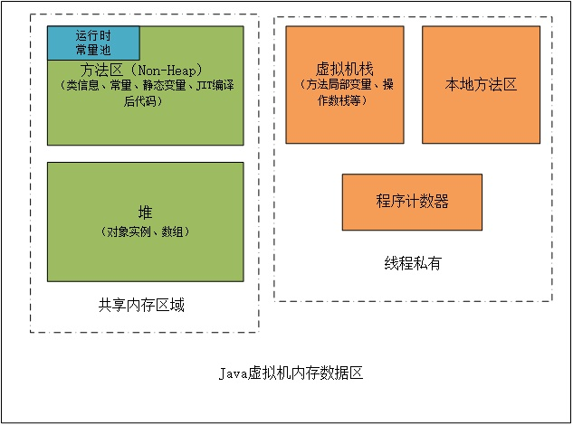

[toc]



## 1.程序计数器（Program Counter Register）

程序计数器是一块较小的内存空间，它可以看作是当前线程所执行的字节码的行号指示器。每个线程都有各自独立的程序计数器，如果线程正在执行的是一个Java方法，那么这个计数器记录的是正在执行的虚拟机字节码指令地址，如果正在执行的是Native方法，则程序计数器为空（Undifined）。
**此内存区域是唯一一个在Java虚拟机规范中没有规定任何OutOfMemoryError情况的区域。**

## 2.虚拟机栈（VM Stack）

虚拟机栈也是线程私有的，它描述的是Java方法执行的内存模型：**每个方法在执行的同时都会创建一个栈帧（Stack Frame）用于存储局部变量表、操作数栈、动态链接、方法出口等信息，每一个方法从调用直至完成的过程，就对应着一个栈帧在虚拟机栈中入栈和出栈的过程。**

虚拟机栈帧中，局部变量表是比较为人所熟知的，也就是平常所说的“栈”，局部变量表所需的内存空间在编译期间分配完成，当进入一个方法时，这个方法需要在栈帧中分配多大的局部变量空间是完全确定的，在方法运行期间不会改变局部变量表的大小。

虚拟机栈有两种异常情况：

1. StackOverflowError：线程请求的栈深度大于虚拟机所允许的深度，特别是方法的递归调用时

2. OutOfMemoryError：虚拟机栈无法满足线程所申请的空间需求，即使经过动态扩展仍然无法满足，那么将导致OutOfMemoryError错误

## 3.本地方法栈（Native Method Stack）

本地方法栈与虚拟机栈相似，不过服务于本地方法，有些虚拟机将这两个区域合二为一。

本地方法栈中抛出异常的情况与虚拟机栈相同。

## 二、共享的内存区域

## 1.堆（Heap）

通常来说，堆是Java虚拟机管理的内存中最大的一块，被所有线程共享，在虚拟机启动时创建，堆的作用就是存储对象实例。

堆也是垃圾收集器所管理的主要区域，因此很多时候也被称作“GC堆”。从内存回收的角度来看，由于现在收集器基本都采用分代收集算法，因此堆还可以被细分为：**新生代和老年代**。再继续细分可以分为：**Eden空间、From Survivor空间、To Survivor空间等**，从内存分配的角度来看，线程共享的堆中还可以划分出多个线程私有的分配缓冲区（Thread Local Allocation Buffer，TLAB）。

堆可以是物理上不连续的空间，只要逻辑上是连续的即可，-Xmx和-Xms参数可以控制堆的最大和最小大小。

堆的空间大小不满足时将抛出OutOfMemoryError异常。

## 2.方法区（Method Area）

用于存储已被虚拟机加载的类信息、常量、静态变量、JIT编译后的代码等数据。Java虚拟机规范将方法区描述为堆的一个逻辑部分，但是它却有一个别名叫做Non-Heap（非堆）。

方法区同样会抛出OutOfMemoryError异常。

```text
   在方法区中有一部分区域用来存储编译期产生的各种字面量和符号引用，这部分内容将在类加载后进入方法区的运行时常量池中存放。
    这里需要说明一点，常量并不是只能在编译期产生，运行期间也会产生新的常量并被发在常量池中，如String类的intern()方法。
```

## 三、直接内存（Direct Memory）

本机直接内存并不是Java虚拟机运行时数据区的一部分，但它能在一些场景中显著提高性能，因为其避免了在Java堆和Native堆中来回复制数据。

直接内存同样会抛出OutOfMemoryError异常。


# 第7章 虚拟机类加载机制

代码编译的结果从本地机器码转变为字节码，是存储格式发展的一小步，却是编程语言发展的一大步。

虚拟机的类加载机制：

```
Java虚拟机把描述类的数据从Class文件加载到内存，并对数据进行校验、转换解析和初始化，最终形成可以被虚拟机直接使用的Java类型，这个过程被称作虚拟机的类加载机制
```

特点：

- 类型的加载、连接和初始化过程都是在程序运行期间完成的，带来了极高的扩展性和灵活性


## 类加载阶段


类加载的7个阶段，整个生命周期将会经历加载（Loading）、验证（Verification）、准备（Preparation）、解析（Resolution）、初始化（Initialization）、使用（Using）和卸载（Unloading）七个阶段，其中验证、准备、解析三个部分统称为连接（Linking）。

加载、验证、准备、初始化和卸载这五个阶段的顺序是确定的，类型的加载过程必须按照这种顺序按部就班地开始，而解析阶段则不一定：它在某些情况下可以在初始化阶段之后再开始，这是为了支持Java语言的运行时绑定特性（也称为动态绑定或晚期绑定）。这些阶段通常都是互相交叉地混合进行的，会在一个阶段执行的过程中调用、激活另一个阶段。

关于在什么情况下需要开始类加载过程的第一个阶段“加载”，《Java虚拟机规范》中并没有进行强制约束，这点可以交给虚拟机的具体实现来自由把握。但是对于初始化阶段，《Java虚拟机规范》则是严格规定了有且只有六种情况必须立即对类进行“初始化”（而加载、验证、准备自然需要在此之前开始）：

1. 遇到new、getstatic、putstatic或invokestatic这四条字节码指令时，如果类型没有进行过初始化，则需要先触发其初始化阶段。能够生成这四条指令的典型Java代码场景有：·使用new关键字实例化对象的时候。·读取或设置一个类型的静态字段（被final修饰、已在编译期把结果放入常量池的静态字段除外）的时候。·调用一个类型的静态方法的时候。
2. 使用java.lang.reflect包的方法对类型进行反射调用的时候，如果类型没有进行过初始化，则需要先触发其初始化。
3. 当初始化类的时候，如果发现其父类还没有进行过初始化，则需要先触发其父类的初始化。
4. 当虚拟机启动时，用户需要指定一个要执行的主类（包含main()方法的那个类），虚拟机会先初始化这个主类。
5. 当使用JDK 7新加入的动态语言支持时，如果一个java.lang.invoke.MethodHandle实例最后的解析结果为REF_getStatic、REF_putStatic、REF_invokeStatic、REF_newInvokeSpecial四种类型的方法句柄，并且这个方法句柄对应的类没有进行过初始化，则需要先触发其初始化。
6. 当一个接口中定义了JDK 8新加入的默认方法（被default关键字修饰的接口方法）时，如果有这个接口的实现类发生了初始化，那该接口要在其之前被初始化。对于这六种会触发类型进行初始化的场景，《Java虚拟机规范》中使用了一个非常强烈的限定语——“有且只有”，这六种场景中的行为称为对一个类型进行主动引用。除此之外，所有引用类型的方式都不会触发初始化，称为被动引用。


接口与类真正有所区别的是前面讲述的六种“有且仅有”需要触发初始化场景中的第三种：当一个类在初始化时，要求其父类全部都已经初始化过了，但是一个接口在初始化时，并不要求其父接口全部都完成了初始化，只有在真正使用到父接口的时候（如引用接口中定义的常量）才会初始化。

## 7.3 类加载的过程

### 7.3.1 加载

在加载阶段，Java虚拟机需要完成以下三件事情：

1. 通过一个类的全限定名来获取定义此类的二进制字节流。
2. 将这个字节流所代表的静态存储结构转化为方法区的运行时数据结构。
3. 在内存中生成一个代表这个类的java.lang.Class对象，作为方法区这个类的各种数据的访问入口。

对于数组类而言，情况就有所不同，数组类本身不通过类加载器创建，它是由Java虚拟机直接在内存中动态构造出来的。但数组类与类加载器仍然有很密切的关系，因为数组类的元素类型（Element Type，指的是数组去掉所有维度的类型）最终还是要靠类加载器来完成加载，一个数组类（下面简称为C）创建过程遵循以下规则：

- 如果数组的组件类型（Component Type，指的是数组去掉一个维度的类型，注意和前面的元素类型区分开来）是引用类型，那就递归采用本节中定义的加载过程去加载这个组件类型，数组C将被标识在加载该组件类型的类加载器的类名称空间上（这点很重要，在7.4节会介绍，一个类型必须与类加载器一起确定唯一性）。
- 如果数组的组件类型不是引用类型（例如int[]数组的组件类型为int），Java虚拟机将会把数组C标记为与引导类加载器关联。
- 数组类的可访问性与它的组件类型的可访问性一致，如果组件类型不是引用类型，它的数组类的可访问性将默认为public，可被所有的类和接口访问到。

加载阶段与连接阶段的部分动作（如一部分字节码文件格式验证动作）是交叉进行的，加载阶段尚未完成，连接阶段可能已经开始，但这些夹在加载阶段之中进行的动作，仍然属于连接阶段的一部分，这两个阶段的开始时间仍然保持着固定的先后顺序。

### 7.3.2 验证

验证阶段大致上会完成下面四个阶段的检验动作：文件格式验证、元数据验证、字节码验证和符号引用验证

### 7.3.3 准备

# 第10章 前端编译与优化

编译器分类

- 前端编译器（叫“编译器的前端”更准确一些），把`*.java变成*.class文件的过程`
- Java虚拟机的即时编译器（常称JIT编译器，Just In Time Compiler）运行期把字节码编译转变成本地机器码的过程
- 静态的提前编译器（常称AOT编译器，Ahead OfTime Compiler）直接把程序编译成与目标机器指令集相关的二进制代码的过程

列举静态的提前编译器（常称AOT编译器，Ahead OfTime Compiler）直接把程序编译成与目标机器指令集相关的二进制代码的过程

- 前端编译器：JDK的Javac、Eclipse JDT中的增量式编译器（ECJ）
- 即时编译器：HotSpot虚拟机的C1、C2编译器，Graal编译器。
- 提前编译器：JDK的Jaotc、GNU Compiler for the Java（GCJ）、Excelsior JET

# 第13章 线程安全和锁优化

Java语言中各种操作共享的数据分为以下五类：不可变、绝对线程安全、相对线程安全、线程兼容和线程对立。

## 不可变

不可变的对象一定是线程安全的，不论是对象的方法还是方法的调用者，都不需要再进行任何线程安全的保护措施