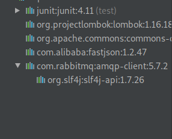

[TOC]


### 消息机制：

可以使软件之间相互连接调用，通过分离数据的发送和接收，从而达到==异步处理==和==解耦==

 RabbitMQ接收、存储、传递的是二进制流数据 

通过消息机制，可以实现数据传输，非阻塞型操作，推送通知，发布/订阅，异步处理，work队列。

`RabbitMQ`是消息中间件的一种。

### 编写语言：

Erlang

# 主要特性：

## 可靠性（Reliability）

`RabbitMQ`使用一些机制来保证程序的可靠性，如持久化、传输确认机制、发布确认、高可用性

## 灵活的路由机制（Flexible Routing）

在消息进入队列之前，通过Exchange来路由消息的。对于典型的路由功能，`RabbitMQ`已经提供了一些内置的Exchange来实现。针对更复杂的路由功能，可以将多个Exchange绑定在一起，也通过插件机制实现自己的Exchange。

## 消息集群（Clustering）

多个`RabbitMQ`服务器可以组成一个集群，形成单个逻辑Broker。

## Federation

```
For servers that need to be more loosely and unreliably connected than clustering allows, RabbitMQ offers a federation model.
```


## 队列高可用（Highly Available Queues）

队列可以在集群中的机器上进行镜像，以确保在硬件问题下还保证消息安全。

## 多种协议的支持（Multi-protocol）

直接支持或者插件支持的方式，支持了几种消息协议

### `AMQP`协议

`RabbitMQ`最早开发就是为了支持`AMQP`，所以该协议是Broker支持的最核心的协议

`AMQP` 0-9-1，0-9，0-8，和扩展协议

### STOMP

`RabbitMQ`通过插件机制支持STOMP当前所有版本

### `MQTT`

`MQTT`是一个轻量级的 发布/订阅 消息机制的二进制协议，旨在用于低端设备的客户端上。它很好的定义了 发布/订阅消息机制，不支持其它消息机制。

`RabbitMQ`通过插件机制支持`MQTT 3.1`

### `AMQP 1.0`

不要在意这个名字，`AMQP` 1.0和`AMQP 0-9-1/0-9/0-8`在本质上是不同的，几乎什么都不一样。借助于`AMQP 1.0`非常少的语法要求；因此将现有的Broker添加上`AMQP 1.0`的协议支持是非常容易的。实质上这个协议比起`AMQP 0-9-1`，是非常复杂的，并且它有非常少的客户端实现。

`RabbitMQ`通过插件机制支持`AMQP 1.0`

### `HTTP`

HTTP当然不是一个消息协议。`RabbitMQ`可以通过以下三种方式来传输消息：

- 管理插件支持一个简单的`HTTP API`用于发送和接收消息。主要用于测试诊断的目的，但是针对少量的消息来说还是可靠的。
- Web-STOMP插件使得，在浏览器上可使用基于`WebSockets`、或者`SockJS`来控制消息。
- `JSON-RPC`插件使浏览器通过J`SON-RPC`和基于`AMQP 0-9-1`协议的消息进行通信。注意`JSON RPC`是一个同步的协议，基于异步传输的`AMQP`的一些功能将使用polling方式进行模拟。

## 多语言客户端的支持（Many Clients）

`RabbitMQ`几乎支持所有常用语言。

## 管理界面（Management UI）

`RabbitMQ`有一个易用的用户界面，使得用户可以监控和管理消息Broker的许多方面。

## 跟踪机制（Tracing）

如果消息异常，`RabbitMQ`提供消息跟踪机制，使用者可以找出发生了什么。

## 插件机制（Plugin System）

`RabbitMQ`提供了许多插件，来从多方面进行扩展，也可以编写自己的插件。


`AMQP`，即 Advanced Message Queuing Protocol，高级消息队列协议，是应用层协议的一个开放标准，为面向消息的中间件设计。消息中间件主要用于组件之间的解耦，消息的发送者无需知道消息使用者的存在，反之亦然。AMQP 的主要特征是面向消息、队列、路由（包括点对点和发布/订阅）、可靠性、安全。

RabbitMQ 是一个开源的 AMQP 实现，服务器端用Erlang语言编写，支持多种客户端，如：Python、Ruby、.NET、Java、JMS、C、PHP、ActionScript、XMPP、STOMP 等，支持 AJAX。用于在分布式系统中存储转发消息，在易用性、扩展性、高可用性等方面表现不俗。

# 相关概念

通常我们谈到队列服务, 会有三个概念： 发消息者、队列、收消息者，RabbitMQ 在这个基本概念之上, 多做了一层抽象, 在发消息者和 队列之间, 加入了交换器 (Exchange). 这样发消息者和队列就没有直接联系, 转而变成发消息者把消息给交换器, 交换器根据调度策略再把消息再给队列。


- 左侧 P 代表 生产者，也就是往 RabbitMQ 发消息的程序。
- 中间即是 RabbitMQ，*其中包括了 交换机 和 队列。*
- 右侧 C 代表 消费者，也就是往 RabbitMQ 拿消息的程序。

那么，*其中比较重要的概念有 4 个，分别为：虚拟主机，交换机，队列，和绑定。*

- 虚拟主机：一个虚拟主机持有一组交换机、队列和绑定。为什么需要多个虚拟主机呢？很简单， RabbitMQ 当中，**用户只能在虚拟主机的粒度进行权限控制**。因此，如果需要禁止A组访问B组的交换机/队列/绑定，必须为A和B分别创建一个虚拟主机。每一个 RabbitMQ 服务器都有一个默认的虚拟主机“/”。
- 交换机：*Exchange 用于转发消息，但是它不会做存储* ，如果没有 Queue bind 到 Exchange 的话，它会直接丢弃掉 Producer 发送过来的消息。
  这里有一个比较重要的概念：**路由键** 。消息到交换机的时候，交互机会转发到对应的队列中，那么究竟转发到哪个队列，就要根据该路由键。
- 绑定：也就是交换机需要和队列相绑定，这其中如上图所示，是多对多的关系。

## 交换机(Exchange)

交换机的功能主要是接收消息并且转发到绑定的队列，交换机不存储消息，在启用ack模式后，交换机找不到队列会返回错误。交换机有四种类型：Direct, topic, Headers and Fanout

- Direct：direct 类型的行为是"先匹配, 再投送". 即在绑定时设定一个 **routing_key**, 消息的**routing_key** 匹配时, 才会被交换器投送到绑定的队列中去.
- Topic：按规则转发消息（最灵活）
- Headers：设置 header attribute 参数类型的交换机
- Fanout：转发消息到所有绑定队列

## 类型

### Direct Exchange

Direct Exchange 是 RabbitMQ 默认的交换机模式，也是最简单的模式，根据key全文匹配去寻找队列。


第一个 X - Q1 就有一个 binding key，名字为 orange； X - Q2 就有 2 个 binding key，名字为 black 和 green。*当消息中的 路由键 和 这个 binding key 对应上的时候，那么就知道了该消息去到哪一个队列中。*

Ps：为什么 X 到 Q2 要有 black，green，2个 binding key呢，一个不就行了吗？ - 这个主要是因为可能又有 Q3，而Q3只接受 black 的信息，而Q2不仅接受black 的信息，还接受 green 的信息。

### Topic Exchange

*Topic Exchange 转发消息主要是根据通配符。* 在这种交换机下，队列和交换机的绑定会定义一种路由模式，那么，通配符就要在这种路由模式和路由键之间匹配后交换机才能转发消息。

在这种交换机模式下：

- 路由键必须是一串字符，用句号（`.`） 隔开，比如说 `agreements.us`，或者 `agreements.eu.stockholm` 等。
- 路由模式必须包含一个 星号（`*`），主要用于匹配路由键指定位置的一个单词，比如说，一个路由模式是这样子：`agreements..b.*`，那么就只能匹配路由键是这样子的：第一个单词是 `agreements`，第四个单词是 b。 井号（#）就表示相当于一个或者多个单词，例如一个匹配模式是 `agreements.eu.berlin.#`，那么，以`agreements.eu.berlin `开头的路由键都是可以的。

具体代码发送的时候还是一样，第一个参数表示交换机，第二个参数表示 routing key，第三个参数即消息。如下：

```bash
rabbitTemplate.convertAndSend("testTopicExchange","key1.a.c.key2", " this is  RabbitMQ!");
```

topic 和 direct 类似, 只是匹配上支持了"模式", 在"点分"的 routing_key 形式中, 可以使用两个通配符:

- `*`表示一个词.
- `#`表示零个或多个词.

### Headers Exchange

headers 也是根据规则匹配, 相较于 direct 和 topic 固定地使用 routing_key , headers 则是一个自定义匹配规则的类型.
在队列与交换器绑定时, 会设定一组键值对规则, 消息中也包括一组键值对( headers 属性), 当这些键值对有一对, 或全部匹配时, 消息被投送到对应队列.

### Fanout Exchange

Fanout Exchange 消息广播的模式，不管路由键或者是路由模式，*会把消息发给绑定给它的全部队列*，如果配置了 routing_key 会被忽略。


```
概念介绍
Broker：broker(中间商)简单来说就是消息队列服务器实体。
Exchange：消息交换机，它指定消息按什么规则，路由到哪个队列。
Queue：消息队列载体，每个消息都会被投入到一个或多个队列。
Binding：绑定，它的作用就是把exchange和queue按照路由规则绑定起来。
Routing Key：路由关键字，exchange根据这个关键字进行消息投递。
vhost：虚拟主机，一个broker里可以开设多个vhost，用作不同用户的权限分离。
producer：消息生产者，就是投递消息的程序。
consumer：消息消费者，就是接受消息的程序。
channel：消息通道，在客户端的每个连接里，可建立多个channel，每个channel代表一个会话任务。
```


```
角色说明
超级管理员(administrator)
可登陆管理控制台，可查看所有的信息，并且可以对用户，策略(policy)进行操作。
监控者(monitoring)
可登陆管理控制台，同时可以查看rabbitmq节点的相关信息(进程数，内存使用情况，磁盘使用情况等)
策略制定者(policymaker)
可登陆管理控制台, 同时可以对policy进行管理。但无法查看节点的相关信息(上图红框标识的部分)。
普通管理者(management)
仅可登陆管理控制台，无法看到节点信息，也无法对策略进行管理。
其他
无法登陆管理控制台，通常就是普通的生产者和消费者。

```


# 操作命令

## win

## 启动

### 以应用的方式来启动

```sh
rabbitmq-server -detached
#-detached 表示以后台方式启动
#rabbitmq-server仅能够启动Broker。管理Broker需使用rabbitmqctl命令来执行。
```

### 以服务的方式来启动

 使用rabbitmq-service.bat命令将RabbitMQ安装为一个服务，如果修改了环境变量，需要重新安装。执行以下命令可以将RabbitMQ安装为一个服务 

```
rabbitmq-service install

```

 执行完成后，一个以RABBITMQ_SERVICENAME命名的服务将会出现在Windows的服务面板中（开始->运行 services.msc），即可以使用Windows服务面板中提供的功能来管理服务，也可以使用rabbitmq-service命令来管理，如要启动服务，可执行： 

```
rabbitmq-service start
```

## 停止

```

```

## UNIX


## 队列列表

```
sudo sudo rabbitmqctl list_queues
rabbitmqctl.bat list_queues
```


# 

# 简单demo

## java

```xml
<!--添加依赖-->
<dependency>
    <groupId>com.rabbitmq</groupId>
    <artifactId>amqp-client</artifactId>
    <version>5.7.2</version>
</dependency>
<!--这个jar包依赖，SLF4J和SLF4J Simple-->
```




### Sending


publisher(sender)-->Send   发布/发送者

consumer(receiver)-->Recv  消费/接收者

```java
import com.rabbitmq.client.Connection;
import com.rabbitmq.client.ConnectionFactory;

import java.io.IOException;
import java.util.concurrent.TimeoutException;

/**
 * description:
 * author:klaus
 * date:2019/11/20
 * co:
 */
public class Send {
    private final static String QUEUE_NAME = "hello";

    public static void main(String[] args) {
        ConnectionFactory factory = new ConnectionFactory();
        factory.setHost("172.16.3.17");//ip
        factory.setPort(5672);//port
        factory.setUsername("root");//username
        factory.setPassword("Zywlw2018");//password
        try (Connection connection = factory.newConnection();
             Channel channel = connection.createChannel()) {
            channel.queueDeclare(QUEUE_NAME, false, false, false, null);
            String message = "Hello World!";
            channel.basicPublish("",QUEUE_NAME, null, message.getBytes());
            System.out.println(" [x] Sent '" + message + "'");
        } catch (TimeoutException e) {
            e.printStackTrace();
        } catch (IOException e) {
            e.printStackTrace();
        }
    }
}
```

### Receiving

```java
package com.opco.rd.producer;

import com.rabbitmq.client.Channel;
import com.rabbitmq.client.Connection;
import com.rabbitmq.client.ConnectionFactory;

import java.io.IOException;
import java.util.concurrent.TimeoutException;

/**
 * description:
 * author:zhaoxingbao
 * date:2019/11/20
 * co:
 */
public class Receiver {
    private final static String QUEUE_NAME = "hello";
    public static void main(String[] args) throws IOException, TimeoutException {
        ConnectionFactory factory = new ConnectionFactory();
        factory.setHost("172.16.3.17");
        factory.setPort(5672);
        factory.setUsername("root");
        factory.setPassword("Zywlw2018");
        Connection connection = factory.newConnection();
        Channel channel = connection.createChannel();
        channel.queueDeclare(QUEUE_NAME, false, false, false, null);//声明消息队列，避免消费者先于生产者启动而无对应队列

        System.out.println(" [*] Waiting for messages. To exit press CTRL+C");
/*
*	Note that we declare the queue here, as well. Because we might start the consumer before the publisher, we want to make sure the queue exists before we try to consume messages from it.

Why don't we use a try-with-resource statement to automatically close the channel and the connection? By doing so we would simply make the program move on, close everything, and exit! This would be awkward because we want the process to stay alive while the consumer is listening asynchronously for messages to arrive -- 不采用try-catch 避免因为异常直接就全部退出了，保持消费者存活，监听消息的到来
*/	
         DeliverCallback deliverCallback = (consumerTag, delivery) -> {
            String message = new String(delivery.getBody(), "UTF-8");
            System.out.println(" [x] Received '" + message + "'");
        };//消费回调
        channel.basicConsume(QUEUE_NAME, true, deliverCallback, consumerTag -> { });//消费方法
    }
}


```


# Working Queues

简单demo中使用命名的队列

工作队列（Working Queues） 是为了使用多个work进程来处理分布式耗时任务 

工作队列（Working Queues）的作用是避免阻塞等待资源密集类任务的完成，转而放入队列异步处理。 将任务封装成一个消息并将其发送至队列中，运行在后台的work进程就会从队列中取出任务并最终执行它。可以使用多个work进程来分摊任务 

  

 这个概念适合web项目，一次HTTP请求时间有限，对于复杂处理业务的请求，很难保证响应时间 

## 轮询分发调度

使用工作队列（Working Queues）利于并行处理

消息积压，可以通过增加消费者（worker）进行扩充

轮询分发依次分发C1，C2，C3.......，然后继续新的回合

 采用的是轮巡制（不会因某个消费者上的任务执行时间过长，导致消息会传递到其它消费者上处理）

## Message acknowledgment

消息应答机制

如果消息传递给消费者，立马将队列中消息删除，不考虑消费者是否真正处理消息，例如消费者宕机了，存在风险

为了避免消息的丢失，消费者和队列之间建立了应答机制，应答机制由开发者决定开启与否

rabbit在等待ack的过程中：

- channel 关闭
- connection关闭
- TCP断联

认为consumer死亡，重新开启传递给另一个consumer

rabbitmq等待过程中，没有消息超时机制，如果没有出现让rabbit判断consumer挂掉的条件，rabbitmq会一直等下去，即使任务执行了很长时间


## java

```java
package com.opco.rd.producer;

import com.rabbitmq.client.Channel;
import com.rabbitmq.client.Connection;
import com.rabbitmq.client.ConnectionFactory;
import com.rabbitmq.client.DeliverCallback;

import java.io.IOException;
import java.util.concurrent.TimeoutException;

/**
 * description:
 * author:zhaoxingbao
 * date:2019/11/21
 * co:
 */
public class Worker {

    private static final String TASK_QUEUE_NAME = "task_name";

    public static void main(String[] args) throws IOException, TimeoutException {
        ConnectionFactory factory = new ConnectionFactory();
        factory.setHost("172.16.3.17");
        factory.setPort(5672);//port  the default is 5672 if don't specified
        factory.setUsername("root");
        factory.setPassword("Zywlw2018");

        final Connection connection = factory.newConnection();
        final Channel channel = connection.createChannel();

        channel.queueDeclare(TASK_QUEUE_NAME, true, false, false, null);
        System.out.println(" [*] Waiting for messages. To exit press CTRL+C");

        channel.basicQos(1);

        DeliverCallback deliverCallback = (cosumerTag, delivery) -> { 
            String message = new String(delivery.getBody(), "UTF-8");
            
            System.out.println(" [x] Received '" + message + "'");
            try {
                doWork(message);
            } finally {
                System.out.println(" [x] Done");
                channel.basicAck(delivery.getEnvelope().getDeliveryTag(), false);
            }
        };

        channel.basicConsume(TASK_QUEUE_NAME, false, deliverCallback, consumerTag -> {});
        

    }

    private static void doWork(String task) {
        for (char ch : task.toCharArray()) {
            if (ch == '.') {
                try {
                    Thread.sleep(1000);
                } catch (InterruptedException e) {
                    Thread.currentThread().interrupt();
                }
            }
        }
    }
}
```


```java
channel.queueDeclare(var1, var2, var3, var4, var5);
var1---
var2---
var3---
var4---
var5---
```


## 参考：

[rabbitmq官网](https://www.rabbitmq.com/)

[子暃之路博客](https://blog.zenfery.cc/topics/mq)

