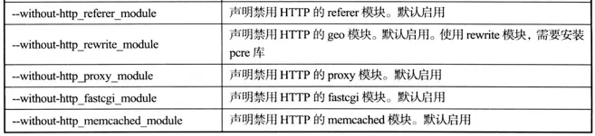
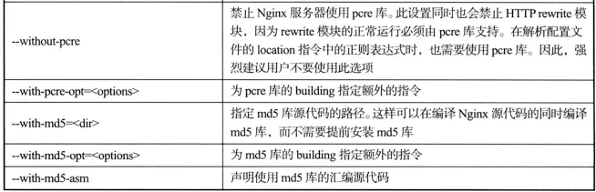
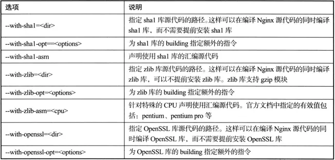

# Nginx

最近工作中，需要迁移环境，需要上手自己配置，关于域名，ip，网关，http服务器之类的，才发现好像知识储备不够，准备上手整理学习相关的知识点。

参考地址:[nginx官网](https://nginx.org)


## 安装 

nginx是一个高性能的http和反向代理服务器。使用源码安装，需要安装C++编译环境，

查询nginx相关资料：

> nginx支持linux的epoll，以及其他常见OS的高性能IO处理方式
>
> nginx用纯C写成
>
> nginx核心代码全部用事件触发机制完成
>
> nginx是跨平台的(实现原理是？)

安装nginx之前需要安装pcre和openssl

```bash
yum -y install pcre*
yum -y install open*
```

这两个工具的作用？

### yum安装

直接使用yum命令安装即可，位置为默认，没有源码可以选择版本，安装位置等灵活，不多做记录了

### 源码安装

源码安装需要安装支持的环境：

```bash
yum -y install gcc gcc-c++ autoconf automake zlib zlib-devel openssl openssl-devel pcre-devel
```

使用wget下载相应的安装包，解压

对于配置，可以选择默认和自定安装：

**默认**

> ```bash
> # 执行解压路径下的configure文件执行
> ./configure
> ```

**自定义配置**

> 实例

```bash
./configure \
# 指定安装路径
--prefix=/usr/local/nginx \
# 指定默认配置文件，启动时也可以通过"nginx -c 文件"指定文件启动
--conf-path=/usr/local/nginx/conf/nginx.conf \
# pid文件路径
--pid-path=/usr/local/nginx/conf/nginx.pid \
--lock-path=/var/lock/nginx.lock \
--error-log-path=/var/log/nginx/error.log \
--http-log-path=/var/log/nginx/access.log \
--with-http_gzip_static_module \
--http-client-body-temp-path=/var/temp/nginx/client \
--http-proxy-temp-path=/var/temp/nginx/proxy \
--http-fastcgi-temp-path=/var/temp/nginx/fastcgi \
--http-uwsgi-temp-path=/var/temp/nginx/uwsgi \
--http-scgi-temp-path=/var/temp/nginx/scgi

```

#### configure脚本参数









#### 已安装，添加新模块

安装后，如果再次添加新的模块，分两种情况：

先使用`nginx -V`指令查询现有模块：

```bash
$ /usr/local/nginx/sbin/nginx  -V
configure arguments: --prefix=/usr/local/nginx --sbin-path=/usr/local/nginx/sbin/nginx --conf-path=/usr/local/nginx/conf/nginx.conf --error-log-path=/var/log/nginx/error.log --http-log-path=/var/log/nginx/access.log --pid-path=/var/run/nginx/nginx.pid --lock-path=/var/lock/nginx.lock --user=nginx --group=nginx --with-http_ssl_module --with-http_stub_status_module --with-http_gzip_static_module --http-client-body-temp-path=/var/tmp/nginx/client/ --http-proxy-temp-path=/var/tmp/nginx/proxy/ --http-fastcgi-temp-path=/var/tmp/nginx/fcgi/ --http-uwsgi-temp-path=/var/tmp/nginx/uwsgi --http-scgi-temp-path=/var/tmp/nginx/scgi --with-pcre

```


* 添加nginx支持模块

  ```bash
  ./configure --prefix=/usr/local/nginx --sbin-path=/usr/local/nginx/sbin/nginx --conf-path=/usr/local/nginx/conf/nginx.conf --error-log-path=/var/log/nginx/error.log --http-log-path=/var/log/nginx/access.log --pid-path=/var/run/nginx/nginx.pid --lock-path=/var/lock/nginx.lock --user=nginx --group=nginx --with-http_ssl_module --with-http_stub_status_module --with-http_gzip_static_module --http-client-body-temp-path=/var/tmp/nginx/client/ --http-proxy-temp-path=/var/tmp/nginx/proxy/ --http-fastcgi-temp-path=/var/tmp/nginx/fcgi/ --http-uwsgi-temp-path=/var/tmp/nginx/uwsgi --http-scgi-temp-path=/var/tmp/nginx/scgi --with-pcre
  # 在已有的基础上添加
  --with-新模块
  ```

  

* 添加第三方模块

```bash
./configure --prefix=/usr/local/nginx --sbin-path=/usr/local/nginx/sbin/nginx --conf-path=/usr/local/nginx/conf/nginx.conf --error-log-path=/var/log/nginx/error.log --http-log-path=/var/log/nginx/access.log --pid-path=/var/run/nginx/nginx.pid --lock-path=/var/lock/nginx.lock --user=nginx --group=nginx --with-http_ssl_module --with-http_stub_status_module --with-http_gzip_static_module --http-client-body-temp-path=/var/tmp/nginx/client/ --http-proxy-temp-path=/var/tmp/nginx/proxy/ --http-fastcgi-temp-path=/var/tmp/nginx/fcgi/ --http-uwsgi-temp-path=/var/tmp/nginx/uwsgi --http-scgi-temp-path=/var/tmp/nginx/scgi --with-pcre
# 在已有的基础上添加
--add-module=第三方插件位置
```

完成后，将二进制文件拷贝到nginx安装目录下：

==不要make install，会完全覆盖安装，nginx完全新的==

```bash
# 停止nginx
/usr/local/nginx/sbin/nginx -s stop
 cp objs/nginx /usr/local/nginx/sbin/nginx
# 重启
 /usr/local/nginx/sbin/nginx //启动nginx
```

## 使用

### 配置


启动过程中遇到不少因为文件没有创建而无法启动的问题：

根据配置提前创建好文件夹或者相关文件

```bash

```


### 命令

## 应用场景

### http服务器

### 反向代理