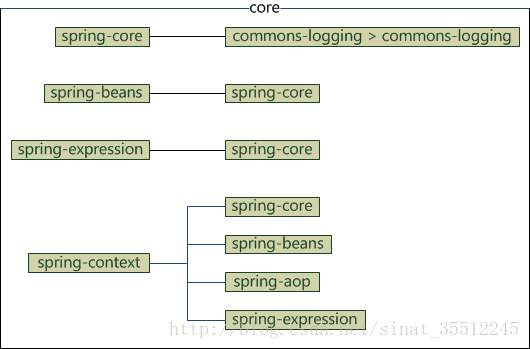
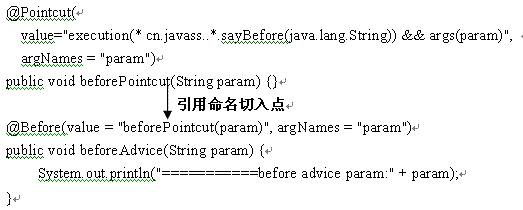

# 整合SSM

[TOC]
**参考资料**
[spring模块结构](https://blog.csdn.net/sinat_35512245/article/details/53893910)


## Spring流程


### Spring工作流程描述

1. 用户向服务器发送请求，请求被Spring 前端控制Servelt DispatcherServlet捕获；
2. DispatcherServlet对请求URL进行解析，得到请求资源标识符（URI）。然后根据该URI，调用HandlerMapping获得该Handler配置的所有相关的对象（包括Handler对象以及Handler对象对应的拦截器），最后以HandlerExecutionChain对象的形式返回；
3.  DispatcherServlet 根据获得的Handler，选择一个合适的HandlerAdapter。（**附注**：如果成功获得HandlerAdapter后，此时将开始执行拦截器的preHandler(...)方法）
4.   提取Request中的模型数据，填充Handler入参，开始执行Handler（Controller)。 在填充Handler的入参过程中，根据你的配置，Spring将帮你做一些额外的工作：
   * HttpMessageConveter： 将请求消息（如Json、xml等数据）转换成一个对象，将对象转换为指定的响应信息
   * 数据转换：对请求消息进行数据转换。如String转换成Integer、Double等
   * 数据根式化：对请求消息进行数据格式化。 如将字符串转换成格式化数字或格式化日期等
   *  数据验证： 验证数据的有效性（长度、格式等），验证结果存储到BindingResult或Error
5. Handler执行完成后，向DispatcherServlet 返回一个ModelAndView对象；
6.  根据返回的ModelAndView，选择一个适合的ViewResolver（必须是已经注册到Spring容器中的ViewResolver)返回给DispatcherServlet ；
7.  ViewResolver 结合Model和View，来渲染视图
8.  将渲染结果返回给客户端。


## spring项目结构

### 包含的模块
spring4


### spring分为5个部分
>* core
>* aop
>* data access
>* web
>* test
>
>总共二十个左右的jar

spring3


>spring3 有19个jar
******
#### 以下介绍5个部分的jar以及依赖关系
##### core
  ore部分包含4个模块
  >spring-core：框架最基础的部分。提供IOC容器，对bean进行管理
  >spring-beans：Bean工厂和bean装配
  >spring-context：spring的上下文即`IOC`容器
  >spring- expression：spring表达式语言

`他们的完整依赖关系`:
    
    

>spring-core依赖了commons-logging，而其他的模块都依赖了spring-core，故整个spring框架都依赖了commons-logging

`只引入spring-context包的情况下会自动导入其他的jar包`
```
<dependency>  
    <groupId>org.springframework</groupId>  
    <artifactId>spring-context</artifactId>  
    <version>${spring.version}</version>
</dependency>
```
`结果如下`


`所以可以直接引入context包`


##### AOP
`AOP部分包含六个模块`

>* spring-aop：面向切面编程
>* spring-aspects：集成AspectJ
>* spring- instrument：提供一些类级的工具支持和ClassLoader级的实现，用于服务器
>* spring-instrument-tomcat：针对tomcat的instrument实现
>* spring-websocket：为web应用提供的高效通信工具
>* spring-messaging：用于构建基于消息的应用程序

`他们的依赖关系`


##### data access
>data access 部分包含5个模块
>* spring-jdbc：jdbc的支持
>* spring-tx：事务的控制
>* spring-orm：对象关系映射，集成orm框架
>* spring-oxm：对象xml映射
>* spring-jms：java消息服务


`他们的依赖关系`


##### web
>web包含4个模块
>* spring-web：基础web功能，如文件上传
>* spring-webmvc：mvc实现
>* spring-webmvc-portlet：基于portlet的mvc实现
>* spring-websocket
>>spring3提供的是
>>
>>* spring-struts：与struts的集成，不推荐，spring4不再提供

`他们的依赖关系`


##### test和spring-context-support
>test部分只有一个模块，将spring-context-support也放在这里
>* spring-test：spring测试，提供junit和mock的功能测试
>* spring-context-support：spring的额外支持包，比如邮件服务，视图解析等
>  `他们的依赖关系`
>  


## 添加依赖
>添加依赖的过程中，一些jar包依赖于项目中其他的jar包，可以不用在pom中书写太多的jar包

## 开发过程中的详细配置
### IOC容器配置
### web配置

==web.xml的作用==：**web.xml文件的作用是配置web工程启动**,对于一个web工程来说，web.xml可以有也可以没有，如果存在web.xml文件；web工程在启动的时候，**web容器(tomcat容器)**会去加载web.xml文件，然后按照一定规则配置web.xml文件中的组件。

==web容器的加载顺序==：ServletContext -> context-param -> listener -> filter ->servlet ;不会因在web.xml中的书写顺序改变：   
   a、web容器启动后,会去加载web.xml文件，读取listener和context-param两个节点
   b、创建一个ServletContext（Servlet上下文）这个上下文供所有部分共享
   c、容器将context-param转换成键值对，交给ServletContext
   d、接着按照上述顺序继续执行


**加载顺序** 
a、首先加载Spring容器加载器：ContextLoaderListener

b、加载过滤器Filter（此处以编码过滤器CharacterEncodingFilter为例）此过滤器的作用就是设置请求参数的编码为UTF-8.

c、加载Servlet：初始化DispatcherServlet，在SpringMVC架构中，DispatchServlet负责请求分发，起到控制器的作用

#### 过滤器

```
作用：
```


#### 

[listener学习](other/listener.md)


#### 


需要说明的是 Spring Boot 2.0 已经不再支持使用继承WebMvcConfigurerAdapter 来实现MVC 配置了


使用了thymeleaf所以，使用mvc的自然是无用的，必须要修改为thymeleaf才行


# AOP

AOP(Aspect Oriented Programming)面向切面编程，OOP(Object Oriented Programming)的补充和完善。

## 核心概念

1、横切关注点

2、切面（aspect）

3、连接点（joinpoint）

4、切入点（pointcut）

5、通知（advice）

6、目标对象

7、织入（weave）

8、引入（introduction）


在代码使用遇到的问题

定义注解类

```java
/*
* 写这个注解类是用来记录一些借口操作的日志
* 所以切入点是在接口方法入口处使用注解
*/
@Target(ElementType.METHOD)
@Retention(RetentionPolicy.RUNTIME)
public @interface Log {
    String value() default "";
}
```


这个类是对文章进行操作的

```java
/**
 * description:
 * author:zhaoxingbao
 * date:2019/6/10
 * co:
 */
@RestController
@RequestMapping("/article")
@Slf4j
public class ArticleController extends BaseController {

    @Autowired
    private ArticleService articleService;

    /**
     *
     * @return
     */
    @RequestMapping("/save")
    @Log("新增文章")
    public String save(@Validated @RequestBody Article article){
        try {
            articleService.save(article);
            return JsonUtil.getSucc(Constant.SUC);
        } catch (Exception e) {
            log.info(e.getMessage());
            throw new GlobalException(e.getMessage());
        }
    }

    @RequestMapping("/delete")
    @Log("删除文章")
    public String delete(@RequestBody List<Long> ids){
        try {
            if(null == ids || ids.size() == 0){
                return JsonUtil.getErrorJson(Constant.PARAM_ERROR);
            }
            articleService.softDelete(ids);
            return JsonUtil.getSucc(Constant.SUC);
        } catch (Exception e) {
            e.printStackTrace();
            log.info(e.getMessage());
            throw new GlobalException(e.getMessage());
        }
    }
}
```


切面编程

```java
@Aspect
@Component
public class LogAspect {

    private Logger logger = LoggerFactory.getLogger(this.getClass());

    @Autowired
    private LogService logService;

    /**
     * @description
     * @author zhaoxingbao
     * @date 2019/6/4 9:25
     * @param
     * @return
     */
    @Pointcut("@annotation(com.opco.blog.admin.annotation.Log)")
    public void pointcut(){

    }

    @Around("pointcut()")
    public Object around(ProceedingJoinPoint proceedingJoinPoint) throws JsonProcessingException {
        Object result = null;
        long beginTime = System.currentTimeMillis();
        try {
            result = proceedingJoinPoint.proceed();
        } catch (Throwable throwable) {
            throwable.printStackTrace();
            throw new GlobalException(throwable.getMessage());
        }
        //获取request请求
        HttpServletRequest request = HttpContextUtil.getHttpServletRequest();
        //设置ip地址
        String ip  = IPUtil.getIPAddr(request);
        //记录时间
        long time = System.currentTimeMillis() - beginTime;
        //保存日志
        User user = (User) SecurityUtils.getSubject().getPrincipal();
        SysLog sysLog = new SysLog();
        sysLog.setUsername(user.getUsername());
        sysLog.setIp(ip);
        sysLog.setTime(time);
        logService.saveLog(proceedingJoinPoint,sysLog);
        return result;
    }

}
```

## 注解说明

1、@Aspect

作用是把当前类表示为一个切面供容器读取

2、@Before

标识一个前置增强方法，相当于BeforeAdvice的功能

3、@AfterReturning

后置增强，相当于AfterReturningAdvice，方法正常退出时执行

4、@AfterThrowing

异常抛出增强，相当于ThrowAdvice

5、@After

final增强，不管是抛出异常或者正常退出都会执行

6、@Around

环绕增强，相当于MethodInterceptor

7、@DeclareParents

引介增强，相当于IntroductionInterceptor

### 命名及匿名切入点

命名切入点可以被其他切入点引用，而匿名切入点是不可以的。只有@AspectJ支持命名切入点，而Schema风格不支持命名切入点。



## AspectJ组合切入点表达式

AspectJ使用 且（&&）、或（||）、非（！）来组合切入点表达式 

 在Schema风格下，由于在XML中使用“&&”需要使用转义字符`“&amp;&amp;”`来代替之，所以很不方便，因此Spring ASP 提供了and、or、not来代替&&、||、！。

切入点使用示例

a、execution：使用”execution(方法表达式)“匹配方法执行；

b、within：使用“within(类型表达式)”匹配指定类型内的方法执行

c、this：使用“this(类型全限定名)”匹配当前AOP代理对象类型的执行方法；注意是AOP代理对象的类型匹配，这样就可能包括引入接口方法也可以匹配，注意this中使用的表达式是类型全限定名，不支持通配符

d、target：使用“target(类型全限定名)”匹配当前目标对象类型的执行方法；注意是目标对象的类型匹配，这样就不包括引入接口也类型匹配；注意target中使用的表达式必须是类型全限定名，不支持通配符；

e、args：使用“args(类型参数列表)”匹配当前执行的方法传入参数为指定类型的执行方法；注意是匹配传入的参数类型，不是匹配方法签名的参数类型；参数类型列表中的参数必须是类型全限定名，通配符不支持 ；args属于动态切入点，这种切入点的开销非常大，非特殊情况最好不要用；

f、@within：使用“@within(注解类型)”匹配所有持有指定注解类型内的方法；注解类型也必须是全限定类型名

g、@target：使用“@target(注解类型)”匹配当前目标对象类型的执行方法，其中目标对象持有指定的注解；注解类型也必须是全限定类型名

h、@args：使用“@args(注解列表)“匹配当前执行的方法传入的参数持有指定注解的执行；注解类型也必须是全限定类型名；

i、@annotation：使用“@annotation(注解类型)”匹配当前执行方法持有指定注解的方法；注解类型也必须是全限定类型名；

j、bean：使用“bean(Bean id 或名字通配符)”匹配特定名称的Bean对象的执行方法；Spring ASP扩展的，在AspectJ中无相应概念；

k、reference  pointcut：表示引用其他命名切入点，只有@AspectJ风格支持，Schema风格不支持

参考：

[一个很不错的AspectJ的Execution表达式说明](<https://blog.csdn.net/xiao190128/article/details/82181769>)


# @Transactional

在service 或者dao 或者controller 添加区别

dao作用范围就是一次crud

service作用范围内可能有多次crud

具体如何实现一致性，遇到问题回滚，会完成的也会回滚吗？


# @Autowired和@Resource注解的区别

都能用来标注在字段或属性上


不同在于：

1. 提供方：@Autowired是由org.springframework.beans.factory.annotation.Autowired提供，换句话说就是由Spring提供      @Resource是 javax.annotation.Resource提供，即J2EE提供，需要JDK1.6及以上

2. 注入方式：@Autowired只按照byType 注入；@Resource默认按byName自动注入，也提供按照byType 注入；

3. 属性：@Autowired按类型装配依赖对象，默认情况下它要求依赖对象必须存在，如果允许null值，可以设置它required属性为false。如果想使用按名称装配，可以结合@Qualifier注解一起使用。@Resource有两个中重要的属性：name和type。name属性指定byName，如果没有指定name属性，当注解标注在字段上，即默认取字段的名称作为bean名称寻找依赖对象，当注解标注在属性的setter方法上，即默认取属性名作为bean名称寻找依赖对象。需要注意的是，@Resource如果没有指定name属性，并且按照默认的名称仍然找不到依赖对象时， @Resource注解会回退到按类型装配。但一旦指定了name属性，就只能按名称装配了。

4. @Resource装配顺序

   　　1. 如果同时指定了name和type，则从Spring上下文中找到唯一匹配的bean进行装配，找不到则抛出异常

      　　2. 如果指定了name，则从上下文中查找名称（id）匹配的bean进行装配，找不到则抛出异常

             　　3. 如果指定了type，则从上下文中找到类型匹配的唯一bean进行装配，找不到或者找到多个，都会抛出异常

                   　　4. 如果既没有指定name，又没有指定type，则自动按照byName方式进行装配；如果没有匹配，则回退为一个原始类型进行匹配，如果匹配则自动装配；      


推荐使用@Resource注解在字段上，这样就不用写setter方法了.并且这个注解是属于J2EE的，减少了与Spring的耦合,这样代码看起就比较优雅 


# @Configuration和@Component区别

> 一句话就是 `@Configuration` 中所有带 `@Bean` 注解的方法都会被动态代理，因此调用该方法返回的都是同一个实例

## `@Configuration`注解

```java
@Target(ElementType.TYPE)
@Retention(RetentionPolicy.RUNTIME)
@Documented
@Component
public @interface Configuration {
    String value() default "";
}
```

本质上还是 `@Component`，因此 `<context:component-scan/>` 或者 `@ComponentScan` 都能处理`@Configuration` 注解的类

@Configuration 标记的类必须符合下面的要求：

- 配置类必须以类的形式提供（不能是工厂方法返回的实例），允许通过生成子类在运行时增强（cglib 动态代理）。
- 配置类不能是 final 类（没法动态代理）。
- 配置注解通常为了通过 @Bean 注解生成 Spring 容器管理的类，
- 配置类必须是非本地的（即不能在方法中声明，不能是 private）。
  任何嵌套配置类都必须声明为static。
- @Bean 方法可能不会反过来创建进一步的配置类（也就是返回的 bean 如果带有 @Configuration，也不会被特殊处理，只会作为普通的 bean）。

## 加载过程

==~~~这里也不太懂==

PostProcessor？？？

postProcessBeanFactory？？？

Spring 容器在启动时，会加载默认的一些 PostPRocessor，其中就有 ConfigurationClassPostProcessor，这个后置处理程序专门处理带有 @Configuration 注解的类，这个程序会在 bean 定义加载完成后，在 bean 初始化前进行处理。主要处理的过程就是使用 cglib 动态代理增强类，而且是对其中带有 @Bean 注解的方法进行处理。

在 ConfigurationClassPostProcessor 中的 postProcessBeanFactory 方法中调用了下面的方法：


# MIME

**媒体类型**（通常称为 **Multipurpose Internet Mail Extensions** 或 **MIME** 类型 ）是一种标准，用来表示文档、文件或字节流的性质和格式。它在[IETF RFC 6838](https://tools.ietf.org/html/rfc6838)中进行了定义和标准化。

## 通用结构

```
type/subtype
```

MIME的组成结构非常简单；由类型与子类型两个字符串中间用`'/'`分隔而组成。不允许空格存在。*type* 表示可以被分多个子类的独立类别。*subtype 表示细分后的每个类型。*

MIME类型对大小写不敏感，但是传统写法都是小写。

### 独立类型


```
text/plain
text/html
image/jpeg
image/png
audio/mpeg
audio/ogg
audio/*
video/mp4
application/*
application/json
application/javascript
application/ecmascript
application/octet-stream
…
```

*独立*类型表明了对文件的分类，可以是如下之一：

| 类型          | 描述                                                         | 典型示例                                                     |
| :------------ | :----------------------------------------------------------- | :----------------------------------------------------------- |
| `text`        | 表明文件是普通文本，理论上是人类可读                         | `text/plain`, `text/html`, `text/css, text/javascript`       |
| `image`       | 表明是某种图像。不包括视频，但是动态图（比如动态gif）也使用image类型 | `image/gif`, `image/png`, `image/jpeg`, `image/bmp`, `image/webp`, `image/x-icon`, `image/vnd.microsoft.icon` |
| `audio`       | 表明是某种音频文件                                           | `audio/midi`, `audio/mpeg, audio/webm, audio/ogg, audio/wav` |
| `video`       | 表明是某种视频文件                                           | `video/webm`, `video/ogg`                                    |
| `application` | 表明是某种二进制数据                                         | `application/octet-stream`, `application/pkcs12`, `application/vnd.mspowerpoint`, `application/xhtml+xml`, `application/xml`, `application/pdf` |

对于text文件类型若没有特定的subtype，就使用 `text/plain`。类似的，二进制文件没有特定或已知的 subtype，即使用 `application/octet-stream`。

### Multipart 类型


```
multipart/form-data
multipart/byteranges
```

*Multipart* 类型表示细分领域的文件类型的种类，经常对应不同的 MIME 类型。这是*复合*文件的一种表现方式。`multipart/form-data` 可用于联系 [HTML Forms](https://developer.mozilla.org/en-US/docs/Web/Guide/HTML/Forms) 和 [`POST`](https://developer.mozilla.org/zh-CN/docs/Web/HTTP/Methods/POST) 方法，此外 `multipart/byteranges`使用状态码[`206`](https://developer.mozilla.org/zh-CN/docs/Web/HTTP/Status/206) `Partial Content`来发送整个文件的子集，而HTTP对不能处理的复合文件使用特殊的方式：将信息直接传送给浏览器（这时可能会建立一个“另存为”窗口，但是却不知道如何去显示内联文件。）


参考：

[MIME](https://developer.mozilla.org/zh-CN/docs/Web/HTTP/Basics_of_HTTP/MIME_types)


# InitializingBean

这个接口只有一个方法afterPropertiesSet()


1、Spring为bean提供了两种初始化bean的方式，实现InitializingBean接口，实现afterPropertiesSet方法，或者在配置文件中通过init-method指定，两种方式可以同时使用。

2、实现InitializingBean接口是直接调用afterPropertiesSet方法，比通过反射调用init-method指定的方法效率要高一点，但是init-method方式消除了对spring的依赖。

3、如果调用afterPropertiesSet方法时出错，则不调用init-method指定的方法。


# 实际遇到问题


