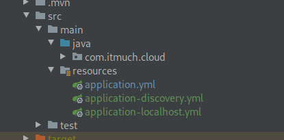

springboot 打包成可执行jar需要

```xml
<build>
    <plugins>
        <plugin>
            <groupId>org.springframework.boot</groupId>
            <artifactId>spring-boot-maven-plugin</artifactId>
        </plugin>
    </plugins>
</build>
```

`spring-boot-starter-parent`里已经有了默认约定，绑定了repackage的goal了


在使用slf4j日志框架的时候，注意查看spring默认的实现框架，slf4j是一组定义接口，规范


spring boot 启动的真正入口类，类里也有默认的main方法，在不写入任何新的代码情况下，按照springboot的默认设置启动

```java
spring-boot-x.x.x-RELEASE.jar
org.springframework.boot.SpringApplication
```


swagger 整合 spring boot  使用ui jar包有两个

springfox-swagger-ui

springfox-swagger-ui-rfc6570

两个是使用不太一样 rfc 的这个版本需要配合oauth2 使用


配置的时候容易出现

```shell
No mapping found for HTTP request with URI [/dm/swagger-ui.html] in DispatcherServlet
```

原因是swagger-ui.html在 jar包中，Spring Boot自动配置本身不会自动把/swagger-ui.html这个路径映射到对应的目录META-INF/resources/下面，在启动类上添加注解@EnableWebMvc

@EnableWebMvc ....三个的区别


```java
    @Override
    public void addResourceHandlers(ResourceHandlerRegistry registry) {
        registry.addResourceHandler("swagger-ui.html")
                .addResourceLocations("classpath:/META-INF/resources/");
        registry.addResourceHandler("/webjars/**")
                .addResourceLocations("classpath:/META-INF/resources/webjars/");

    }
```


使用profile指定不同的配置文件

在classpath下

application-{profile}.yml

application-{profile}.properties

可以通过--spring.profiles.active=xxx来指定



java -jar --spring.profile.active=xxx    xxx.jar

java -jar -Dspring.profile.active=xxx xxx.jar