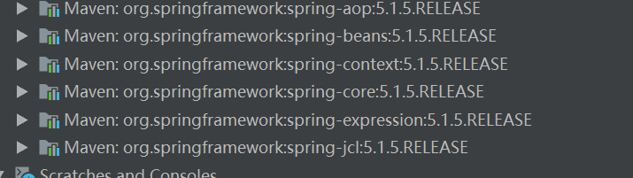

# 整合SSM

[TOC]
**参考资料**
[spring模块结构](https://blog.csdn.net/sinat_35512245/article/details/53893910)

## spring项目结构

### 包含的模块
spring4


### spring分为5个部分
>* core
>* aop
>* data access
>* web
>* test
>
>图中每一个圆角矩形，都对应一个jar，其groupId都为"org.springframework"，每一个jar都有一个不同的artifactId，另外"instrumentation"和"Messageing"有两个jar，还有一个"spring-context-support"没有列出来，故spring的jar包总共20来个

spring3


>spring3 有19个jar
******
#### 以下介绍5个部分的jar以及依赖关系
##### core
  ore部分包含4个模块
  >spring-core：依赖注入和DI的最基本实现
  >spring-beans：Bean工厂和bean装配
  >spring-context：spring的上下文即`IOC`容器
  >spring- expression：spring表达式语言

`他们的完整依赖关系`:
    
    

>spring-core依赖了commons-logging，而其他的模块都依赖了spring-core，故整个spring框架都依赖了commons-logging

`只引入spring-context包的情况下会自动导入其他的jar包`
```
<dependency>  
    <groupId>org.springframework</groupId>  
    <artifactId>spring-context</artifactId>  
    <version>${spring.version}</version>
</dependency>
```
`结果如下`


`所以可以直接引入context包`

##### AOP
`AOP部分包含六个模块`
>* spring-aop：面向切面编程
>* spring-aspects：集成AspectJ
>* spring- instrument：提供一些类级的工具支持和ClassLoader级的实现，用于服务器
>* spring-instrument-tomcat：针对tomcat的instrument实现
>* spring-websocket：为web应用提供的高效通信工具
>* spring-messaging：用于构建基于消息的应用程序

`他们的依赖关系`


##### data access
>data access 部分包含5个模块
>* spring-jdbc：jdbc的支持
>* spring-tx：事务的控制
>* spring-orm：对象关系映射，集成orm框架
>* spring-oxm：对象xml映射
>* spring-jms：java消息服务


`他们的依赖关系`


##### web
>web包含4个模块
>* spring-web：基础web功能，如文件上传
>* spring-webmvc：mvc实现
>* spring-webmvc-portlet：基于portlet的mvc实现
>* spring-websocket
>>spring3提供的是
>>
>>* spring-struts：与struts的集成，不推荐，spring4不再提供

`他们的依赖关系`


##### test和spring-context-support
>test部分只有一个模块，将spring-context-support也放在这里
>* spring-test：spring测试，提供junit和mock的功能测试
>* spring-context-support：spring的额外支持包，比如邮件服务，视图解析等
>  `他们的依赖关系`
>  


## 添加依赖
>添加依赖的过程中，一些jar包依赖于项目中其他的jar包，可以不用在pom中书写太多的jar包

## 开发过程中的详细配置
### IOC容器配置
#### xml配置式

#### 注解配置式
#### xml和注解比较
### web配置
#### 过滤器
#### xml配置式
#### 注解配置式
#### 监听器
#### xml配置式
#### 注解配置式
#### 控制器
#### xml配置式
#### 注解配置式