[TOC]
# 1.对象导论

# 2.一切都是对象
# 3.操作符
# 4.控制执行流程
# 5.初始化与清理
# 6.访问控制权限
# 7.复用类
# 8.多态
# 9.接口
# 10.内部类
# 11.持有对象

## 11.2 基本概念

Java容器类类库的用途是“保存对象”，并将其划分为两个不同的概念：

1. Collection，一个独立元素的队列，元素都服从一条或多条规则

   | 容器类型 | 服从规则                         |
   | -------- | -------------------------------- |
   | List     | 按照插入的顺序保存元素           |
   | Set      | 不能有重复元素                   |
   | Queue    | 按照排队规则来确定对象产生的顺序 |

   

2. Map。一组成对的“键值对”对象。    也被称为“关联数组”，或者“字典”

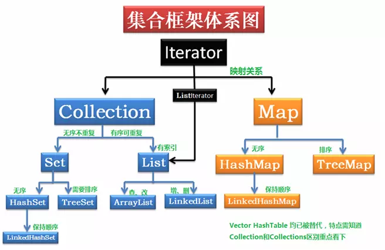

所有的Collection都可以用foreach语法遍历，因为都是Iterator接口


判断某个元素是否属于 结合内，或者集合是否包含这个对象，需要这个类有重写equals和hashCode


### equals方法的准则

```
自反性：对于任何非空引用值x，x.equals(x)都应返回true
对称性：对于任何非空引用值x和y，当且仅当y.equals(x)返回true时，x.equals(y)才应返回true
传递性：对于任何非空引用值x、y和z，如果x.equals(y)返回true，并且y.equals(z)返回true，那么x.equals(z)应返回true
一致性：对于任何非空引用值x和y，多次调用x.equals(y)始终返回true或始终返回false，前提是对象上equals比较中所用的信息没有被修改
非空性：对于任何非空引用值x，x.equals(null)都应返回false
```

## 11.6 迭代器

迭代器（是一种设计模式）是一个对象，用来遍历并选择序列中的对象，客户端程序不必关注序列的底层结构

> 迭代器被称为轻量级对象

### ListIterrator

是Iterrator的子类型，可以双向移动

## 11.7 LinkedList

## 11.8  Stack

“栈”通常指“后进先出”（LIFO）的容器，也被称为“叠加栈”


# 12.通过异常处理错误
# 13.字符串
## 不可变String
>String对象是不可变的，String类的每一个看起来修改String值的方法，实际上都是创建了一个新的String对象------**不可变性**
### 重载"+"和StringBuilder
>可以给String对象添加任意多的别名，因为**String对象具有只读特性**，不会对他的应用有任何影响
>坏处：**会带来一定的效率问题**，
>重载：一个操作符在用于特定的类时，被赋予了特殊的意义。
```
Java中仅有的两个重载的操作符:
1、“+”
2、“+=”
```
```
public class Connection{
    public static void main(String[] args){
        String mango = "mango";
        String s = "abc"+mango+"def"+47;
        System.out.print(s);
    }
}
```
生成最终的String对象过程中产生了一堆需要垃圾回收的中间对象

>jvm自动的引入了`StringBuilder`类
### 无意识的递归
`如何使用toString()打印出对象的地址`
>使用this关键字
```
public class InfiniteRecursion{
    public static void main(String[] args){
        List<InfiniteRecuresion> v = 
            new ArrayList<InfiniteRecuresion>();
        for(int i = 0; i < 10; i++)
            v.add(new InfiniteRecursion();
        System.out.print(v);
    }
    public String toString(){
    //这样写有异常，+this会自动调用this.toString()方法，就发生了递归调用
    //    return "InfiniteRecursion address:"+this+"\n";
        return "InfiniteRecursion address:"+super.toString()+"\n";
    }
}
```
String类的方法返回值：
* 内容没有改变，返回原对象的引用
* 内容改变了，返回了一个新的引用
### 格式化输出
### printf()用法
### System.out.format()
### Formatter类
Java中管理所有的格式化功能，可以看做一个**翻译器**。
### 格式化说明符
### String.format()
应用场景：只需要使用此意format()方法时，String.format()用起来更方便
### 正则表达式
>正则表达式  包含的各种字符，字符类，逻辑操作符，量词等等需要再做一个研究，理解并学会使用正则
>**Pattern.compile()的另外一个版本**：接受一个标价参数

| 编译标记                     | 效果 |
| ---------------------------- | ---- |
| Pattern.CANON_EQ             |      |
| Pattern.CASE_INSENSITIVE(?i) |      |
| Pattern.CONMMENTS(?x)        |      |
| Pattern.DOTALL(?s)           |      |
| Pattern.MUTILINE(?m)         |      |
| Pattern.UNICODE_CSAE(?u)     |      |
| Pattern.UNIX_LINES(?d)       |      |
**匹配**
**分割**
**替换**
**第四种，后续添加**


### Pattern和Matcher
相比较于功能有限的String类，正则表达式对象功能更强大

## 扫描输入
> 使用StringReader将String转化为可读的流对象，使用这个对象来构造BufferReader对象，使用readLine()方法，一次读取一行文本
> Scanner类：
#### Scanner定界符
默认：根据空白字符对输入进行分词
支持：通过正则表达式指定定界符
~~~
    import java.util.*;
    
    public class ScannerDelimiter{
        public static void main(String[] args){
            Scanner scanner = new Scanner("12, 42, 78, 99, 42");
            scanner.useDelimiter("\\s*,\\s*");
            while(scanner.hasNextInt())
                System.out.println(scanner.nextInt());
        }
    }
~~~
`以上的代码制定了  ","为定界符，包括逗号前后任意的空白字符`
### 使用正则表达式扫描
>除了能够扫描基本类型之外，还可以用自定义的正则表达式进行扫描
## 14.类型信息
`运行时类型信息使得你可以在程序运行时发现和使用类型信息`
`RTTI：Run-Time Type Identification
通过运行时类型信息程序能够使用基类的指针或引用来检查这些指针或引用所指的对象的实际派生类型`
>Java是如何在运行时识别对象和类的信息的：
>1、"传统的"的RTTI，假定我们在编译时已经知道了所有的信息
>2、"反射"机制，允许我们在运行时发现和使用类的信息
### 为什么使用RTTI
>RTTI名字的含义：在运行时，识别一个对象的类型   

`RTTI和反射的区别？？？？？`
## Class对象
Java使用Class对象来执行其RTTI
>类是程序的一部分，每个类都有一个Class对象，当编写并且编译了一个新类，就会产生一个Class对象(更恰当的说，是保存在一个同名的.class文件中)，为了生成这个对象，运行这个程序的Java虚拟机(JVM)将使用被称为"类加载器"的子系统
***
>类加载器子系统实际上可以包含一条类加载链，但是只有一个`原生类加载器`，他是JVM实现的一部分。原生类加载器加载的是所谓的`可信类`，包括Java API类，通常是通过本地盘加载的。在这条链中，通常是不需要添加额外的类加载器，但是如果你有特殊的需求，那么你有一种方式可以加载额外的类加载器
***
>所有的类都是在对其第一次使用的时候动态的加载到JVM中的，当程序创建第一个对类的静态成员的引用时，就会加载这个类。`这个证明构造器也是类的静态方法，即使在构造器之前并没有使用static关键字。因此使用new操作符创建类的新对象也会当做对类的静态成员的引用。`

因此，Java程序在它开始运行之前并非完全被加载。如果尚未加载，默认的类加载器就会根据类名查找.class文件。这个字节码被加载时，它们会接受验证，确保没有被破坏，并且不包含不良Java代码（这是Java中用于安全防范目的的措施之一）。一  
***

# 15.泛型

​		一般类使用具体类型，要么基本类型，要么自定义类，越是具体的类，适用的范围相应就越小。

​		在面向对象编程语言中，多态算是一种**泛化机制**。基类作为参数，从基类导出的任何类也可以作为参数。但**final**类不能扩展，其他任何类都可以被扩展，仍然是有一定的限制。

​		与单继承体系相比，接口作为参数，而不是一个类，限制会变小。但有时接口也是对程序的约束还是太强了，任然需要实际实现这个接口的具体类。这里就需要一种“某种不具体的类型”，来编写更通用的代码，而不是一个具体的类或接口

​		泛型的概念：Java SE5 引入的改变。泛型实现了==参数化类型==的概念，使代码可以应用于多种类型。 ==解耦类或方法与所使用的的类型之间的约束==。-------就是将原来具体的类型参数化，实际使用传入具体的参数。

```
理解注释：
在使用的过程需要用到参数，参数是某种类型的对象，但是想适用范围更广，选择使用一个参数来代替具体的类型参数，到了具体使用的时候通过<具体类型>来告诉编译器，类里或者方法里的这些参数都变成这个。达到限制具体类型参与的目的
```


## 15.2 简单泛型

泛型对与容器类：

```java
class Automobile{}

public class Holder1{
    private Automobile a;
    public Holder1(Automobile a){
        this.a = a;
    }
    public getAutomobile(){
        return a;
    }
}
```

重用性不好，无法持有其他类型的任何对象，在内部已经声明的具体的类型参数。

Java SE5 之前可以通过这个持有Object类型的对象来扩大适用范围。

泛型的主要目的是用来指定==容器要持有什么样的对象，而且由编译器来保证类型的正确性==：

```java
public class Holder3<T>{
    private T a;
    public Holder3(T a){this.a = a;}
    public void set(T a){this.a = a;}
    public T get(){return a;}
    public static void main(String[] args){
        Holder3<Automobile> h3 = new Holder3<Automobile>(new Automobile());
        Automobile a = h3.get();
    }
}
```

使用时必要在<>尖括号中指明想要持有什么样子的类型：即告诉编译器，想要使用什么样的类型，让编译器帮处理一切细节。

### 15.2.1 一个元组类库

​	**元祖(tuple)**的概念：将一组对象直接打包存储于其中一个单一对象，这个容器对象允许读取其中的元素，但是不允许向其中存放新的元素。 (这个概念也称为**数据传送对象**，或**信使**) 

> 和DTO有些类似的感觉

```java
//不使用泛型
public class TwoTuple1{
    public final Item a;
    public final Price b;
    public TwoTuple1(Item a,Price b){
        this.a = a;
        this.b = b;
    }
}
//使用泛型
public class TwoTuple2<A,B>{
    public final A first;
    public final B second;
}
```

从适用性上的扩展是泛型带来显性的改变

不使用访问器和修改器(get和set)，使用final后，就无法将其他的值赋予first和second。

可以通过继承机制来实现长度更长的元组：

```java
public class ThreeTuple<A,B,C> extends TwoTuple2<A,B>{
    public final C third;
    public ThreeTuple(A a,B b,C c){
        super(a,b);
        this.third = c;
    }
}
public class FourTuple<A,B,C,D> extends ThreeTuple<A,B,C>{
    ////
}
```

### 15.2.1 一个堆栈类

​		一个内部链式存储机制：

```java
public class LinkedStack<T>{
    private static class Node<U>{
        U item;
        Node<U> next;
        Node(){
            item = null;
            next = null;
        }
        Node(U item,Node<U> next){
            this.item = item;
            this.next = next;
        }
        boolean end(){return item == null && next == null;}
    }
    private Node<T> top = new Node<T>();//End sentinel
    public void push(T item ){
        top = new Node<T>(item,top);
    }
    public T top(){
        T result = top.item;
        if(!top.end())
           top = top.next;
       	return result;
    }
    public void main(String[] args){
        LinkedStack<String> lss = new LinkedStack<String>();
        for(String s : "Phasers or stun!".split(" ")){
            lss.push(s);
        String s;
        while((s = lss.pop()) != null){
            System.out.println(S);
        }
    }
}
```

该例子使用了末端哨兵(end sentinel)来判断堆栈何时为空，每次调用一次push()方法，就会创建一个Node<T>对象，并将其链接到前一个Node<T>对象。

```
理解注释：
一种容器的实现思路，容器中的数据以节点的形式存在，每个节点包含下个节点的引用（地址），达到链式的存储方式
```


### 15.2.3 RandomList

假设需要一个持有特定类型对象的列表，每次调用其上的select()方法时，它可以随机选取一个元素。

```java
import java.util.*;

public class RandomList<T>{
    private Arraylist<T> storage = new ArrayList<T>();
    private Random rand = new Random(47);
    public void add(T item){ storage.add(item);}
    public T select(){
        return storage.get(rand.nextInt(storage.size());)
    }
    public static void main(String[] args){
        RandomList<String> rs = new RandomList<String>();
        for(String s : ("The quick brown fox jumped over " +
                        "the lazy brown dog").split(" "))
            rs.add(s);
        for(int i = 0; i < 11; i++)
            System.out.println(rs.select() + "");
    }
}

```

## 15.3 泛型接口

泛型在接口的应用，例如生成器(generator)，这是一种专门负责创建对象的类。实际上，这是工厂方法设计模式的一种应用。不过，生成器常见新的对象时，他不需要任何的参数，而工厂方法一般需要参数。

```java
pulic interface Generator<T> { T next();}
```

```java
public class CoffeeGenerator implements Generator<Coffee>, Iterable<Coffee>{
    private Class[] types = {Latte.class,Mocha.class,Cappuccino.class,Americano.class,Breva,class};
    private static Random rand = new Random(47);
    public CoffeeGenerator(){}
    
    private int size = 0;
    public CoffeeGenerator(int sz){ size = sz;}
    public Coffee Next(){
        try{
            return (Coffee)type[rand.nextInt(types.length)].newInstance();
        }catch(Exception e){
            throw new RnuTimeException(e);
        }
    }
    class CoffeeIterator implements Iterator<Coffee>{
        int count = size;
        public boolean hasNext(){
            count --;
            return CoffeeGenerator.this.next();
        }
        public void remove(){
            throw new UnsupportedOperationException();
        }
    }
    public Iterator<Coffee> iterator(){
        return new CoffeeIterator();
    }
    public static void main(String[] args){
        CoffeeGenerator gen = new CoffeeGenerator();
        for(int i = 0;i < 5; i++){
            System.out.println(gen.next());
        }
        for(Coffee c : new CoffeeGenerator(5)){
            System.out.println(c);
        }
    }
}
```

参数化的Generator接口确保next()的返回值是参数类型。CoffeeGenerator同事还实现了Iterable接口，说以在循环语句中使用。不过它还需要一个“末端哨兵”来判断何时停止，这是第二个构造器的功能。

```java
public class Fibonacci implements Generator<Integer>{
    private int count = 0;
    public Integer next(){return fib(count++);}
    private int fib(int n){
        if(n<2) return 1;
        return fib(n-2) + fib(n-1);
    }
    public static void main(String[] args){
        Fibonacci gen = new Fibonacci();
        for(int i = 0; i < 18; i++){
            System.out.println(gen.next() + " ");
        }
    }
}
```

在Fibnoacci类的里里外外使用的都是int类型，但是参数都是Integer——Java泛型的一个局限性：基本类型无法作为类型参数。  从Java SE5具备了自动打包和自动拆包的功能。

## 15.4 泛型方法

泛型用在方法上——是否拥有泛型方法，与其所在的类是否是泛型没有关系。

对于一个static方法而言，无法访问泛型类的类型参数，所以，如果static方法需要使用泛型能力，就必须使其成为泛型方法。

```java
public class GenericMethods {
    public <T> void f(T x){
        System.out.println(x.getClass().getName());
    }
    public void main(String[] args){
        GenericMethods gm = new GenericMethods();
        gm.f(" ");
        gm.f(1);
        gm.f(1.0);
        gm.f(1.0F);
        gm.f('c');
        gm.f(gm);
    }
}
```

使用泛型类时，必须在创建对象的时候指定类型参数的值，

而使用泛型方法的时候，通常不必指明参数类型，因为编译器会为我们找出具体的类型。这称为**类型参数推断(type argument inference)**。

f()调用基本类型的时候，会自动打包

### 15.4.1 杠杆利用类型参数推断

```java
Map<Person, List<? extends Pet>> petPeople = 
    new HashMap<Person, List<? extends Pet>>();
```

类型推断只对赋值操作有效，其他时候不起作用

#### 显式的类型说明

泛型方法中可以显式的指明类型，不过这种语法很少见，要显式的指明类型，必须在点操作符与方法名之间插入尖括号，然后把类型置于尖括号内，如果是在定义该方法的内部必须在点操作符之前使用this关键字，如果是使用static的方法，必须在点操作符之前加上类名。

只有在进行非赋值语句时，才需要这样操作。

### 15.4.2 可变参数与泛型方法

泛型方法和可变参数列表能够很好的共存

```java
public class GenericVarargs{
    public static <T> List<T> makeList(T... args){
        List<T> result = new ArrayList<T>();
        for(T item : args)
            reustlt.add(item);
        return result;
    }
    public static void main (String[] args){
        List<String> ls = makeList("A");
        System.out.println(ls);
        ls = makeList("A","B","C");
        System.out.println(ls);
    }
}
```

### 15.4.3 用于Generator的泛型方法

### 15.4.4 一个通用的Generator

### 15.4.5 简化元组的使用

### 15.4.6 一个Set使用工具

## 15.5 匿名内部类

## 15.6 构建复杂模型

## 15.7 擦除的神秘之处

 **在泛型代码内部，无法获取任何有关泛型参数类型的信息。**

Java泛型是使用擦除来实现的，List<Stirng>和 List<Integer>在运行时事实上是相同的类型，两种形式都被擦除成原生的“List”类型。

### 15.7.1 C++的方式

C++没有擦除

```c++
#include<iostream>
using namespace std;
template<class T> class Manipulator {
    T obj;
    public:
    	Manipulator(T x) { obj = x; }
    	void manipulator { obj.f();}
};
class HasF {
    public:
    	void f() { cout << "HasF :: f()" << endl;}
};
int main() {
    HasF hf;
    Manipulator<HasF> manipulator(hf);
    manipulator.manipulator();
}
```

当实例化这个模板的时候，C++编译器将进行检查。在Manipulator<HasF>被实例化的这一刻，会检查到HasF拥有f()这个方法。如果情况并非如此，就会得到一个编译期错误。

```java
public class HasF {
    public void f() {
        System.out.println("HasF.f()");
    }
}

class Manipulato<T> {
    T obj;
    public Manipulator(T x) {
        obj = x;
    }
    public void manipulator() {
        obj.f();
    }
}
```

这是错误的表达，因为有了擦除，Java编译器无法将manipulator()必须能够在obj上调用f()这一需求映射到HasF拥有f()上。

为了完成上述功能，引入了**泛型类边界的概念**：告诉编译器只能遵守这个边界的类型，重用extends关键字

```java
class Manipulator<T extends HasF> {
    T obj;
    public Manipulator(T x) { obj = x; }
    public void manipulator() { obj.f(); }
}
```

**泛型类型参数**将擦除到他的第一个边界(可能会有多个边界),**类型参数**的擦除，代码解释：

```java
class Manipulator<T extends HasF> {
    T obj;
    public Manipulator(T x) { obj = x; }
    public void manipulator() { obj.f(); }
}
//编译器实际上会把类型参数替换为它的擦除，T擦除到了HasF，就好像在类的声明中用HasF替换掉了T一样
//在上述例子中，泛型没有贡献任何好处。只需很容易的自己去擦除。就可以创建出没有泛型的类：

class Manipulator3 {
    private HasF obj;
    public Manipulator3() { obj = x; }
    public void manipulator() {
        obj.f();
    }
}
```

以上的例子很好的体现了一点：当你希望使用的类型参数比某个更具体的类型(以及他的所有的子类型)更加泛化的时候

###  15.7.2 迁移兼容性

泛型类型只有在静态类型检查期间才出现，在此之后，程序中所有的泛型类型都将被擦除，例如

List<T> ------>  List

而普通的类型变量在未指定边界的情况下将被擦除为Object。

擦除的核心动机是泛化的客户端可以用非泛化的类库来使用，反之亦然。------>迁移兼容性

### 15.7.3  擦除的问题

擦除的代价是显著的，泛型不能用于显式的引用运行时的类型的操作中，例如转型、instanceof操作和new表达式，

### 15.7.4 边界处的动作

擦除带来的困惑，可以表示没有任何意义的事务。

```java
public class ArrayMaker<T> {
    private Class<T> kind;
    public ArrayMaker(Class<T> kind) { this.kind = kind; }
    @SuppressWarnings("unchenked")
    T[] create(int size) {
        return (T[])Array.newInstance(kind, size);
    }
    public static void main(Stirng[] args) {
        ArrayMaker<String> stringMaker = new ArrayMaker<String>(String.class);
        String[] stringArray = stringMaker.create();
        System.out.println(Arrays.toString(stringArray));
    }
}
```

## 15.9 边界

边界可以在泛型的参数类型上设置限制条件，可以强制规定泛型可以应用的类型，潜在的效果是按照边界类型来调用方法。

因为擦除移除了类型信息，所以无界泛型参数调用的方法只是那些可以用Object调用的方法。Java泛型重用了extends关键字来实现将参数限制为某个类型自己。

==extends关键字在泛型边界上下文环境中和在普通情况下所具有的的意义是完全不同的。==

```java
interface HasColor{
    java.awt.Color getColor();
}
class Colored<T extends HasColor>{
    T item;
    Colored(T item){ this.item = item; }
    java.awt.Color color(){
        return item.getColor();
    }
}
class Dimension{ public int x, y, z; }
class ColoredDimension<T extends HasColor & Dimension>{
    T item;
    ColoredDimension(T item){ this.item = item; }
    T getItem(){ return item; }
    java.awt.Color color(){ return item.getColor(); }
    int getX(){ return item.x; }
    int getY(){ return item.y; }
    int getZ(){ return item.z; }
}
```

可以使用继承来消除冗余

```java
class HoldItem<T>{
    T item;
    HoldItem(T item){ this.item = item; }
    T getItem(){ return item; }
}

class Colored2<T extends HasColor> extends HoldItem<T>{
    Colored2(T item){ super(item); }
    java.awt.Color color(){ return item.getColor(); }
}

class ColoredDimension2<T extends Dimension & HasColor> extends Colored2<T>{
    ColoredDimension2<T>{ super(item); }
    int getX(){ return item.x; }
    int getY(){ return item.y; }
    int getZ(){ return item.z; }
}
```

## 15.10 通配符

Apple的List在类型上不等价于Fruit的List，即使Apple是一种Fruit类型。

```java
class Fruit{}
class Apple extends Fruit {}
class Jonathan extends Apple {}
class Orange extends Fruit{}

public class NonCovariantGenerics{
    //Compile Error: incompatible types;
    List<Fruit> flist = new ArrayList<Apple>();
}
```


泛型没有内建的协变类型。数组在语言中是完全定义的，因此可以内建了编译期和运行时的检查，但是使用泛型时，编译器和运行时系统都不知道你想用类型做些什么，以及应该采用什么样的规则。

解释：

1. 两个泛型之间是没有关系的（所以自然没有继承关系）
2. List<Apple>在类型上不等价于List<Number>
3. 真正的问题是，讨论的是容器的类型，而不是容器持有的类型

### 延伸--Java泛型的协变、逆变和不变

协变：<? extends T> --->实现向上转型List<? extends Fruit> flist = new ArrayList<Apple>();    说明实际类型比变量显示的更小

逆变：<? super T>--->实现向下转型List<? super Apple> alist = new ArrayList<Fruit>();  说明实际类型比变量显示的更大

不变：T  --->没有关系，无法去比较

```
T   和   ？ 区别
声明一个泛型类或泛型方法
使用一个泛型类或泛型方法
```


 

**逆变与协变来描述类型转换（type transformation）后的继承关系**，其定义：如果A、B表示类型，f(·)表示类型转化

f(·)是**逆变（contravariant）**的，当A≤B时有f(B)≤f(A)成立；

f(·)是**协变（covariant）**的，当A≤B时有f(A)≤f(B)成立；

f(·)是**不变（invariant）**的，当A≤B时上述两个式子均不成立，即f(A)与f(B)相互之间没有继承关系

## 15.10.1 

List<? extends Fruit> 的add()方法参数就变成了"? extends Fruit"，从这个描述中，编译器不能了解这里需要Fruit的那个具体子类型，因此他不会接受任何类型的Fruit。

将Apple向上转型为Fruit也没用，==编译器会直接拒绝调对参数列表中涉及通配符的方法的调用==

> 不知道具体这个？extends Fruit是什么类型，运行检查


```
List和List<?>
List表示   持有任何Object类型的原生List
List<?>表示  具有某种特定类型的非原生List，只是不知道那种类型是什么
```


### 15.10.2 逆变

超类型通配符，声明通配符继承某个类

### 15.10.4 捕获转换

通配符`?`和任意引用类型`T`的关系，对于ArrayList<?>类型是ArrayList<T>的超类型。


## 15.11 问题

 基本类型不能作为类型参数，

解决方案是

> Java SE5的自动包装机制，双向转换机制，ArrayList<Integer> 就像是一个ArrayList<int>一样


## 15.12 自限定的类型

```java
class SelfBounded<T extends SelfBounded<T>>
```


古怪的循环泛型（CRG）

CRG：**基类用导出类替代其参数。**意味着泛型基类编程了一种其所有导出类的公共功能的模板。

```java
//这个不是   
public interface BaseService<T>{
    void f();
}


public class BaseServiceImpl<T> implements BaseService<T> {
    
    private Mapper<T> mapper;
    
    void f(){
        
    }
}

public interface FruitMapper<Fruit> extends Mapper<Fruit>{
    
}

public interface FruitService extends FruitService<Fruit>{}

public class FruitServiceImpl implements FruitServiceImpl{}
```


### 自限定

自限定类型的价值在于可以产生**协变参数类型**

**协变返回类型**是在Java SE5中引入的


使用自限定类型，和普通的继承机制的区别，方法覆盖和方法重载。


### 动态类型安全


## 15.15 混型

最基本概念：混合多个类的能力以产生一个可以表示混型中所有类型的类，


潜在类型机制或者结构化类型机制

Python和C++支持潜在类型机制，Python是动态类型语言（所有的类型检查都发生在运行时），C++是静态类型语言（类型检查发生在编译期），潜在类型机制不要求静态或冬天类型检查

Ruby   Smalltalk  语言也支持潜在类型检查

Python支持正则（非成员）函数

Java不支持潜在类型机制，


## 15.17 对缺乏潜在类型机制的补偿


## 潜在类型机制

适配器设计模式

功能型编程风格


# 16.数组

数组与其他种类的容器之间的区别：

- 效率
- 类型
- 保存基本类型的能力

Java中，数组是一种效率最高的存储和随机访问对象引用序列的方式，

速度快的原因：简单的线性序列，  

付出代价：数组对象的大小被固定，并且在其生命周期中不可改变

如果编译期就能够指出错误，会显得更加优雅

数组可以持有基本类型，而泛型之前的容器则不能，有了泛型，可以指定并检查所持有对象的类型，并且有了自动包装机制，容器看起来还能够持有基本类型

## 16.2 数组是第一级对象

无论什么类型的数组，数组标识符是一个引用，指向在堆中创建的一个真实对象，这个数组对象来保存指向其他对象的引用。

只读成员length是数组对象的一部分（事实上，是唯一一个可以访问的字段或者方法）

length是数组的大小，而不是实际保存的元素个数

```
新生成的一个数组对象时，其中所有的引用被自动初始化为null
基本类型的数组：
1、数值型自动初始化为0
2、字符型（char）的，就自动初始化为（char）O
3、布尔型（boolean）----> false
```

指针和引用

```
指针是一个对象，利用地址，他的值直接指向存在电脑中另一个地方的值。在使用一个指针时，一个程序可以直接使用这个指针所存储的内存地址，又可以使用这个地址里存储的函数的值
```


## 16.5 数组与泛型

不支持实例化具有参数化类型的数组；

```java
Peel<Banana>[] pells = new Peel<Banana>[10];
```

擦除会移除参数信息，数组必须要知道持有的确切类型，以强制保证类型安全，以上不成立

参数化数组本身：

T[] 

不能创建泛型数组这一说法不十分准确：

可以创建对这种数组的引用

List<String>[] ls;        

```java
List<String>[] ls;//创建引用
List la = new List[10];//创建非泛型的数组
ls = (List<String>[]) la;//转型成泛型的数组
ls[0] = new ArrayList<String>();
```

## Arrays实用功能

### 数组拷贝

System.arraycopy()，复制数组比用for循环复制要快的多，针对所有类型做了重载

如果复制对象数组，只是复制了对象的引用，浅复制或者浅拷贝（shallow copy）

### 数组比较

Arrays.equals()，针对所有基本类型与Object都做了重载  

数组相等的条件是元素个数必须相等，并且对应位置的元素也相等，通过对每个元素使用equals方法比较（基本类型，使用基本类型的包装器类的equals方法）

### 数组元素的比较

程序设计的基本目标是“将保持不变的事物与会发生改变的事物相分离”

### 数组排序

排序的数组对象实现了Comparable接口或者具有相关联的Comparator

### 在已排序的数组中查找

排好序的数组可以使用Arrays.binarySearch()执行快速查找。

未排序的数组使用binarySearch()，将产生不可预料的结果

找到目标元素，产生的返回值等于或大于0，否则为负值，这个值表示位置的信息，如果数组中所有的元素都小于要查找的对象，插入点就等于a.size()，对于包含了重复元素，无法保证找到的是这些副本中的哪一个


# 17.容器深入研究

```
Object.toString方法产生该对象的散列码的无符号十六进制表示（通过hashCode()生成的
```

所有的Collection子类型都刻意接收另一个Collection对象的构造器，用所接收的Collection对象中的元素来填充新的容器

### 17.2.3 Abstract类

享元模式

```

```

## 17.3 Collection的功能方法

### 未获支持操作

UnsupportedOperationException

## 17.5 List

## 17.6 Set和存储顺序

| Set(interface) | 存入Set的每个元素都必须是唯一的，Set不保存重复元素，加入Set的元素必须定义equals()方法以确保对象的唯一性 |
| -------------- | ------------------------------------------------------------ |
| HashSet        | 为快速查找而设计的Set。存入HashSet的元素必须定义hashCode()   |
| TreeSet        | 保持次序的Set，底层为树结构。使用它可以从Set中提取有序的序列。元素必须实现Comparable接口 |
| LinkedHashSet  | 具有HashSet的查询速度，且内部使用链表维护元素的顺序(插入的次序)。迭代器遍历Set时，会按照元素插入的次序显示。元素必须定义hashCode()方法 |

HashSet对速度进行了优化

良好的编程风格而言，覆盖equals()时同事覆盖hashCode()方法

### SortedSet

SortedSet的comparator()，返回当天Set使用的Comparator；或者返回null，表示自然排序

SortedSet实现排序的原理：

```

```

## 17.7 队列

### 优先级队列

### 双向队列

双向队列可以在任何一端添加或移除元素

## 17.8 Map

### 性能

在get()中使用线性搜索时，执行速度会相当的慢，HashMap使用特殊的值，称作散列码，来取代对健的缓慢搜索。

**散列码是“相对唯一”的、用以代表对象的int值，它是通过将该对象的某些信息进行转换而生成的。**

hashCode()是根类Object中的方法，因此所有Java对象都能产生散列码。

HashMap就是使用对象的hashCode进行快速查询的。此方法能够显著提高性能。


| 类别              | 特点 |
| ----------------- | ---- |
| HashMap           |      |
| LinkedHashMap     |      |
| TreeMap           |      |
| WeekHashMap       |      |
| ConcurrentHashMap |      |
| IdenityHashmap    |      |

### SortedMap

### LinkedHashMap

为了提高速度，LinkedHashMap散列化所有的元素，但遍历键值对时，却又以元素的插入顺序返回键值对 

## 17.9 散列与散列码


# 18.Java I/O系统
# 19.枚举类型
# 20.注解
# 21.并发

### JMM


JMM(Java Memory Model,JMM)：Java虚拟机规范中定义了Java内存模型（Java Memory Model，JMM），用于==屏蔽掉各种硬件和操作系统的内存访问差异==，以实现让Java程序在各种平台下都能达到一致的并发效果，JMM规范了Java虚拟机与计算机内存是如何协同工作的：规定了一个线程如何和何时可以看到由其他线程修改过后的共享变量的值，以及在必须时如何同步的访问共享变量。

原始的Java内存模型存在一些不足，因此Java内存模型在Java1.5时被重新修订。这个版本的Java内存模型在Java8中仍然在使用。

Java内存模型（不仅仅是JVM内存分区）：调用栈和本地变量存放在线程栈上，对象存放在堆上。

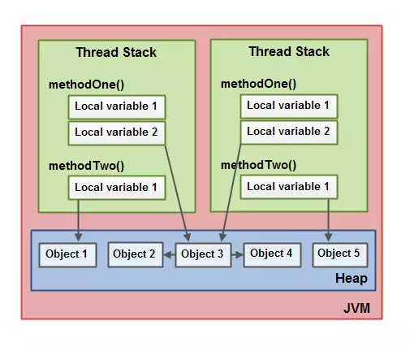

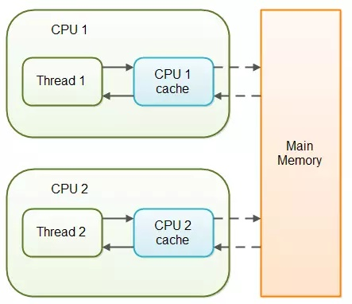

- 一个本地变量可能是原始类型，在这种情况下，它总是“呆在”线程栈上。

- 一个本地变量也可能是指向一个对象的一个引用。在这种情况下，引用（这个本地变量）存放在线程栈上，但是对象本身存放在堆上。

- 一个对象可能包含方法，这些方法可能包含本地变量。这些本地变量仍然存放在线程栈上，即使这些方法所属的对象存放在堆上。

- 一个对象的成员变量可能随着这个对象自身存放在堆上。不管这个成员变量是原始类型还是引用类型。

- 静态成员变量跟随着类定义一起也存放在堆上。

- 存放在堆上的对象可以被所有持有对这个对象引用的线程访问。当一个线程可以访问一个对象时，它也可以访问这个对象的成员变量。如果两个线程同时调用同一个对象上的同一个方法，它们将会都访问这个对象的成员变量，但是每一个线程都拥有这个成员变量的私有拷贝。

#### 硬件内存架构

  现代硬件内存模型与Java内存模型有一些不同，理解内存模型架构以及Java内存模型如何与它协同工作也是非常重要的。

  现代计算机硬件架构的简单图示：

  

  - **多CPU**：一个现代计算机通常由两个或者多个CPU。其中一些CPU还有多核。从这一点可以看出，在一个有两个或者多个CPU的现代计算机上同时运行多个线程是可能的。每个CPU在某一时刻运行一个线程是没有问题的。这意味着，如果你的Java程序是多线程的，在你的Java程序中每个CPU上一个线程可能同时（并发）执行。

  - **CPU寄存器**：每个CPU都包含一系列的寄存器，它们是CPU内内存的基础。CPU在寄存器上执行操作的速度远大于在主存上执行的速度。这是因为CPU访问寄存器的速度远大于主存。
  - **高速缓存cache**：由于计算机的存储设备与处理器的运算速度之间有着几个数量级的差距，所以现代计算机系统都不得不加入一层读写速度尽可能接近处理器运算速度的高速缓存（Cache）来作为内存与处理器之间的缓冲：将运算需要使用到的数据复制到缓存中，让运算能快速进行，当运算结束后再从缓存同步回内存之中，这样处理器就无须等待缓慢的内存读写了。CPU访问缓存层的速度快于访问主存的速度，但通常比访问内部寄存器的速度还要慢一点。每个CPU可能有一个CPU缓存层，一些CPU还有多层缓存。在某一时刻，一个或者多个缓存行（cache lines）可能被读到缓存，一个或者多个缓存行可能再被刷新回主存。
  - **内存**：一个计算机还包含一个主存。所有的CPU都可以访问主存。主存通常比CPU中的缓存大得多。
  - **运作原理**：通常情况下，当一个CPU需要读取主存时，它会将主存的部分读到CPU缓存中。它甚至可能将缓存中的部分内容读到它的内部寄存器中，然后在寄存器中执行操作。当CPU需要将结果写回到主存中去时，它会将内部寄存器的值刷新到缓存中，然后在某个时间点将值刷新回主存。

#### 一些问题：（多线程环境下尤其）

  - **缓存一致性问题**：在多处理器系统中，每个处理器都有自己的高速缓存，而它们又共享同一主内存（MainMemory）。基于高速缓存的存储交互很好地解决了处理器与内存的速度矛盾，但是也引入了新的问题：缓存一致性（CacheCoherence）。当多个处理器的运算任务都涉及同一块主内存区域时，将可能导致各自的缓存数据不一致的情况，如果真的发生这种情况，那同步回到主内存时以谁的缓存数据为准呢？为了解决一致性的问题，需要各个处理器访问缓存时都遵循一些协议，在读写时要根据协议来进行操作，这类协议有MSI、MESI（IllinoisProtocol）、MOSI、Synapse、Firefly及DragonProtocol，等等：
  - 
  - **指令重排序问题**：为了使得处理器内部的运算单元能尽量被充分利用，处理器可能会对输入代码进行乱序执行（Out-Of-Order Execution）优化，处理器会在计算之后将乱序执行的结果重组，保证该结果与顺序执行的结果是一致的，但并不保证程序中各个语句计算的先后顺序与输入代码中的顺序一致。因此，如果存在一个计算任务依赖另一个计算任务的中间结果，那么其顺序性并不能靠代码的先后顺序来保证。与处理器的乱序执行优化类似，Java虚拟机的即时编译器中也有类似的指令重排序（Instruction Reorder）优化

#### Java内存模型和硬件内存架构之间的桥接

Java内存模型与硬件内存架构之间存在差异。硬件内存架构没有区分线程栈和堆。对于硬件，所有的线程栈和堆都分布在主内存中。部分线程栈和堆可能有时候会出现在CPU缓存中和CPU内部的寄存器中。如下图所示：

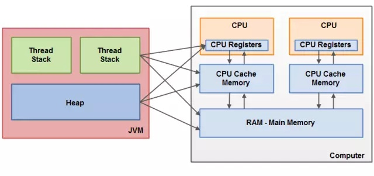


从抽象的角度来看，JMM定义了线程和主内存之间的抽象关系：

- 线程之间的共享变量存储在主内存（Main Memory）中
- 每个线程都有一个私有的本地内存（Local Memory），本地内存是JMM的一个抽象概念，并不真实存在，它涵盖了缓存、写缓冲区、寄存器以及其他的硬件和编译器优化。本地内存中存储了该线程以读/写共享变量的拷贝副本。
- 从更低的层次来说，主内存就是硬件的内存，而为了获取更好的运行速度，虚拟机及硬件系统可能会让工作内存优先存储于寄存器和高速缓存中。
- Java内存模型中的线程的工作内存（working memory）是cpu的寄存器和高速缓存的抽象描述。而JVM的静态内存储模型（JVM内存模型）只是一种对内存的物理划分而已，它只局限在内存，而且只局限在JVM的内存。

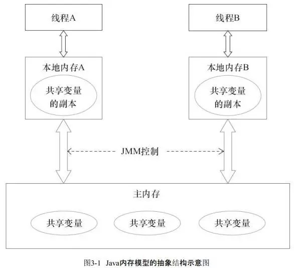

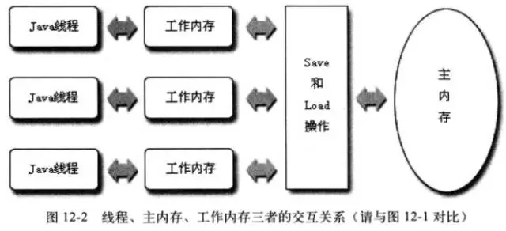


#### JMM模型下的线程间通信

线程间通信必须要经过主内存。

如下，如果线程A与线程B之间要通信的话，必须要经历下面2个步骤：

1）线程A把本地内存A中更新过的共享变量刷新到主内存中去。

2）线程B到主内存中去读取线程A之前已更新过的共享变量。

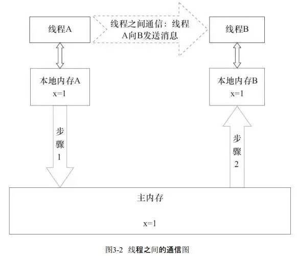

关于主内存与工作内存之间的具体交互协议，即一个变量如何从主内存拷贝到工作内存、如何从工作内存同步到主内存之间的实现细节，Java内存模型定义了以下八种操作来完成：

- **lock（锁定）**：作用于主内存的变量，把一个变量标识为一条线程独占状态。
- **unlock（解锁）**：作用于主内存变量，把一个处于锁定状态的变量释放出来，释放后的变量才可以被其他线程锁定。
- **read（读取）**：作用于主内存变量，把一个变量值从主内存传输到线程的工作内存中，以便随后的load动作使用
- **load（载入）**：作用于工作内存的变量，它把read操作从主内存中得到的变量值放入工作内存的变量副本中。
- **use（使用）**：作用于工作内存的变量，把工作内存中的一个变量值传递给执行引擎，每当虚拟机遇到一个需要使用变量的值的字节码指令时将会执行这个操作。
- **assign（赋值）**：作用于工作内存的变量，它把一个从执行引擎接收到的值赋值给工作内存的变量，每当虚拟机遇到一个给变量赋值的字节码指令时执行这个操作。
- **store（存储）**：作用于工作内存的变量，把工作内存中的一个变量的值传送到主内存中，以便随后的write的操作。
- **write（写入）**：作用于主内存的变量，它把store操作从工作内存中一个变量的值传送到主内存的变量中。

Java内存模型还规定了在执行上述八种基本操作时，必须满足如下规则：

- 如果要把一个变量从主内存中复制到工作内存，就需要按顺寻地执行read和load操作， 如果把变量从工作内存中同步回主内存中，就要按顺序地执行store和write操作。但Java内存模型只要求上述操作必须按顺序执行，而没有保证必须是连续执行。
- 不允许read和load、store和write操作之一单独出现
- 不允许一个线程丢弃它的最近assign的操作，即变量在工作内存中改变了之后必须同步到主内存中。
- 不允许一个线程无原因地（没有发生过任何assign操作）把数据从工作内存同步回主内存中。
- 一个新的变量只能在主内存中诞生，不允许在工作内存中直接使用一个未被初始化（load或assign）的变量。即就是对一个变量实施use和store操作之前，必须先执行过了assign和load操作。
- 一个变量在同一时刻只允许一条线程对其进行lock操作，但lock操作可以被同一条线程重复执行多次，多次执行lock后，只有执行相同次数的unlock操作，变量才会被解锁。lock和unlock必须成对出现
- 如果对一个变量执行lock操作，将会清空工作内存中此变量的值，在执行引擎使用这个变量前需要重新执行load或assign操作初始化变量的值
- 如果一个变量事先没有被lock操作锁定，则不允许对它执行unlock操作；也不允许去unlock一个被其他线程锁定的变量。
- 对一个变量执行unlock操作之前，必须先把此变量同步到主内存中（执行store和write操作）。

#### Java内存模型解决的问题

当对象和变量被存放在计算机中各种不同的内存区域中时，就可能会出现一些具体的问题。Java内存模型建立所围绕的问题：在多线程并发过程中，如何处理多线程读同步问题与可见性（多线程缓存与指令重排序）、多线程写同步问题与原子性（多线程竞争race condition）。

**1、多线程读同步与可见性**

**可见性（共享对象可见性）**：线程对共享变量修改的可见性。当一个线程修改了共享变量的值，其他线程能够立刻得知这个修改

**线程缓存导致的可见性问题：**

如果两个或者更多的线程在没有正确的使用volatile声明或者同步的情况下共享一个对象，一个线程更新这个共享对象可能对其它线程来说是不可见的：共享对象被初始化在主存中。跑在CPU上的一个线程将这个共享对象读到CPU缓存中，然后修改了这个对象。只要CPU缓存没有被刷新会主存，对象修改后的版本对跑在其它CPU上的线程都是不可见的。这种方式可能导致每个线程拥有这个共享对象的私有拷贝，每个拷贝停留在不同的CPU缓存中。

下图示意了这种情形。跑在左边CPU的线程拷贝这个共享对象到它的CPU缓存中，然后将count变量的值修改为2。这个修改对跑在右边CPU上的其它线程是不可见的，因为修改后的count的值还没有被刷新回主存中去。


解决这个内存可见性问题你可以使用：

- Java中的volatile关键字：volatile关键字可以保证直接从主存中读取一个变量，如果这个变量被修改后，总是会被写回到主存中去。Java内存模型是通过在变量修改后将新值同步回主内存，在变量读取前从主内存刷新变量值这种依赖主内存作为传递媒介的方式来实现可见性的，无论是普通变量还是volatile变量都是如此，普通变量与volatile变量的区别是：volatile的特殊规则保证了新值能立即同步到主内存，以及每个线程在每次使用volatile变量前都立即从主内存刷新。因此我们可以说volatile保证了多线程操作时变量的可见性，而普通变量则不能保证这一点。
- Java中的synchronized关键字：同步快的可见性是由“如果对一个变量执行lock操作，将会清空工作内存中此变量的值，在执行引擎使用这个变量前需要重新执行load或assign操作初始化变量的值”、“对一个变量执行unlock操作之前，必须先把此变量同步回主内存中（执行store和write操作）”这两条规则获得的。
- Java中的final关键字：final关键字的可见性是指，被final修饰的字段在构造器中一旦被初始化完成，并且构造器没有把“this”的引用传递出去（this引用逃逸是一件很危险的事情，其他线程有可能通过这个引用访问到“初始化了一半”的对象），那么在其他线程就能看见final字段的值（无须同步）

**重排序导致的可见性问题：**

Java程序中天然的有序性可以总结为一句话：如果在本地线程内观察，所有操作都是有序的（“线程内表现为串行”(Within-Thread As-If-Serial Semantics)）；如果在一个线程中观察另一个线程，所有操作都是无序的（“指令重排序”现象和“线程工作内存与主内存同步延迟”现象）。

Java语言提供了volatile和synchronized两个关键字来保证线程之间操作的有序性：

- volatile关键字本身就包含了禁止指令重排序的语义
- synchronized则是由“一个变量在同一个时刻只允许一条线程对其进行lock操作”这条规则获得的，这个规则决定了持有同一个锁的两个同步块只能串行地进入

**指令序列的重排序：**

1）编译器优化的重排序。编译器在不改变单线程程序语义的前提下，可以重新安排语句的执行顺序。

2）指令级并行的重排序。现代处理器采用了指令级并行技术（Instruction-LevelParallelism，ILP）来将多条指令重叠执行。如果不存在数据依赖性，处理器可以改变语句对应机器指令的执行顺序。

3）内存系统的重排序。由于处理器使用缓存和读/写缓冲区，这使得加载和存储操作看上去可能是在乱序执行。

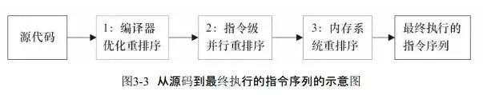

每个处理器上的写缓冲区，仅仅对它所在的处理器可见。这会导致处理器执行内存操作的顺序可能会与内存实际的操作执行顺序不一致。由于现代的处理器都会使用写缓冲区，因此现代的处理器都会允许对写-读操作进行重排序：

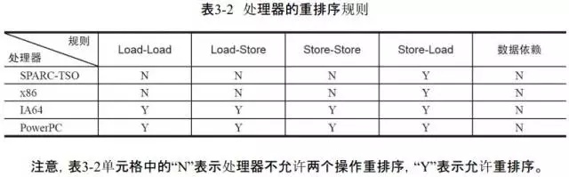

**数据依赖：**

编译器和处理器在重排序时，会遵守数据依赖性，编译器和处理器不会改变存在数据依赖关系的两个操作的执行顺序。（这里所说的数据依赖性仅针对单个处理器中执行的指令序列和单个线程中执行的操作，不同处理器之间和不同线程之间的数据依赖性不被编译器和处理器考虑）

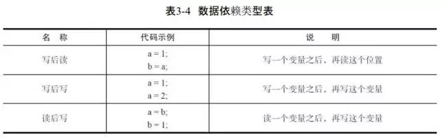

**指令重排序对内存可见性的影响：**

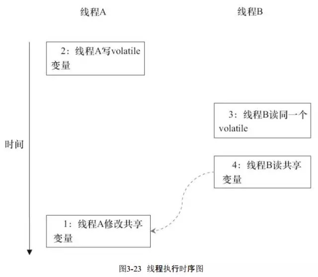

当1和2之间没有数据依赖关系时，1和2之间就可能被重排序（3和4类似）。这样的结果就是：读线程B执行4时，不一定能看到写线程A在执行1时对共享变量的修改。

**指令重排序改变多线程程序的执行结果例子：**

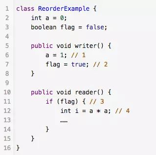

flag变量是个标记，用来标识变量a是否已被写入。这里假设有两个线程A和B，A首先执行writer()方法，随后B线程接着执行reader()方法。线程B在执行操作4时，能否看到线程A在操作1对共享变量a的写入呢？

答案是：不一定能看到。

由于操作1和操作2没有数据依赖关系，编译器和处理器可以对这两个操作重排序；同样，操作3和操作4没有数据依赖关系，编译器和处理器也可以对这两个操作重排序。

**as-if-serial语义：**

不管怎么重排序（编译器和处理器为了提高并行度），（单线程）程序的执行结果不能被改变。（编译器、runtime和处理器都必须遵守as-if-serial语义）

**happens before：**

从JDK 5开始，Java使用新的JSR-133内存模型，JSR-133使用happens-before的概念来阐述操作之间的内存可见性：在JMM中，如果一个操作执行的结果需要对另一个操作可见（两个操作既可以是在一个线程之内，也可以是在不同线程之间），那么这两个操作之间必须要存在happens-before关系：

- 程序顺序规则：一个线程中的每个操作，happens-before于该线程中的任意后续操作。
- 监视器锁规则：对一个锁的解锁，happens-before于随后对这个锁的加锁。
- volatile变量规则：对一个volatile域的写，happens-before于任意后续对这个volatile域的读。
- 传递性：如果A happens-before B，且B happens-before C，那么A happens-before C。

一个happens-before规则对应于一个或多个编译器和处理器重排序规则

**内存屏障禁止特定类型的处理器重排序：**

重排序可能会导致多线程程序出现内存可见性问题。对于处理器重排序，JMM的处理器重排序规则会要求Java编译器在生成指令序列时，插入特定类型的内存屏障（Memory Barriers，Intel称之为Memory Fence）指令，通过内存屏障指令来禁止特定类型的处理器重排序。通过禁止特定类型的编译器重排序和处理器重排序，为程序员提供一致的内存可见性保证。

为了保证内存可见性，Java编译器在生成指令序列的适当位置会插入内存屏障指令来禁止特定类型的处理器重排序。

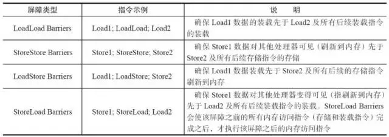

StoreLoad Barriers是一个“全能型”的屏障，它同时具有其他3个屏障的效果。现代的多处理器大多支持该屏障（其他类型的屏障不一定被所有处理器支持）。执行该屏障开销会很昂贵，因为当前处理器通常要把写缓冲区中的数据全部刷新到内存中（Buffer Fully Flush）。

**2、多线程写同步与原子性**

**多线程竞争（Race Conditions）问题**：当读，写和检查共享变量时出现race conditions。

如果两个或者更多的线程共享一个对象，多个线程在这个共享对象上更新变量，就有可能发生race conditions。

想象一下，如果线程A读一个共享对象的变量count到它的CPU缓存中。再想象一下，线程B也做了同样的事情，但是往一个不同的CPU缓存中。现在线程A将count加1，线程B也做了同样的事情。现在count已经被增加了两次，每个CPU缓存中一次。如果这些增加操作被顺序的执行，变量count应该被增加两次，然后原值+2被写回到主存中去。然而，两次增加都是在没有适当的同步下并发执行的。无论是线程A还是线程B将count修改后的版本写回到主存中取，修改后的值仅会被原值大1，尽管增加了两次：

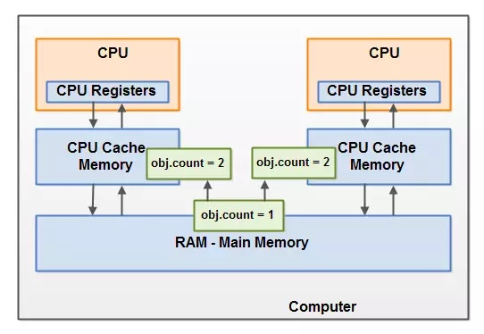

解决这个问题可以使用Java同步块。一个同步块可以保证在同一时刻仅有一个线程可以进入代码的临界区。同步块还可以保证代码块中所有被访问的变量将会从主存中读入，当线程退出同步代码块时，所有被更新的变量都会被刷新回主存中去，不管这个变量是否被声明为volatile。

**使用原子性保证多线程写同步问题：**

**原子性：**指一个操作是按原子的方式执行的。要么该操作不被执行；要么以原子方式执行，即执行过程中不会被其它线程中断。

- Reads and writes are atomic for reference variables and for most primitive variables (all types except long and double).
- Reads and writes are atomic for all variables declared **volatile** (including long and double variables).

（[https://docs.oracle.com/javase/tutorial/essential/concurrency/atomic.html](https://link.zhihu.com/?target=https%3A//docs.oracle.com/javase/tutorial/essential/concurrency/atomic.html)）

**实现原子性：**

- 由Java内存模型来直接保证的原子性变量操作包括read、load、assign、use、store、write，我们大致可以认为基本数据类型变量、引用类型变量、声明为volatile的任何类型变量的访问读写是具备原子性的（long和double的非原子性协定：对于64位的数据，如long和double，Java内存模型规范允许虚拟机将没有被volatile修饰的64位数据的读写操作划分为两次32位的操作来进行，即允许虚拟机实现选择可以不保证64位数据类型的load、store、read和write这四个操作的原子性，即如果有多个线程共享一个并未声明为volatile的long或double类型的变量，并且同时对它们进行读取和修改操作，那么某些线程可能会读取到一个既非原值，也不是其他线程修改值的代表了“半个变量”的数值。但由于目前各种平台下的商用虚拟机几乎都选择把64位数据的读写操作作为原子操作来对待，因此在编写代码时一般也不需要将用到的long和double变量专门声明为volatile）。这些类型变量的读、写天然具有原子性，但类似于 “基本变量++” / “volatile++” 这种复合操作并没有原子性。
- 如果应用场景需要一个更大范围的原子性保证，需要使用同步块技术。Java内存模型提供了lock和unlock操作来满足这种需求。虚拟机提供了字节码指令monitorenter和monitorexist来隐式地使用这两个操作，这两个字节码指令反映到Java代码中就是同步快——synchronized关键字。

#### JMM对特殊Java语义的特殊规则支持

[volatile总结](https://link.zhihu.com/?target=http%3A//mp.weixin.qq.com/s%3F__biz%3DMzI3NzM2OTQ5Mg%3D%3D%26mid%3D2247484289%26idx%3D1%26sn%3Dbdf6721e01c613bfb1458a8584e80800%26chksm%3Deb66047adc118d6c395c14e5b953686bfdfac93fd6fa8c0731bb89aadd7437bba800d034659d%26scene%3D21%23wechat_redirect) （保证内存可见性：Lock前缀的指令、内存屏障禁止重排序）

[synchronized总结](https://link.zhihu.com/?target=http%3A//mp.weixin.qq.com/s%3F__biz%3DMzI3NzM2OTQ5Mg%3D%3D%26mid%3D2247484280%26idx%3D1%26sn%3D8de305338c5ab348c3e2a784084e4306%26chksm%3Deb660483dc118d95e9bcde15a01103f818ed2fd399989f36dc2d57740a305e91cf986d4f5a64%26scene%3D21%23wechat_redirect) （保证内存可见性和操作原子性：互斥锁；锁优化）


### java多线程的三大核心

```java
> 原子性
> 可见性
> 顺序性
```

### 原子性

`Java` 的原子性就和数据库事务的原子性差不多，一个操作中要么全部执行成功或者失败。

`JMM` 只是保证了基本的原子性，但类似于 `i++` 之类的操作，看似是原子操作，其实里面涉及到:

- 获取 i 的值。
- 自增。
- 再赋值给 i。

这三步操作，所以想要实现 `i++` 这样的原子操作就需要用到 `synchronized` 或者是 `lock` 进行加锁处理。

如果是基础类的自增操作可以使用 `AtomicInteger` 这样的原子类来实现(其本质是利用了 `CPU` 级别的 的 `CAS` 指令来完成的)。

其中用的最多的方法就是: `incrementAndGet()` 以原子的方式自增。 源码如下:

```java
public final long incrementAndGet() {
        for (;;) {
            long current = get();
            long next = current + 1;
            if (compareAndSet(current, next))
                return next;
        }
    }
```

首先是获得当前的值，然后自增 +1。接着则是最核心的 `compareAndSet() `来进行原子更新。

```java
public final boolean compareAndSet(long expect, long update) {
        return unsafe.compareAndSwapLong(this, valueOffset, expect, update);
    }
```

其逻辑就是判断当前的值是否被更新过，是否等于 `current`，如果等于就说明没有更新过然后将当前的值更新为 `next`，如果不等于则返回`false` 进入循环，直到更新成功为止。

还有其中的 `get()` 方法也很关键，返回的是当前的值，当前值用了 `volatile` 关键词修饰，保证了内存可见性。

```java
 private volatile int value;
```


### 可见性

现代计算机中，由于 `CPU` 直接从主内存中读取数据的效率不高，所以都会对应的 `CPU` 高速缓存，先将主内存中的数据读取到缓存中，线程修改数据之后首先更新到缓存，之后才会更新到主内存。如果此时还没有将数据更新到主内存其他的线程此时来读取就是修改之前的数据。


如上图所示。

`volatile` 关键字就是用于保证内存可见性，当线程A更新了 volatile 修饰的变量时，它会立即刷新到主线程，并且将其余缓存中该变量的值清空，导致其余线程只能去主内存读取最新值。

使用 `volatile` 关键词修饰的变量每次读取都会得到最新的数据，不管哪个线程对这个变量的修改都会立即刷新到主内存。

`synchronized`和加锁也能能保证可见性，实现原理就是在释放锁之前其余线程是访问不到这个共享变量的。但是和 `volatile` 相比开销较大。


### 顺序性

以下这段代码:

```java
int a = 100 ; //1
int b = 200 ; //2
int c = a + b ; //3
```

正常情况下的执行顺序应该是 `1>>2>>3`。但是有时 `JVM` 为了提高整体的效率会进行==指令重排==导致执行的顺序可能是 `2>>1>>3`。但是 `JVM` 也不能是什么都进行重排，是在保证最终结果和代码顺序执行结果一致的情况下才可能进行重排。

重排在单线程中不会出现问题，但在多线程中会出现数据不一致的问题。

Java 中可以使用 `volatile` 来保证顺序性，`synchronized 和 lock` 也可以来保证有序性，和保证原子性的方式一样，通过同一段时间只能一个线程访问来实现的。

除了通过 `volatile` 关键字显式的保证顺序之外， `JVM` 还通过 `happen-before` 原则来隐式的保证顺序性。

其中有一条就是适用于 `volatile` 关键字的，针对于 `volatile` 关键字的写操作肯定是在读操作之前，也就是说读取的值肯定是最新的。

### volatile 的应用

#### 双重检查锁的单例模式

可以用 `volatile` 实现一个双重检查锁的单例模式：

```java
  public class Singleton {
        private static volatile Singleton singleton;

        private Singleton() {
        }

        public static Singleton getInstance() {
            if (singleton == null) {
                synchronized (Singleton.class) {
                    if (singleton == null) {
                        singleton = new Singleton();
                    }
                }
            }
            return singleton;
        }

    }
```

这里的 `volatile` 关键字主要是为了防止指令重排。 如果不用 `volatile` ，`singleton = new Singleton();`，这段代码其实是分为三步：

- 分配内存空间。(1)
- 初始化对象。(2)
- 将 `singleton` 对象指向分配的内存地址。(3)

加上 `volatile` 是为了让以上的三步操作顺序执行，反之有可能第三步在第二步之前被执行就有可能导致某个线程拿到的单例对象还没有初始化，以致于使用报错。

#### 控制停止线程的标记

```java
  private volatile boolean flag ;
    private void run(){
        new Thread(new Runnable() {
            @Override
            public void run() {
                while (flag) {
                    doSomeThing();
                }
            }
        });
    }

    private void stop(){
        flag = false ;
    }
```


这里如果没有用 volatile 来修饰 flag ，就有可能其中一个线程调用了 `stop()`方法修改了 flag 的值并不会立即刷新到主内存中，导致这个循环并不会立即停止。

这里主要利用的是 `volatile` 的内存可见性。

总结一下:

- `volatile` 关键字只能保证可见性，顺序性，**不能保证原子性**。

### 异步同步，阻塞和非阻塞

#### 1.同步与异步

同步和异步关注的是**消息通信机制** (synchronous communication/ asynchronous communication)

#### 2.阻塞与非阻塞

阻塞和非阻塞关注的是**程序在等待调用结果（消息，返回值）时的状态.**


`unix`网络编程中将IO模型分为5类：阻塞IO，非阻塞IO，IO复用，信号驱动，异步IO。

1. 阻塞IO就是那种recv, read，一直等，等到有了数据才返回；
2. 非阻塞IO就是立即返回，设置描述符为非阻塞，但是要进程自己一直检查是否可读；
3. IO复用其实也是阻塞的，不过可以用来等很多描述符，比起阻塞有了进步，可以算有点异步了，但需要阻塞着检查是否可读。**对同一个描述符的IO操作也是有序的。**
4. 信号驱动采用信号机制等待，有了更多的进步，不用监视描述符了，而且不用阻塞着等待数据到来，被动等待信号通知，由信号处理程序处理。**但对同一个描述符的IO操作还是有序的。**
5. 异步IO，发送IO请求后，不用等了，也不再需要发送IO请求获取结果了。等到通知后，其实是系统帮你把数据读取好了的，**你等到的通知也不再是要求你去读写IO了，而是告诉你IO请求过程已经结束了**。你要做的就是可以处理数据了。且同一个描述符上可能同时存在很多请求。(对应上面那个买书例子中，就是送书到我家，我直接看书就行了，不需要再去跑一趟了)。

其中IO服用和信号驱动，在处理业务逻辑上可以说有异步，但在IO操作层面上来说还是同步的

posix.1严格定义的异步IO是要求没有任何一点阻塞，而上述的前面四个（阻塞IO，非阻塞IO，IO复用，信号驱动）都不同程度阻塞了，而且都有一个共同的阻塞： 内核拷贝数据到进程空间的这段时间需要等待。

# 22.图形化用户界面  

 