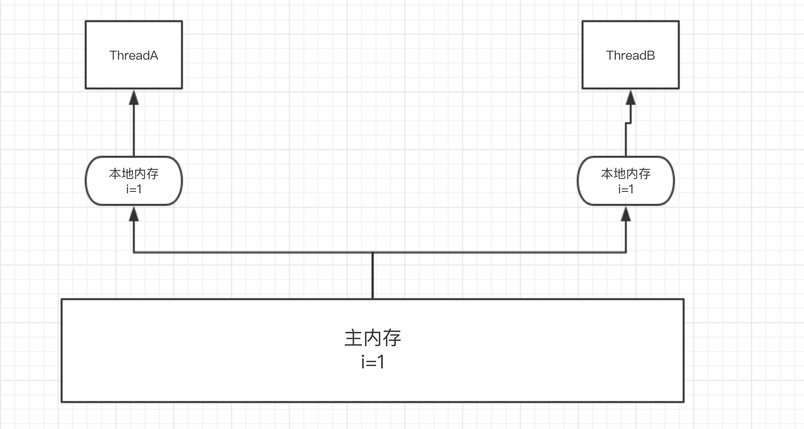

[TOC]
# 1.对象导论

# 2.一切都是对象
# 3.操作符
# 4.控制执行流程
# 5.初始化与清理
# 6.访问控制权限
# 7.复用类
# 8.多态
# 9.接口
# 10.内部类
# 11.持有对象
# 12.通过异常处理错误
# 13.字符串
## 不可变String
>String对象是不可变的，String类的每一个看起来修改String值的方法，实际上都是创建了一个新的String对象------**不可变性**
### 重载"+"和StringBuilder
>可以给String对象添加任意多的别名，因为**String对象具有只读特性**，不会对他的应用有任何影响
>坏处：**会带来一定的效率问题**，
>重载：一个操作符在用于特定的类时，被赋予了特殊的意义。
```
Java中仅有的两个重载的操作符:
1、“+”
2、“+=”
```
```
public class Connection{
    public static void main(String[] args){
        String mango = "mango";
        String s = "abc"+mango+"def"+47;
        System.out.print(s);
    }
}
```
生成最终的String对象过程中产生了一堆需要垃圾回收的中间对象

>jvm自动的引入了`StringBuilder`类
### 无意识的递归
`如何使用toString()打印出对象的地址`
>使用this关键字
```
public class InfiniteRecursion{
    public static void main(String[] args){
        List<InfiniteRecuresion> v = 
            new ArrayList<InfiniteRecuresion>();
        for(int i = 0; i < 10; i++)
            v.add(new InfiniteRecursion();
        System.out.print(v);
    }
    public String toString(){
    //这样写有异常，+this会自动调用this.toString()方法，就发生了递归调用
    //    return "InfiniteRecursion address:"+this+"\n";
        return "InfiniteRecursion address:"+super.toString()+"\n";
    }
}
```
String类的方法返回值：
* 内容没有改变，返回原对象的引用
* 内容改变了，返回了一个新的引用
### 格式化输出
### printf()用法
### System.out.format()
### Formatter类
Java中管理所有的格式化功能，可以看做一个**翻译器**。
### 格式化说明符
### String.format()
应用场景：只需要使用此意format()方法时，String.format()用起来更方便
### 正则表达式
>正则表达式  包含的各种字符，字符类，逻辑操作符，量词等等需要再做一个研究，理解并学会使用正则
>**Pattern.compile()的另外一个版本**：接受一个标价参数

| 编译标记                     | 效果 |
| ---------------------------- | ---- |
| Pattern.CANON_EQ             |      |
| Pattern.CASE_INSENSITIVE(?i) |      |
| Pattern.CONMMENTS(?x)        |      |
| Pattern.DOTALL(?s)           |      |
| Pattern.MUTILINE(?m)         |      |
| Pattern.UNICODE_CSAE(?u)     |      |
| Pattern.UNIX_LINES(?d)       |      |
**匹配**
**分割**
**替换**
**第四种，后续添加**


### Pattern和Matcher
相比较于功能有限的String类，正则表达式对象功能更强大

## 扫描输入
> 使用StringReader将String转化为可读的流对象，使用这个对象来构造BufferReader对象，使用readLine()方法，一次读取一行文本
> Scanner类：
#### Scanner定界符
默认：根据空白字符对输入进行分词
支持：通过正则表达式指定定界符
~~~
    import java.util.*;
    
    public class ScannerDelimiter{
        public static void main(String[] args){
            Scanner scanner = new Scanner("12, 42, 78, 99, 42");
            scanner.useDelimiter("\\s*,\\s*");
            while(scanner.hasNextInt())
                System.out.println(scanner.nextInt());
        }
    }
~~~
`以上的代码制定了  ","为定界符，包括逗号前后任意的空白字符`
### 使用正则表达式扫描
>除了能够扫描基本类型之外，还可以用自定义的正则表达式进行扫描
## 14.类型信息
`运行时类型信息使得你可以在程序运行时发现和使用类型信息`
`RTTI：Run-Time Type Identification
通过运行时类型信息程序能够使用基类的指针或引用来检查这些指针或引用所指的对象的实际派生类型`
>Java是如何在运行时识别对象和类的信息的：
>1、"传统的"的RTTI，假定我们在编译时已经知道了所有的信息
>2、"反射"机制，允许我们在运行时发现和使用类的信息
### 为什么使用RTTI
>RTTI名字的含义：在运行时，识别一个对象的类型   

`RTTI和反射的区别？？？？？`
## Class对象
Java使用Class对象来执行其RTTI
>类是程序的一部分，每个类都有一个Class对象，当编写并且编译了一个新类，就会产生一个Class对象(更恰当的说，是保存在一个同名的.class文件中)，为了生成这个对象，运行这个程序的Java虚拟机(JVM)将使用被称为"类加载器"的子系统
***
>类加载器子系统实际上可以包含一条类加载链，但是只有一个`原生类加载器`，他是JVM实现的一部分。原生类加载器加载的是所谓的`可信类`，包括Java API类，通常是通过本地盘加载的。在这条链中，通常是不需要添加额外的类加载器，但是如果你有特殊的需求，那么你有一种方式可以加载额外的类加载器
***
>所有的类都是在对其第一次使用的时候动态的加载到JVM中的，当程序创建第一个对类的静态成员的引用时，就会加载这个类。`这个证明构造器也是类的静态方法，即使在构造器之前并没有使用static关键字。因此使用new操作符创建类的新对象也会当做对类的静态成员的引用。`

因此，Java程序在它开始运行之前并非完全被加载。如果尚未加载，默认的类加载器就会根据类名查找.class文件。这个字节码被加载时，它们会接受验证，确保没有被破坏，并且不包含不良Java代码（这是Java中用于安全防范目的的措施之一）。一  
***

# 15.泛型
# 16.数组
# 17.容器深入研究
# 18.Java I/O系统
# 19.枚举类型
# 20.注解
# 21.并发

## java多线程的三大核心

>原子性
>可见性
>顺序性


### 原子性

`Java` 的原子性就和数据库事务的原子性差不多，一个操作中要么全部执行成功或者失败。

`JMM` 只是保证了基本的原子性，但类似于 `i++` 之类的操作，看似是原子操作，其实里面涉及到:

> 
>
> JMM(Java Memory Model,JMM)Java虚拟机规范中定义了Java内存模型（Java Memory Model，JMM），用于屏蔽掉各种硬件和操作系统的内存访问差异，以实现让Java程序在各种平台下都能达到一致的并发效果，JMM规范了Java虚拟机与计算机内存是如何协同工作的：规定了一个线程如何和何时可以看到由其他线程修改过后的共享变量的值，以及在必须时如何同步的访问共享变量。

- 获取 i 的值。
- 自增。
- 再赋值给 i。

这三步操作，所以想要实现 `i++` 这样的原子操作就需要用到 `synchronized` 或者是 `lock` 进行加锁处理。

如果是基础类的自增操作可以使用 `AtomicInteger` 这样的原子类来实现(其本质是利用了 `CPU` 级别的 的 `CAS` 指令来完成的)。

其中用的最多的方法就是: `incrementAndGet()` 以原子的方式自增。 源码如下:

```java
public final long incrementAndGet() {
        for (;;) {
            long current = get();
            long next = current + 1;
            if (compareAndSet(current, next))
                return next;
        }
    }
```

首先是获得当前的值，然后自增 +1。接着则是最核心的 `compareAndSet() `来进行原子更新。

```java
public final boolean compareAndSet(long expect, long update) {
        return unsafe.compareAndSwapLong(this, valueOffset, expect, update);
    }
```

其逻辑就是判断当前的值是否被更新过，是否等于 `current`，如果等于就说明没有更新过然后将当前的值更新为 `next`，如果不等于则返回`false` 进入循环，直到更新成功为止。

还有其中的 `get()` 方法也很关键，返回的是当前的值，当前值用了 `volatile` 关键词修饰，保证了内存可见性。

```java
 private volatile int value;
```


### 可见性

现代计算机中，由于 `CPU` 直接从主内存中读取数据的效率不高，所以都会对应的 `CPU` 高速缓存，先将主内存中的数据读取到缓存中，线程修改数据之后首先更新到缓存，之后才会更新到主内存。如果此时还没有将数据更新到主内存其他的线程此时来读取就是修改之前的数据。



如上图所示。

`volatile` 关键字就是用于保证内存可见性，当线程A更新了 volatile 修饰的变量时，它会立即刷新到主线程，并且将其余缓存中该变量的值清空，导致其余线程只能去主内存读取最新值。

使用 `volatile` 关键词修饰的变量每次读取都会得到最新的数据，不管哪个线程对这个变量的修改都会立即刷新到主内存。

`synchronized`和加锁也能能保证可见性，实现原理就是在释放锁之前其余线程是访问不到这个共享变量的。但是和 `volatile` 相比开销较大。


### 顺序性

以下这段代码:

```java
int a = 100 ; //1
int b = 200 ; //2
int c = a + b ; //3
```

正常情况下的执行顺序应该是 `1>>2>>3`。但是有时 `JVM` 为了提高整体的效率会进行==指令重排==导致执行的顺序可能是 `2>>1>>3`。但是 `JVM` 也不能是什么都进行重排，是在保证最终结果和代码顺序执行结果一致的情况下才可能进行重排。

重排在单线程中不会出现问题，但在多线程中会出现数据不一致的问题。

Java 中可以使用 `volatile` 来保证顺序性，`synchronized 和 lock` 也可以来保证有序性，和保证原子性的方式一样，通过同一段时间只能一个线程访问来实现的。

除了通过 `volatile` 关键字显式的保证顺序之外， `JVM` 还通过 `happen-before` 原则来隐式的保证顺序性。

其中有一条就是适用于 `volatile` 关键字的，针对于 `volatile` 关键字的写操作肯定是在读操作之前，也就是说读取的值肯定是最新的。

### volatile 的应用

#### 双重检查锁的单例模式

可以用 `volatile` 实现一个双重检查锁的单例模式：

```java
  public class Singleton {
        private static volatile Singleton singleton;

        private Singleton() {
        }

        public static Singleton getInstance() {
            if (singleton == null) {
                synchronized (Singleton.class) {
                    if (singleton == null) {
                        singleton = new Singleton();
                    }
                }
            }
            return singleton;
        }

    }
```

这里的 `volatile` 关键字主要是为了防止指令重排。 如果不用 `volatile` ，`singleton = new Singleton();`，这段代码其实是分为三步：

- 分配内存空间。(1)
- 初始化对象。(2)
- 将 `singleton` 对象指向分配的内存地址。(3)

加上 `volatile` 是为了让以上的三步操作顺序执行，反之有可能第三步在第二步之前被执行就有可能导致某个线程拿到的单例对象还没有初始化，以致于使用报错。

#### 控制停止线程的标记

```java
  private volatile boolean flag ;
    private void run(){
        new Thread(new Runnable() {
            @Override
            public void run() {
                while (flag) {
                    doSomeThing();
                }
            }
        });
    }

    private void stop(){
        flag = false ;
    }
```


这里如果没有用 volatile 来修饰 flag ，就有可能其中一个线程调用了 `stop()`方法修改了 flag 的值并不会立即刷新到主内存中，导致这个循环并不会立即停止。

这里主要利用的是 `volatile` 的内存可见性。

总结一下:

- `volatile` 关键字只能保证可见性，顺序性，**不能保证原子性**。

### 异步同步，阻塞和非阻塞

#### 1.同步与异步

同步和异步关注的是**消息通信机制** (synchronous communication/ asynchronous communication)

#### 2.阻塞与非阻塞

阻塞和非阻塞关注的是**程序在等待调用结果（消息，返回值）时的状态.**


`unix`网络编程中将IO模型分为5类：阻塞IO，非阻塞IO，IO复用，信号驱动，异步IO。

1. 阻塞IO就是那种recv, read，一直等，等到有了数据才返回；
2. 非阻塞IO就是立即返回，设置描述符为非阻塞，但是要进程自己一直检查是否可读；
3. IO复用其实也是阻塞的，不过可以用来等很多描述符，比起阻塞有了进步，可以算有点异步了，但需要阻塞着检查是否可读。**对同一个描述符的IO操作也是有序的。**
4. 信号驱动采用信号机制等待，有了更多的进步，不用监视描述符了，而且不用阻塞着等待数据到来，被动等待信号通知，由信号处理程序处理。**但对同一个描述符的IO操作还是有序的。**
5. 异步IO，发送IO请求后，不用等了，也不再需要发送IO请求获取结果了。等到通知后，其实是系统帮你把数据读取好了的，**你等到的通知也不再是要求你去读写IO了，而是告诉你IO请求过程已经结束了**。你要做的就是可以处理数据了。且同一个描述符上可能同时存在很多请求。(对应上面那个买书例子中，就是送书到我家，我直接看书就行了，不需要再去跑一趟了)。

其中IO服用和信号驱动，在处理业务逻辑上可以说有异步，但在IO操作层面上来说还是同步的

posix.1严格定义的异步IO是要求没有任何一点阻塞，而上述的前面四个（阻塞IO，非阻塞IO，IO复用，信号驱动）都不同程度阻塞了，而且都有一个共同的阻塞： 内核拷贝数据到进程空间的这段时间需要等待。

# 22.图形化用户界面