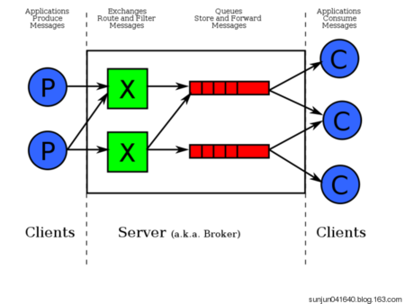

[TOC]

# 1.简介

RabbitMQ 是实现 AMQP（高级消息队列协议）的消息中间件的一种。 RabbitMQ 主要是为了实现系统之间的双向解耦而实现的。当**生产者大量产生数据时，消费者无法快速消费，那么需要一个中间层**。保存这个数据。

AMQP，即 Advanced Message Queuing Protocol，高级消息队列协议，是应用层协议的一个开放标准，为面向消息的中间件设计。消息中间件主要用于组件之间的解耦，消息的发送者无需知道消息使用者的存在，反之亦然。AMQP 的主要特征是面向消息、队列、路由（包括点对点和发布/订阅）、可靠性、安全。

RabbitMQ 是一个开源的 AMQP 实现，服务器端用Erlang语言编写，支持多种客户端，如：Python、Ruby、.NET、Java、JMS、C、PHP、ActionScript、XMPP、STOMP 等，支持 AJAX。用于在分布式系统中存储转发消息，在易用性、扩展性、高可用性等方面表现不俗。

## 1.1 相关概念

通常我们谈到队列服务, 会有三个概念： 发消息者、队列、收消息者，RabbitMQ 在这个基本概念之上, 多做了一层抽象, 在发消息者和 队列之间, 加入了交换器 (Exchange). 这样发消息者和队列就没有直接联系, 转而变成发消息者把消息给交换器, 交换器根据调度策略再把消息再给队列。



- 左侧 P 代表 生产者，也就是往 RabbitMQ 发消息的程序。
- 中间即是 RabbitMQ，*其中包括了 交换机 和 队列。*
- 右侧 C 代表 消费者，也就是往 RabbitMQ 拿消息的程序。

那么，*其中比较重要的概念有 4 个，分别为：虚拟主机，交换机，队列，和绑定。*

- 虚拟主机：一个虚拟主机持有一组交换机、队列和绑定。为什么需要多个虚拟主机呢？很简单， RabbitMQ 当中，**用户只能在虚拟主机的粒度进行权限控制**。因此，如果需要禁止A组访问B组的交换机/队列/绑定，必须为A和B分别创建一个虚拟主机。每一个 RabbitMQ 服务器都有一个默认的虚拟主机“/”。
- 交换机：*Exchange 用于转发消息，但是它不会做存储* ，如果没有 Queue bind 到 Exchange 的话，它会直接丢弃掉 Producer 发送过来的消息。
  这里有一个比较重要的概念：**路由键** 。消息到交换机的时候，交互机会转发到对应的队列中，那么究竟转发到哪个队列，就要根据该路由键。
- 绑定：也就是交换机需要和队列相绑定，这其中如上图所示，是多对多的关系。

### 交换机(Exchange)

交换机的功能主要是接收消息并且转发到绑定的队列，交换机不存储消息，在启用ack模式后，交换机找不到队列会返回错误。交换机有四种类型：Direct, topic, Headers and Fanout

- Direct：direct 类型的行为是"先匹配, 再投送". 即在绑定时设定一个 **routing_key**, 消息的**routing_key** 匹配时, 才会被交换器投送到绑定的队列中去.
- Topic：按规则转发消息（最灵活）
- Headers：设置 header attribute 参数类型的交换机
- Fanout：转发消息到所有绑定队列

#### 类型

##### **Direct Exchange**

Direct Exchange 是 RabbitMQ 默认的交换机模式，也是最简单的模式，根据key全文匹配去寻找队列。


第一个 X - Q1 就有一个 binding key，名字为 orange； X - Q2 就有 2 个 binding key，名字为 black 和 green。*当消息中的 路由键 和 这个 binding key 对应上的时候，那么就知道了该消息去到哪一个队列中。*

Ps：为什么 X 到 Q2 要有 black，green，2个 binding key呢，一个不就行了吗？ - 这个主要是因为可能又有 Q3，而Q3只接受 black 的信息，而Q2不仅接受black 的信息，还接受 green 的信息。

##### **Topic Exchange**

*Topic Exchange 转发消息主要是根据通配符。* 在这种交换机下，队列和交换机的绑定会定义一种路由模式，那么，通配符就要在这种路由模式和路由键之间匹配后交换机才能转发消息。

在这种交换机模式下：

- 路由键必须是一串字符，用句号（`.`） 隔开，比如说 `agreements.us`，或者 `agreements.eu.stockholm` 等。
- 路由模式必须包含一个 星号（`*`），主要用于匹配路由键指定位置的一个单词，比如说，一个路由模式是这样子：`agreements..b.*`，那么就只能匹配路由键是这样子的：第一个单词是 `agreements`，第四个单词是 b。 井号（#）就表示相当于一个或者多个单词，例如一个匹配模式是 `agreements.eu.berlin.#`，那么，以`agreements.eu.berlin `开头的路由键都是可以的。

具体代码发送的时候还是一样，第一个参数表示交换机，第二个参数表示 routing key，第三个参数即消息。如下：

```bash
rabbitTemplate.convertAndSend("testTopicExchange","key1.a.c.key2", " this is  RabbitMQ!");
```

topic 和 direct 类似, 只是匹配上支持了"模式", 在"点分"的 routing_key 形式中, 可以使用两个通配符:

- `*`表示一个词.
- `#`表示零个或多个词.

##### **Headers Exchange**

headers 也是根据规则匹配, 相较于 direct 和 topic 固定地使用 routing_key , headers 则是一个自定义匹配规则的类型.
在队列与交换器绑定时, 会设定一组键值对规则, 消息中也包括一组键值对( headers 属性), 当这些键值对有一对, 或全部匹配时, 消息被投送到对应队列.

##### **Fanout Exchange**

Fanout Exchange 消息广播的模式，不管路由键或者是路由模式，*会把消息发给绑定给它的全部队列*，如果配置了 routing_key 会被忽略。


```
概念介绍
Broker：broker(中间商)简单来说就是消息队列服务器实体。
Exchange：消息交换机，它指定消息按什么规则，路由到哪个队列。
Queue：消息队列载体，每个消息都会被投入到一个或多个队列。
Binding：绑定，它的作用就是把exchange和queue按照路由规则绑定起来。
Routing Key：路由关键字，exchange根据这个关键字进行消息投递。
vhost：虚拟主机，一个broker里可以开设多个vhost，用作不同用户的权限分离。
producer：消息生产者，就是投递消息的程序。
consumer：消息消费者，就是接受消息的程序。
channel：消息通道，在客户端的每个连接里，可建立多个channel，每个channel代表一个会话任务。
```


```
角色说明
超级管理员(administrator)
可登陆管理控制台，可查看所有的信息，并且可以对用户，策略(policy)进行操作。
监控者(monitoring)
可登陆管理控制台，同时可以查看rabbitmq节点的相关信息(进程数，内存使用情况，磁盘使用情况等)
策略制定者(policymaker)
可登陆管理控制台, 同时可以对policy进行管理。但无法查看节点的相关信息(上图红框标识的部分)。
普通管理者(management)
仅可登陆管理控制台，无法看到节点信息，也无法对策略进行管理。
其他
无法登陆管理控制台，通常就是普通的生产者和消费者。

```


## 整合处理和java相关的

