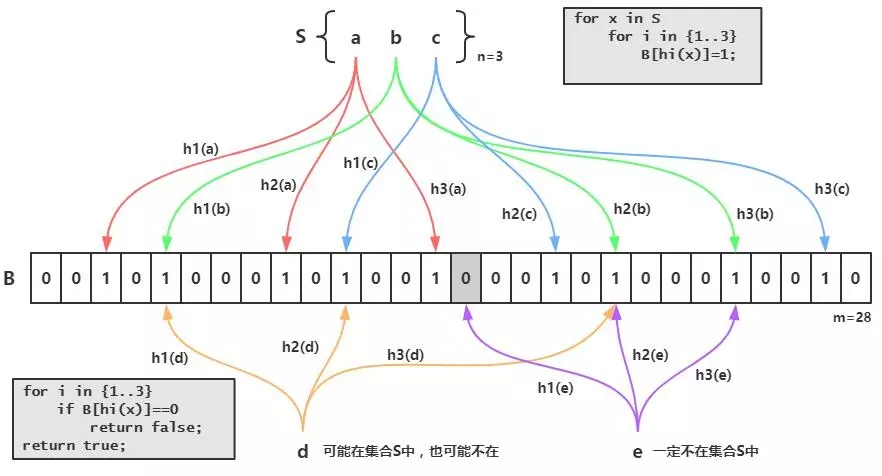
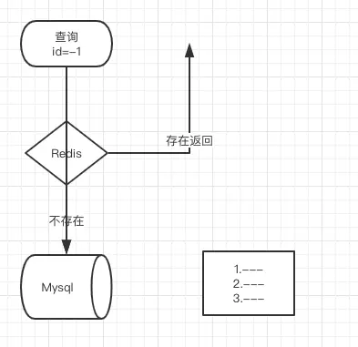
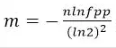

# redis基础

[toc]

[掘金--redis基础--敖丙]( https://juejin.im/post/5db69365518825645656c0de )

传统的关系型数据库如Mysql已经不能适用所有的场景了，比如秒杀的库存扣减，APP首页的访问流量高峰等等，都很容易把数据库打崩，所以引入了缓存中间件，目前市面上比较常用的缓存中间件有 **Redis** 和 **Memcached** 不过中和考虑了他们的优缺点，最后选择了Redis。

## 数据结构

String  Hash List  Set  Sorted 

疑问：每种数据结构的适合的应用场景？

看资料发现还有新的结构  ？

关键词 ：

HyperLogLog  

 Geo 

 Pub/Sub

BloomFilter

RedisSearch

Redis-ML

==缓存穿透==  --

BloomFilter -- 布隆过滤器

概念：布隆过滤器（英语：Bloom Filter）是1970年由一个叫布隆的小伙子提出的。它实际上是一个很长的二进制向量和一系列随机映射函数。布隆过滤器可以用于检索一个元素是否在一个集合中。它的优点是空间效率和查询时间都远远超过一般的算法，缺点是有一定的误识别率和删除困难。

布隆过滤器的原理是，当一个元素被加入集合时，通过K个散列函数将这个元素映射成一个位数组中的K个点，把它们置为1。检索时，我们只要看看这些点是不是都是1就（大约）知道集合中有没有它了：如果这些点有任何一个0，则被检元素一定不在；如果都是1，则被检元素很可能在。这就是布隆过滤器的基本思想。

Bloom Filter跟单哈希函数Bit-Map不同之处在于：Bloom Filter使用了k个哈希函数，每个字符串跟k个bit对应。从而降低了冲突的概率

## 缓存击透

### BloomFilter  缺点

bloom filter之所以能做到在时间和空间上的效率比较高，是因为牺牲了判断的准确率、删除的便利性

- 存在误判，可能要查到的元素并没有在容器中，但是hash之后得到的k个位置上值都是1。如果bloom filter中存储的是黑名单，那么可以通过建立一个白名单来存储可能会误判的元素。
- 删除困难。一个放入容器的元素映射到bit数组的k个位置上是1，删除的时候不能简单的直接置为0，可能会影响其他元素的判断。可以采用Counting Bloom Filter

## BloomFilter实现

布隆过滤器有许多实现与优化，Guava中就提供了一种Bloom Filter的实现。

在==使用bloom filter==时，绕不过的两点是==预估数据量n==以及==期望的误判率fpp==，

在==实现bloom filter==时，绕不过的两点就是==hash函数==的选取以及==bit数组的大小==。

对于一个确定的场景，我们预估要存的数据量为n，期望的误判率为fpp，然后需要计算我们需要的Bit数组的大小m，以及hash函数的个数k，并选择hash函数

### (1)Bit数组大小选择

 根据预估数据量n以及误判率fpp，bit数组大小的m的计算方式： 

### (2)哈希函数选择

 由预估数据量n以及bit数组长度m，可以得到一个hash函数的个数k：

