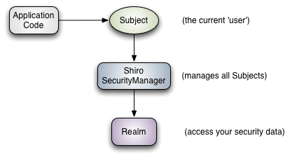
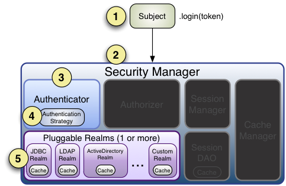

# shiro

[TOC]

## 简介

Apache Shiro是Java的一个安全框架。目前，使用Apache Shiro的人越来越多，因为它相当简单，对比Spring Security，可能没有Spring Security做的功能强大，但是在实际工作时可能并不需要那么复杂的东西，所以使用小而简单的Shiro就足够了。对于它俩到底哪个好，这个不必纠结，能更简单的解决项目问题就好了。

Shiro可以非常容易的开发出足够好的应用，其不仅可以用在JavaSE环境，也可以用在JavaEE环境。Shiro可以帮助我们完成：认证、授权、加密、会话管理、与Web集成、缓存等。这不就是我们想要的嘛，而且Shiro的API也是非常简单；其基本功能点如下图所示：


**Authentication：**身份认证/登录，验证用户是不是拥有相应的身份；

**Authorization：**授权，即权限验证，验证某个已认证的用户是否拥有某个权限；即判断用户是否能做事情，常见的如：验证某个用户是否拥有某个角色。或者细粒度的验证某个用户对某个资源是否具有某个权限；

**Session Manager：**会话管理，即用户登录后就是一次会话，在没有退出之前，它的所有信息都在会话中；会话可以是普通JavaSE环境的，也可以是如Web环境的；

**Cryptography：**加密，保护数据的安全性，如密码加密存储到数据库，而不是明文存储；

**Web Support：**Web支持，可以非常容易的集成到Web环境；

**Caching：**缓存，比如用户登录后，其用户信息、拥有的角色/权限不必每次去查，这样可以提高效率；

**Concurrency：**shiro支持多线程应用的并发验证，即如在一个线程中开启另一个线程，能把权限自动传播过去；

**Testing：**提供测试支持；

**Run As：**允许一个用户假装为另一个用户（如果他们允许）的身份进行访问；

**Remember Me：**记住我，这个是非常常见的功能，即一次登录后，下次再来的话不用登录了。

 

**记住一点，Shiro不会去维护用户、维护权限；这些需要我们自己去设计/提供**；然后通过相应的接口注入给Shiro即可。

从外部来看Shiro吧，即从应用程序角度的来观察如何使用Shiro完成工作



**Subject：**主体，代表了当前“用户”，这个用户不一定是一个具体的人，与当前应用交互的任何东西都是Subject，如网络爬虫，机器人等；即一个抽象概念；所有Subject都绑定到SecurityManager，与Subject的所有交互都会委托给SecurityManager；可以把Subject认为是一个门面；SecurityManager才是实际的执行者；

**SecurityManager：**安全管理器；即所有与安全有关的操作都会与SecurityManager交互；且它管理着所有Subject；可以看出它是Shiro的核心，它负责与后边介绍的其他组件进行交互，如果学习过SpringMVC，你可以把它看成DispatcherServlet前端控制器；

**Realm：**域，Shiro从从Realm获取安全数据（如用户、角色、权限），就是说SecurityManager要验证用户身份，那么它需要从Realm获取相应的用户进行比较以确定用户身份是否合法；也需要从Realm得到用户相应的角色/权限进行验证用户是否能进行操作；可以把Realm看成DataSource，即安全数据源。

==从以上也可以看出，Shiro不提供维护用户/权限，而是通过Realm让开发人员自己注入。==

> shiro内部架构图：


**Subject：**主体，可以看到主体可以是任何可以与应用交互的“用户”；

**SecurityManager：**相当于SpringMVC中的DispatcherServlet或者Struts2中的FilterDispatcher；是Shiro的心脏；所有具体的交互都通过SecurityManager进行控制；它管理着所有Subject、且负责进行认证和授权、及会话、缓存的管理。

**Authenticator：**认证器，负责主体认证的，==这是一个扩展点，如果用户觉得Shiro默认的不好，可以自定义实现==；其需要==认证策略（Authentication Strategy）==，即什么情况下算用户认证通过了；

**Authrizer：**授权器，或者访问控制器，用来决定主体是否有权限进行相应的操作；即控制着用户能访问应用中的哪些功能；

**Realm：**可以有1个或多个Realm，可以认为是安全实体数据源，即用于获取安全实体的；可以是JDBC实现，也可以是LDAP实现，或者内存实现等等；由用户提供；注意：Shiro不知道你的用户/权限存储在哪及以何种格式存储；所以我们一般在应用中都需要实现自己的Realm；

**SessionManager：**如果写过Servlet就应该知道Session的概念，Session呢需要有人去管理它的生命周期，这个组件就是SessionManager；而Shiro并不仅仅可以用在Web环境，也可以用在如普通的JavaSE环境、EJB等环境；所有呢，Shiro就抽象了一个自己的Session来管理主体与应用之间交互的数据；这样的话，比如我们在Web环境用，刚开始是一台Web服务器；接着又上了台EJB服务器；这时想把两台服务器的会话数据放到一个地方，这个时候就可以实现自己的分布式会话（如把数据放到Memcached服务器）；

**SessionDAO：**DAO大家都用过，数据访问对象，用于会话的CRUD，比如我们想把Session保存到数据库，那么可以实现自己的SessionDAO，通过如JDBC写到数据库；比如想把Session放到Memcached中，可以实现自己的Memcached SessionDAO；另外SessionDAO中可以使用Cache进行缓存，以提高性能；

**CacheManage：**缓存控制器，来管理如用户、角色、权限等的缓存的；因为这些数据基本上很少去改变，放到缓存中后可以提高访问的性能

**Cryptography：**密码模块，Shiro提高了一些常见的加密组件用于如密码加密/解密的。

## shiro用法

### shiro相关jar包及作用

```xml
<!-- shiro 核心包-->
<dependency>  
    <groupId>org.apache.shiro</groupId>  
    <artifactId>shiro-core</artifactId>  
    <version>1.2.2</version>  
</dependency>  
```

### 身份认证流程

先明确几个概念：

**principles：**身份，主体的标识属性，可以是任何东西，如用户名、邮箱等，唯一即可。一个主体可以有多个principals，但只有一个Primary principals，一般是用户名/密码/手机号

**credentials**：证明/凭证，即只有主体知道的安全值，如密码/数字证书等。最常见的principals和credentials组合就是用户名/密码了。接下来先进行一个基本的身份认证。

另外两个相关的概念是之前提到的**Subject**及**Realm**，分别是主体及验证主体的数据源。



####  Realm

> 域，Shiro从从Realm获取安全数据（如用户、角色、权限），就是说SecurityManager要验证用户身份，那么它需要从Realm获取相应的用户进行比较以确定用户身份是否合法；也需要从Realm得到用户相应的角色/权限进行验证用户是否能进行操作；可以把Realm看成DataSource，即安全数据源。如我们之前的ini配置方式将使用org.apache.shiro.realm.text.IniRealm。Shiro默认提供的Realm

##### Shiro默认提供的Realm


**org.apache.shiro.realm.text.IniRealm：**[users]部分指定用户名/密码及其角色；[roles]部分指定角色即权限信息；

**org.apache.shiro.realm.text.PropertiesRealm：** user.username=password,role1,role2指定用户名/密码及其角色；role.role1=permission1,permission2指定角色及权限信息；

**org.apache.shiro.realm.jdbc.JdbcRealm：**通过sql查询相应的信息，如“select password from users where username = ?”获取用户密码，“select password, password_salt from users where username = ?”获取用户密码及盐；“select role_name from user_roles where username = ?”获取用户角色；“select permission from roles_permissions where role_name = ?”获取角色对应的权限信息；也可以调用相应的api进行自定义sql

##### 单Realm配置

##### 多Realm配置

==将这两个知识点记下，主要是想看spring的配置说法==

### Authenticator及AuthenticationStrategy

Authenticator的职责是验证用户帐号，是Shiro API中身份验证核心的入口点： 

```java
public AuthenticationInfo authenticate(AuthenticationToken authenticationToken)  
            throws AuthenticationException;   
```

如果验证成功，将返回AuthenticationInfo验证信息，==此信息中包含了身份及凭证==；如果验证失败将抛出相应的AuthenticationException实现。

SecurityManager接口继承了Authenticator，另外还有一个ModularRealmAuthenticator实现，其委托给多个Realm验证，==验证规则通过AuthenticationStrategy接口指定，默认提供的实现==：

**FirstSuccessfulStrategy**：只要有一个Realm验证成功即可，只返回第一个Realm身份验证成功的认证信息，其他的忽略；

**AtLeastOneSuccessfulStrategy**：只要有一个Realm验证成功即可，和FirstSuccessfulStrategy不同，返回所有Realm身份验证成功的认证信息；

**AllSuccessfulStrategy**：所有Realm验证成功才算成功，且返回所有Realm身份验证成功的认证信息，如果有一个失败就失败了。

==ModularRealmAuthenticator默认使用AtLeastOneSuccessfulStrategy策略。==

> 如何指定策略？
>
> 配置中指定AuthenticationStrategy接口的实现类，

### 授权

**主体**

主体，即访问应用的用户，在Shiro中使用Subject代表该用户。用户只有授权后才允许访问相应的资源。

**资源**

在应用中用户可以访问的任何东西，比如访问JSP页面、查看/编辑某些数据、访问某个业务方法、打印文本等等都是资源。用户只要授权后才能访问。

**权限**

安全策略中的原子授权单位，通过权限我们可以表示在应用中用户有没有操作某个资源的权力。即权限表示在应用中用户能不能访问某个资源，如：

访问用户列表页面

查看/新增/修改/删除用户数据（即很多时候都是CRUD（增查改删）式权限控制）

如上可以看出，权限代表了用户有没有操作某个资源的权利，即反映在某个资源上的操作允不允许，不反映谁去执行这个操作。所以后续还需要把权限赋予给用户，即定义哪个用户允许在某个资源上做什么操作（权限），Shiro不会去做这件事情，而是由实现人员提供。

Shiro支持粗粒度权限（如用户模块的所有权限）和细粒度权限（操作某个用户的权限，即实例级别的），后续部分介绍。

**角色**

角色代表了操作集合，可以理解为权限的集合，一般情况下我们会赋予用户角色而不是权限，即这样用户可以拥有一组权限，赋予权限时比较方便。典型的如：项目经理、技术总监、CTO、开发工程师等都是角色，不同的角色拥有一组不同的权限。

> **隐式角色**：即直接通过角色来验证用户有没有操作权限，如在应用中CTO、技术总监、开发工程师可以使用打印机，假设某天不允许开发工程师使用打印机，此时需要从应用中删除相应代码；再如在应用中CTO、技术总监可以查看用户、查看权限；突然有一天不允许技术总监查看用户、查看权限了，需要在相关代码中把技术总监角色从判断逻辑中删除掉；即粒度是以角色为单位进行访问控制的，粒度较粗；如果进行修改可能造成多处代码修改。

> **显示角色**：在程序中通过权限控制谁能访问某个资源，角色聚合一组权限集合；这样假设哪个角色不能访问某个资源，只需要从角色代表的权限集合中移除即可；无须修改多处代码；即粒度是以资源/实例为单位的；粒度较细。

请google搜索==“RBAC”和“RBAC新解”==分别了解==“基于角色的访问控制”“基于资源的访问控制(Resource-Based Access Control)”==。

#### 支持的授权方式

##### 编程式：通过写if/else授权代码块完成： 

```java
Subject subject = SecurityUtils.getSubject();  
if(subject.hasRole(“admin”)) {  
    //有权限  
} else {  
    //无权限  
}   
```

##### 注解式：通过在执行的java方法上放置相应的注解完成：

```java
@RequiresRoles("admin")  
public void hello() {  
    //有权限  
}  
```

##### JSP/GSP标签：在JSP/GSP页面通过相应的标签完成：

```java
<shiro:hasRole name="admin">  
<!— 有权限 —>  
</shiro:hasRole> 
```

#### 授权

##### 基于角色的访问控制（隐式角色）

##### 基于资源的访问控制（显式角色）

#### 字符串通配符权限permission

##### 单个资源单个权限

##### 单个资源多个权限

##### 单个资源多个权限

##### 所有资源全部权限

##### 实例级别的权限

###### 单个实例单个权限

###### 单个实例多个权限

###### 单个实例所有权限

###### 所有实例单个权限

###### 所有实例所有权限


##### 