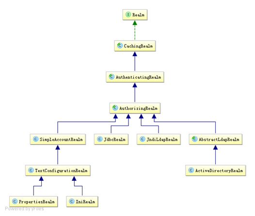

[TOC]

# 1 简介

Apache Shiro是Java的一个安全框架。目前，使用Apache Shiro的人越来越多，因为它相当简单，对比Spring Security，可能没有Spring Security做的功能强大，但是在实际工作时可能并不需要那么复杂的东西，所以使用小而简单的Shiro就足够了。对于它俩到底哪个好，这个不必纠结，能更简单的解决项目问题就好了。

Shiro可以非常容易的开发出足够好的应用，其不仅可以用在JavaSE环境，也可以用在JavaEE环境。Shiro可以帮助我们完成：认证、授权、加密、会话管理、与Web集成、缓存等。这不就是我们想要的嘛，而且Shiro的API也是非常简单；其基本功能点如下图所示：


**Authentication：**身份认证/登录，验证用户是不是拥有相应的身份；

**Authorization：**授权，即权限验证，验证某个已认证的用户是否拥有某个权限；即判断用户是否能做事情，常见的如：验证某个用户是否拥有某个角色。或者细粒度的验证某个用户对某个资源是否具有某个权限；

**Session Manager：**会话管理，即用户登录后就是一次会话，在没有退出之前，它的所有信息都在会话中；会话可以是普通JavaSE环境的，也可以是如Web环境的；

**Cryptography：**加密，保护数据的安全性，如密码加密存储到数据库，而不是明文存储；

**Web Support：**Web支持，可以非常容易的集成到Web环境；

**Caching：**缓存，比如用户登录后，其用户信息、拥有的角色/权限不必每次去查，这样可以提高效率；

**Concurrency：**shiro支持多线程应用的并发验证，即如在一个线程中开启另一个线程，能把权限自动传播过去；

**Testing：**提供测试支持；

**Run As：**允许一个用户假装为另一个用户（如果他们允许）的身份进行访问；

**Remember Me：**记住我，这个是非常常见的功能，即一次登录后，下次再来的话不用登录了。

 

**记住一点，Shiro不会去维护用户、维护权限；这些需要我们自己去设计/提供**；然后通过相应的接口注入给Shiro即可。

从外部来看Shiro吧，即从应用程序角度的来观察如何使用Shiro完成工作


**Subject：**主体，代表了当前“用户”，这个用户不一定是一个具体的人，与当前应用交互的任何东西都是Subject，如网络爬虫，机器人等；即一个抽象概念；所有Subject都绑定到SecurityManager，与Subject的所有交互都会委托给SecurityManager；可以把Subject认为是一个门面；SecurityManager才是实际的执行者；

**SecurityManager：**安全管理器；即所有与安全有关的操作都会与SecurityManager交互；且它管理着所有Subject；可以看出它是Shiro的核心，它负责与后边介绍的其他组件进行交互，如果学习过SpringMVC，你可以把它看成DispatcherServlet前端控制器；

**Realm：**域，Shiro从从Realm获取安全数据（如用户、角色、权限），就是说SecurityManager要验证用户身份，那么它需要从Realm获取相应的用户进行比较以确定用户身份是否合法；也需要从Realm得到用户相应的角色/权限进行验证用户是否能进行操作；可以把Realm看成DataSource，即安全数据源。

==从以上也可以看出，Shiro不提供维护用户/权限，而是通过Realm让开发人员自己注入。==

> shiro内部架构图：


**Subject：**主体，可以看到主体可以是任何可以与应用交互的“用户”；

**SecurityManager：**相当于SpringMVC中的DispatcherServlet或者Struts2中的FilterDispatcher；是Shiro的心脏；所有具体的交互都通过SecurityManager进行控制；它管理着所有Subject、且负责进行认证和授权、及会话、缓存的管理。

**Authenticator：**认证器，负责主体认证的，==这是一个扩展点，如果用户觉得Shiro默认的不好，可以自定义实现==；其需要==认证策略（Authentication Strategy）==，即什么情况下算用户认证通过了；

**Authrizer：**授权器，或者访问控制器，用来决定主体是否有权限进行相应的操作；即控制着用户能访问应用中的哪些功能；

**Realm：**可以有1个或多个Realm，可以认为是安全实体数据源，即用于获取安全实体的；可以是JDBC实现，也可以是LDAP实现，或者内存实现等等；由用户提供；注意：Shiro不知道你的用户/权限存储在哪及以何种格式存储；所以我们一般在应用中都需要实现自己的Realm；

**SessionManager：**如果写过Servlet就应该知道Session的概念，Session呢需要有人去管理它的生命周期，这个组件就是SessionManager；而Shiro并不仅仅可以用在Web环境，也可以用在如普通的JavaSE环境、EJB等环境；所有呢，Shiro就抽象了一个自己的Session来管理主体与应用之间交互的数据；这样的话，比如我们在Web环境用，刚开始是一台Web服务器；接着又上了台EJB服务器；这时想把两台服务器的会话数据放到一个地方，这个时候就可以实现自己的分布式会话（如把数据放到Memcached服务器）；

**SessionDAO：**DAO大家都用过，数据访问对象，用于会话的CRUD，比如我们想把Session保存到数据库，那么可以实现自己的SessionDAO，通过如JDBC写到数据库；比如想把Session放到Memcached中，可以实现自己的Memcached SessionDAO；另外SessionDAO中可以使用Cache进行缓存，以提高性能；

**CacheManage：**缓存控制器，来管理如用户、角色、权限等的缓存的；因为这些数据基本上很少去改变，放到缓存中后可以提高访问的性能

**Cryptography：**密码模块，Shiro提高了一些常见的加密组件用于如密码加密/解密的。

# 2 shiro用法

## 2.1 shiro相关jar包及作用

```xml
<!-- shiro 核心包-->
<dependency>  
    <groupId>org.apache.shiro</groupId>  
    <artifactId>shiro-core</artifactId>  
    <version>1.2.2</version>  
</dependency>  
```

## 2.2 身份认证流程

概念：

**principles：**身份，主体的标识属性，可以是任何东西，如用户名、邮箱等，唯一即可。一个主体可以有多个principals，但只有一个Primary principals，一般是用户名/密码/手机号

**credentials**：证明/凭证，即只有主体知道的安全值，如密码/数字证书等。最常见的principals和credentials组合就是用户名/密码了。


**Subject**及**Realm**，分别是主体及验证主体的数据源。


### 2.2.1  Realm

Realm：域，Shiro从Realm获取安全数据（如用户、角色、权限），就是说SecurityManager要验证用户身份，那么它需要从Realm获取相应的用户进行比较以确定用户身份是否合法；也需要从Realm得到用户相应的角色/权限进行验证用户是否能进行操作；可以把Realm看成DataSource，即安全数据源。

####  Shiro默认提供的Realm



**org.apache.shiro.realm.text.IniRealm：**[users]部分指定用户名/密码及其角色；[roles]部分指定角色即权限信息；

**org.apache.shiro.realm.text.PropertiesRealm：** user.username=password,role1,role2指定用户名/密码及其角色；role.role1=permission1,permission2指定角色及权限信息；

**org.apache.shiro.realm.jdbc.JdbcRealm：**通过sql查询相应的信息，如“select password from users where username = ?”获取用户密码，“select password, password_salt from users where username = ?”获取用户密码及盐；“select role_name from user_roles where username = ?”获取用户角色；“select permission from roles_permissions where role_name = ?”获取角色对应的权限信息；也可以调用相应的api进行自定义sql

####  单Realm配置

1、自定义Realm实现

```java
public class MyRealm1 implements Realm {  
    @Override  
    public String getName() {  
        return "myrealm1";  
    }  
    @Override  
    public boolean supports(AuthenticationToken token) {  
        //仅支持UsernamePasswordToken类型的Token  
        return token instanceof UsernamePasswordToken;   
    }  
    @Override  
    public AuthenticationInfo getAuthenticationInfo(AuthenticationToken token) throws AuthenticationException {  
        String username = (String)token.getPrincipal();  //得到用户名  
        String password = new String((char[])token.getCredentials()); //得到密码  
        if(!"zhang".equals(username)) {  
            throw new UnknownAccountException(); //如果用户名错误  
        }  
        if(!"123".equals(password)) {  
            throw new IncorrectCredentialsException(); //如果密码错误  
        }  
        //如果身份认证验证成功，返回一个AuthenticationInfo实现；  
        return new SimpleAuthenticationInfo(username, password, getName());  
    }  
}   
```

2、ini配置文件指定自定义Realm实现(shiro-realm.ini) 

```ini
#声明一个realm  
myRealm1=com.github.zhangkaitao.shiro.chapter2.realm.MyRealm1  
#指定securityManager的realms实现  
securityManager.realms=$myRealm1   
```

通过$name来引入之前的realm定义

#### 多Realm配置

1、ini配置文件（shiro-multi-realm.ini）  

```ini
#声明一个realm  
myRealm1=com.github.zhangkaitao.shiro.chapter2.realm.MyRealm1  
myRealm2=com.github.zhangkaitao.shiro.chapter2.realm.MyRealm2  
#指定securityManager的realms实现  
securityManager.realms=$myRealm1,$myRealm2   
```

securityManager会按照realms指定的顺序进行身份认证。此处我们使用显示指定顺序的方式指定了Realm的顺序，如果删除“securityManager.realms=$myRealm1,$myRealm2”，那么securityManager会按照realm声明的顺序进行使用（即无需设置realms属性，其会自动发现），当我们显示指定realm后，其他没有指定realm将被忽略，如“securityManager.realms=$myRealm1”，那么myRealm2不会被自动设置进去。

#### JDBC Realm使用

1、数据库及依赖

```xml
<dependency>  
    <groupId>mysql</groupId>  
    <artifactId>mysql-connector-java</artifactId>  
    <version>5.1.25</version>  
</dependency>  
<dependency>  
    <groupId>com.alibaba</groupId>  
    <artifactId>druid</artifactId>  
    <version>0.2.23</version>  
</dependency>   
```

本文将使用mysql数据库及druid连接池； 

2、到数据库shiro下建三张表：users（用户名/密码）、user_roles（用户/角色）、roles_permissions（角色/权限），具体请参照shiro-example-chapter2/sql/shiro.sql；并添加一个用户记录，用户名/密码为zhang/123；

3、ini配置（shiro-jdbc-realm.ini） 

```ini
jdbcRealm=org.apache.shiro.realm.jdbc.JdbcRealm  
dataSource=com.alibaba.druid.pool.DruidDataSource  
dataSource.driverClassName=com.mysql.jdbc.Driver  
dataSource.url=jdbc:mysql://localhost:3306/shiro  
dataSource.username=root  
#dataSource.password=  
jdbcRealm.dataSource=$dataSource  
securityManager.realms=$jdbcRealm   
```

1、变量名=全限定类名会自动创建一个类实例

2、变量名.属性=值 自动调用相应的setter方法进行赋值

3、$变量名 引用之前的一个对象实例 

4、测试代码请参照com.github.zhangkaitao.shiro.chapter2.LoginLogoutTest的testJDBCRealm方法，和之前的没什么区别。

## 2.3 Authenticator及AuthenticationStrategy

Authenticator的职责是验证用户帐号，是Shiro API中身份验证核心的入口点： 

```java
public AuthenticationInfo authenticate(AuthenticationToken authenticationToken)  throws AuthenticationException;   
```

如果验证成功，将返回AuthenticationInfo验证信息，==此信息中包含了身份及凭证==；如果验证失败将抛出相应的AuthenticationException实现。

SecurityManager接口继承了Authenticator，另外还有一个ModularRealmAuthenticator实现，其委托给多个Realm验证，==验证规则通过AuthenticationStrategy接口指定，默认提供的实现==：

==FirstSuccessfulStrategy==：只要有一个Realm验证成功即可，只返回第一个Realm身份验证成功的认证信息，其他的忽略；

==AtLeastOneSuccessfulStrategy==：只要有一个Realm验证成功即可，和FirstSuccessfulStrategy不同，返回所有Realm身份验证成功的认证信息；

==AllSuccessfulStrategy==：所有Realm验证成功才算成功，且返回所有Realm身份验证成功的认证信息，如果有一个失败就失败了。

==ModularRealmAuthenticator默认使用AtLeastOneSuccessfulStrategy策略。==

> 如何指定策略？
>
> 配置中指定AuthenticationStrategy接口的实现类，

## 2.4 授权

**主体**

主体，即访问应用的用户，在Shiro中使用Subject代表该用户。用户只有授权后才允许访问相应的资源。

**资源**

在应用中用户可以访问的任何东西，比如访问JSP页面、查看/编辑某些数据、访问某个业务方法、打印文本等等都是资源。用户只要授权后才能访问。

**权限**

安全策略中的原子授权单位，通过权限我们可以表示在应用中用户有没有操作某个资源的权力。即权限表示在应用中用户能不能访问某个资源，如：

访问用户列表页面

查看/新增/修改/删除用户数据（即很多时候都是CRUD（增查改删）式权限控制）

如上可以看出，权限代表了用户有没有操作某个资源的权利，即反映在某个资源上的操作允不允许，不反映谁去执行这个操作。所以后续还需要把权限赋予给用户，即定义哪个用户允许在某个资源上做什么操作（权限），Shiro不会去做这件事情，而是由实现人员提供。

Shiro支持粗粒度权限（如用户模块的所有权限）和细粒度权限（操作某个用户的权限，即实例级别的），后续部分介绍。

**角色**

角色代表了操作集合，可以理解为权限的集合，一般情况下我们会赋予用户角色而不是权限，即这样用户可以拥有一组权限，赋予权限时比较方便。典型的如：项目经理、技术总监、CTO、开发工程师等都是角色，不同的角色拥有一组不同的权限。

> **隐式角色**：即直接通过角色来验证用户有没有操作权限，如在应用中CTO、技术总监、开发工程师可以使用打印机，假设某天不允许开发工程师使用打印机，此时需要从应用中删除相应代码；再如在应用中CTO、技术总监可以查看用户、查看权限；突然有一天不允许技术总监查看用户、查看权限了，需要在相关代码中把技术总监角色从判断逻辑中删除掉；即粒度是以角色为单位进行访问控制的，粒度较粗；如果进行修改可能造成多处代码修改。

> **显示角色**：在程序中通过权限控制谁能访问某个资源，角色聚合一组权限集合；这样假设哪个角色不能访问某个资源，只需要从角色代表的权限集合中移除即可；无须修改多处代码；即粒度是以资源/实例为单位的；粒度较细。

请google搜索==“RBAC”和“RBAC新解”==分别了解==“基于角色的访问控制”“基于资源的访问控制(Resource-Based Access Control)”==。

###2.4.1  支持的授权方式

#### 编程式：通过写if/else授权代码块完成： 

```java
Subject subject = SecurityUtils.getSubject();  
if(subject.hasRole(“admin”)) {  
    //有权限  
} else {  
    //无权限  
}   
```

#### 注解式：通过在执行的java方法上放置相应的注解完成：

```java
@RequiresRoles("admin")  
public void hello() {  
    //有权限  
}  
```

#### JSP/GSP标签：在JSP/GSP页面通过相应的标签完成：

```java
<shiro:hasRole name="admin">  
<!— 有权限 —>  
</shiro:hasRole> 
```

### 2.4.2 授权

#### 基于角色的访问控制（隐式角色）

规则即：==“用户名=密码,角色1，角色2”==，如果需要在应用中判断用户是否有相应角色，就需要在相应的Realm中返回角色信息，也就是说Shiro不负责维护用户-角色信息，需要应用提供，Shiro只是提供相应的接口方便验证，后续会介绍如何动态的获取用户角色。

```ini
[users]  
zhang=123,role1,role2  
wang=123,role1  
[roles]  
role1=user:create,user:update  
role2=user:create,user:delete  
```


```java
@Test  
public void testHasRole() {  
    login("classpath:shiro-role.ini", "zhang", "123");  
    //判断拥有角色：role1  
    Assert.assertTrue(subject().hasRole("role1")); 
    //判断拥有角色：role1 and role2  
  Assert.assertTrue(subject().hasAllRoles(Arrays.asList("role1", "role2")));  
    //判断拥有角色：role1 and role2 and !role3  
    boolean[] result = subject().hasRoles(Arrays.asList("role1", "role2", "role3"));  
    Assert.assertEquals(true, result[0]);  
    Assert.assertEquals(true, result[1]);  
    Assert.assertEquals(false, result[2]);  
}   
```

```java
@Test(expected = UnauthorizedException.class)  
public void testCheckRole() {  
    login("classpath:shiro-role.ini", "zhang", "123");  
    //断言拥有角色：role1  
    subject().checkRole("role1");  
    //断言拥有角色：role1 and role3 失败抛出异常  
    subject().checkRoles("role1", "role3");  
}   
```

==缺点就是如果很多地方进行了角色判断，但是有一天不需要了那么就需要修改相应代码把所有相关的地方进行删除；这就是粗粒度造成的问题。==

#### 基于资源的访问控制（显式角色）

规则：==“用户名=密码，角色1，角色2”“角色=权限1，权限2”==，即首先根据用户名找到角色，然后根据角色再找到权限；即角色是权限集合；Shiro同样不进行权限的维护，需要我们通过Realm返回相应的权限信息。只需要维护“用户——角色”之间的关系即可。

```ini
[users]  
zhang=123,role1,role2  
wang=123,role1  
[roles]  
role1=user:create,user:update  
role2=user:create,user:delete  
```


```java
@Test  
public void testIsPermitted() {  
    login("classpath:shiro-permission.ini", "zhang", "123");  
    //判断拥有权限：user:create  
    Assert.assertTrue(subject().isPermitted("user:create"));  
    //判断拥有权限：user:update and user:delete  
  Assert.assertTrue(subject().isPermittedAll("user:update", "user:delete"));  
    //判断没有权限：user:view  
  Assert.assertFalse(subject().isPermitted("user:view"));  
}   
```

```java
@Test(expected = UnauthorizedException.class)  
public void testCheckPermission () {  
    login("classpath:shiro-permission.ini", "zhang", "123");  
    //断言拥有权限：user:create  
    subject().checkPermission("user:create");  
    //断言拥有权限：user:delete and user:update  
    subject().checkPermissions("user:delete", "user:update");  
    //断言拥有权限：user:view 失败抛出异常  
    subject().checkPermissions("user:view");  
}   
```

==这种方式的一般规则是“资源标识符：操作”，即是资源级别的粒度；这种方式的好处就是如果要修改基本都是一个资源级别的修改，不会对其他模块代码产生影响，粒度小。但是实现起来可能稍微复杂点，需要维护“用户——角色，角色——权限（资源：操作）”之间的关系。==

### 2.4.3 permission

### 字符串通配符权限

规则：“资源标识符：操作：对象实例ID”  即对哪个资源的哪个实例可以进行什么操作。其默认支持通配符权限字符串，“:”表示资源/操作/实例的分割；“,”表示操作的分割；“*”表示任意资源/操作/实例。

#### 单个资源单个权限

```java
subject().checkPermissions("system:user:update");  
```

用户拥有资源“system:user”的“update”权限。

#### 单个资源多个权限

配置

```ini
role41=system:user:update,system:user:delete  
```

```java
subject().checkPermissions("system:user:update", "system:user:delete");  
```

用户拥有资源“system:user”的“update”和“delete”权限。

如上可以简写成：

```ini
role42="system:user:update,delete"   
```

```java
subject().checkPermissions("system:user:update,delete");  
```

通过“system:user:update,delete”验证"system:user:update, system:user:delete"是没问题的，但是反过来是规则不成立。

#### 单个资源全部权限

```ini
role51="system:user:create,update,delete,view"  
```

```java
subject().checkPermissions("system:user:create,delete,update:view");  
```

可以简写成:

```ini
role52=system:user:*  
或者
role53=system:user  
```

```java
subject().checkPermissions("system:user:*");  
subject().checkPermissions("system:user");   
```

通过“system:user:*”验证“system:user:create,delete,update:view”可以，但是反过来是不成立的。

#### 所有资源全部权限

```ini
role61=*:view  
```

```java
subject().checkPermissions("user:view");  
```

#### 实例级别的权限

##### 单个实例单个权限

```ini
role71=user:view:1 
```

```java
subject().checkPermissions("user:view:1");  
```


##### 单个实例多个权限

```ini
role72="user:update,delete:1"  
```

```java
subject().checkPermissions("user:delete,update:1"); 
subject().checkPermissions("user:update:1", "user:delete:1");   
```


##### 单个实例所有权限

```ini
role73=user:*:1  
```

```java
subject().checkPermissions("user:update:1", "user:delete:1", "user:view:1");  
```


##### 所有实例单个权限

```ini
role74=user:auth:*  
```

```java
subject().checkPermissions("user:auth:1", "user:auth:2");  
```


##### 所有实例所有权限

```ini
role75=user:*:*  
```

```java
subject().checkPermissions("user:view:1", "user:auth:2");  
```

#### Shiro对权限字符串缺失部分的处理

如“user:view”等价于“user:view:*”；而“organization”等价于“organization:*”或者“organization:*:*”。可以这么理解，这种方式实现了前缀匹配。

另外如“user:*”可以匹配如“user:delete”、“user:delete”可以匹配如“user:delete:1”、“user:*:1”可以匹配如“user:view:1”、“user”可以匹配“user:view”或“user:view:1”等。即*可以匹配所有，不加*可以进行前缀匹配；但是如“*:view”不能匹配“system:user:view”，需要使用“*:*:view”，即后缀匹配必须指定前缀（多个冒号就需要多个*来匹配）。

####  WildcardPermission

如下两种方式是等价的：

```java
subject().checkPermission("menu:view:1");  
subject().checkPermission(new WildcardPermission("menu:view:1"));  
```

#### 性能问题

通配符匹配方式比字符串相等匹配来说是更复杂的，因此需要花费更长时间，但是一般系统的权限不会太多，且可以配合缓存来提供其性能，如果这样性能还达不到要求我们可以实现位操作算法实现性能更好的权限匹配。另外实例级别的权限验证如果数据量太大也不建议使用，可能造成查询权限及匹配变慢。可以考虑比如在sql查询时加上权限字符串之类的方式在查询时就完成了权限匹配。

###  2.4.4 授权流程

##### 

流程如下：

1、首先调用Subject.isPermitted*/hasRole*接口，其会委托给SecurityManager，而SecurityManager接着会委托给Authorizer；

2、Authorizer是真正的授权者，如果我们调用如isPermitted(“user:view”)，其首先会通过PermissionResolver把字符串转换成相应的Permission实例；

3、在进行授权之前，其会调用相应的Realm获取Subject相应的角色/权限用于匹配传入的角色/权限；

4、Authorizer会判断Realm的角色/权限是否和传入的匹配，如果有多个Realm，会委托给ModularRealmAuthorizer进行循环判断，如果匹配如isPermitted*/hasRole*会返回true，否则返回false表示授权失败。

 

ModularRealmAuthorizer进行多Realm匹配流程：

1、首先检查相应的Realm是否实现了实现了Authorizer；

2、如果实现了Authorizer，那么接着调用其相应的isPermitted*/hasRole*接口进行匹配；

3、如果有一个Realm匹配那么将返回true，否则返回false。

 

如果Realm进行授权的话，应该继承AuthorizingRealm，其流程是：

1.1、如果调用hasRole*，则直接获取AuthorizationInfo.getRoles()与传入的角色比较即可；

1.2、首先如果调用如isPermitted(“user:view”)，首先通过PermissionResolver将权限字符串转换成相应的Permission实例，默认使用WildcardPermissionResolver，即转换为通配符的WildcardPermission；

2、通过AuthorizationInfo.getObjectPermissions()得到Permission实例集合；通过AuthorizationInfo. getStringPermissions()得到字符串集合并通过PermissionResolver解析为Permission实例；然后获取用户的角色，并通过RolePermissionResolver解析角色对应的权限集合（默认没有实现，可以自己提供）；

3、接着调用Permission. implies(Permission p)逐个与传入的权限比较，如果有匹配的则返回true，否则false。 

### 2.4.5 Authorizer、PermissionResolver及RolePermissionResolver

Authorizer的职责是进行授权（访问控制），是Shiro API中授权核心的入口点，其提供了相应的角色/权限判断接口，具体请参考其Javadoc。SecurityManager继承了Authorizer接口，且提供了ModularRealmAuthorizer用于多Realm时的授权匹配。PermissionResolver用于解析权限字符串到Permission实例，而RolePermissionResolver用于根据角色解析相应的权限集合。

我们可以通过如下ini配置更改Authorizer实现：

```ini
authorizer=org.apache.shiro.authz.ModularRealmAuthorizer  
securityManager.authorizer=$authorizer   
```

对于ModularRealmAuthorizer，相应的AuthorizingSecurityManager会在初始化完成后自动将相应的realm设置进去，我们也可以通过调用其setRealms()方法进行设置。对于实现自己的authorizer可以参考ModularRealmAuthorizer实现即可，在此就不提供示例了。

设置ModularRealmAuthorizer的permissionResolver，其会自动设置到相应的Realm上（其实现了PermissionResolverAware接口），如：

```ini
permissionResolver=org.apache.shiro.authz.permission.WildcardPermissionResolver  
authorizer.permissionResolver=$permissionResolver   
```

设置ModularRealmAuthorizer的rolePermissionResolver，其会自动设置到相应的Realm上（其实现了RolePermissionResolverAware接口），如：

```ini
rolePermissionResolver=com.github.zhangkaitao.shiro.chapter3.permission.MyRolePermissionResolver  
authorizer.rolePermissionResolver=$rolePermissionResolver   
```

**示例**

> 1、ini配置（shiro-authorizer.ini）
>
> ```ini
> [main]  
> #自定义authorizer  
> authorizer=org.apache.shiro.authz.ModularRealmAuthorizer  
> #自定义permissionResolver  
> #permissionResolver=org.apache.shiro.authz.permission.WildcardPermissionResolver  
> permissionResolver=com.github.zhangkaitao.shiro.chapter3.permission.BitAndWildPermissionResolver  
> authorizer.permissionResolver=$permissionResolver  
> #自定义rolePermissionResolver  
> rolePermissionResolver=com.github.zhangkaitao.shiro.chapter3.permission.MyRolePermissionResolver  
> authorizer.rolePermissionResolver=$rolePermissionResolver  
> securityManager.authorizer=$authorizer  
> ```

>```ini
>#自定义realm 一定要放在securityManager.authorizer赋值之后（因为调用setRealms会将realms设置给authorizer，并给各个Realm设置permissionResolver和rolePermissionResolver）  
>realm=com.github.zhangkaitao.shiro.chapter3.realm.MyRealm  
>securityManager.realms=$realm   
>```
>
>设置securityManager 的realms一定要放到最后，因为在调用SecurityManager.setRealms时会将realms设置给authorizer，并为各个Realm设置permissionResolver和rolePermissionResolver。另外，不能使用IniSecurityManagerFactory创建的IniRealm，因为其初始化顺序的问题可能造成后续的初始化Permission造成影响。
>
>2、定义BitAndWildPermissionResolver及BitPermission
>
>BitPermission用于实现位移方式的权限，如规则是：
>
>权限字符串格式：+资源字符串+权限位+实例ID；以+开头中间通过+分割；权限：0 表示所有权限；1 新增（二进制：0001）、2 修改（二进制：0010）、4 删除（二进制：0100）、8 查看（二进制：1000）；如 +user+10 表示对资源user拥有修改/查看权限。
>
>```java
>public class BitPermission implements Permission {  
>    private String resourceIdentify;  
>    private int permissionBit;  
>    private String instanceId;  
>    public BitPermission(String permissionString) {  
>        String[] array = permissionString.split("\\+");  
>        if(array.length > 1) {  
>            resourceIdentify = array[1];  
>        }  
>        if(StringUtils.isEmpty(resourceIdentify)) {  
>            resourceIdentify = "*";  
>        }  
>        if(array.length > 2) {  
>            permissionBit = Integer.valueOf(array[2]);  
>        }  
>        if(array.length > 3) {  
>            instanceId = array[3];  
>        }  
>        if(StringUtils.isEmpty(instanceId)) {  
>            instanceId = "*";  
>        }  
>    }  
>  
>    @Override  
>    public boolean implies(Permission p) {  
>        if(!(p instanceof BitPermission)) {  
>            return false;  
>        }  
>        BitPermission other = (BitPermission) p;  
>        if(!("*".equals(this.resourceIdentify) || this.resourceIdentify.equals(other.resourceIdentify))) {  
>            return false;  
>        }  
>        if(!(this.permissionBit ==0 || (this.permissionBit & other.permissionBit) != 0)) {  
>            return false;  
>        }  
>        if(!("*".equals(this.instanceId) || this.instanceId.equals(other.instanceId))) {  
>            return false;  
>        }  
>        return true;  
>    }  
>}   
>```
>
>Permission接口提供了boolean implies(Permission p)方法用于判断权限匹配的；
>
>```java
>public class BitAndWildPermissionResolver implements PermissionResolver {  
>    @Override  
>    public Permission resolvePermission(String permissionString) {  
>        if(permissionString.startsWith("+")) {  
>            return new BitPermission(permissionString);  
>        }  
>        return new WildcardPermission(permissionString);  
>    }  
>}   
>```
>
>BitAndWildPermissionResolver实现了PermissionResolver接口，并根据权限字符串是否以“+”开头来解析权限字符串为BitPermission或WildcardPermission。
>
>3、定义MyRolePermissionResolver
>
>RolePermissionResolver用于根据角色字符串来解析得到权限集合。
>
>```java
>public class MyRolePermissionResolver implements RolePermissionResolver {  
>    @Override  
>    public Collection<Permission> resolvePermissionsInRole(String roleString) {  
>        if("role1".equals(roleString)) {  
>            return Arrays.asList((Permission)new WildcardPermission("menu:*"));  
>        }  
>        return null;  
>    }  
>}   
>```
>
>4、自定义Realm
>
>```java
>public class MyRealm extends AuthorizingRealm {  
>    @Override  
>    protected AuthorizationInfo doGetAuthorizationInfo(PrincipalCollection principals) {  
>        SimpleAuthorizationInfo authorizationInfo = new SimpleAuthorizationInfo();  
>        authorizationInfo.addRole("role1");  
>        authorizationInfo.addRole("role2");  
>        authorizationInfo.addObjectPermission(new BitPermission("+user1+10"));  
>        authorizationInfo.addObjectPermission(new WildcardPermission("user1:*"));  
>        authorizationInfo.addStringPermission("+user2+10");  
>        authorizationInfo.addStringPermission("user2:*");  
>        return authorizationInfo;  
>    }  
>    @Override  
>    protected AuthenticationInfo doGetAuthenticationInfo(AuthenticationToken token) throws AuthenticationException {  
>        //和com.github.zhangkaitao.shiro.chapter2.realm.MyRealm1. getAuthenticationInfo代码一样，省略  
>}  
>}   
>```
>
>此时我们继承AuthorizingRealm而不是实现Realm接口；推荐使用AuthorizingRealm，因为：
>
>AuthenticationInfo doGetAuthenticationInfo(AuthenticationToken token)：表示获取身份验证信息；
>
>AuthorizationInfo doGetAuthorizationInfo(PrincipalCollection principals)：表示根据用户身份获取授权信息。
>
>这种方式的好处是当只需要身份验证时只需要获取身份验证信息而不需要获取授权信息。对于AuthenticationInfo和AuthorizationInfo请参考其Javadoc获取相关接口信息。
>
> 
>
>另外我们可以使用JdbcRealm，需要做的操作如下：
>
>1、执行sql/ shiro-init-data.sql 插入相关的权限数据；
>
>2、使用shiro-jdbc-authorizer.ini配置文件，需要设置jdbcRealm.permissionsLookupEnabled
>
>为true来开启权限查询。
>
> 
>
>此次还要注意就是不能把我们自定义的如“+user1+10”配置到INI配置文件，即使有IniRealm完成，因为IniRealm在new完成后就会解析这些权限字符串，默认使用了WildcardPermissionResolver完成，即此处是一个设计权限，如果采用生命周期（如使用初始化方法）的方式进行加载就可以解决我们自定义permissionResolver的问题。
>
>5、测试用例
>
>```java
>public class AuthorizerTest extends BaseTest {  
>  
>    @Test  
>    public void testIsPermitted() {  
>        login("classpath:shiro-authorizer.ini", "zhang", "123");  
>        //判断拥有权限：user:create  
>        Assert.assertTrue(subject().isPermitted("user1:update"));  
>        Assert.assertTrue(subject().isPermitted("user2:update"));  
>        //通过二进制位的方式表示权限  
>        Assert.assertTrue(subject().isPermitted("+user1+2"));//新增权限  
>        Assert.assertTrue(subject().isPermitted("+user1+8"));//查看权限  
>        Assert.assertTrue(subject().isPermitted("+user2+10"));//新增及查看  
>  
>        Assert.assertFalse(subject().isPermitted("+user1+4"));//没有删除权限  
>  
>        Assert.assertTrue(subject().isPermitted("menu:view"));//通过MyRolePermissionResolver解析得到的权限  
>    }  
>}   
>```

# 3 ini配置

 

# 5 编码/加密

shiro本身提供base64和16进制字符串编码/解码的API支持

```java
String str = "hello";
String base64Encoded = Hex.encodeToString(str.getBytes());
String str2 = new String(Hex.decode(base64Encoded.getBytes()));
Assert.assertEquals(str, str2);
```

## 散列算法

散列算法：一种不可逆的算法

常见散列算法MD5、SHA。

散列算法使用salt（盐）的作用：破解增加难度。直接用来加密md5解密网站，可以反解密

## 加密/解密

提供对称式加密/解密算法的支持

## DefaultPasswordService配合PasswordMatcher

DefaultPasswordService配合PasswordMatcher实现简单的密码加密与验证服务

PasswordService用来加密密码

PasswordMatcher用来验证凭据是否匹配，不匹配将抛出IncorrectCredentialsException异常


# 缓存

```java
package com.opco.blog.admin.config.shiro;

import org.apache.shiro.cache.Cache;
import org.apache.shiro.cache.CacheException;
import org.apache.shiro.cache.CacheManager;
import org.springframework.data.redis.core.RedisTemplate;

import javax.annotation.Resource;

/**
 * description:
 * author:zhaoxingbao
 * date:2019/7/16
 * co:
 */
public class RedisCacheManager implements CacheManager {

    @Resource
    private RedisTemplate<String, Object> redisTemplate;

    @Override
    public <K, V> Cache<K, V> getCache(String name) throws CacheException {
        return null;
    }
}
```

用的过程中遇到

## @Resource注解，参考

[][1]

[@Resource和@Autowired和@Qualifier的异同][1]

@Resource是按照名称来装配注入的，只有找不到与名称匹配的Bean才会按照类型

@Autowired默认是按照类型注入，可以和@Qualifier注解使用

@Resource是由J2EE提供的，@Autowired是由Spring提供的，减少系统对Spring的依赖建议使用@Resource注解

@Resource和@Autowired都可以书写标注在字段或者该字段的setter方法上


# 持久化

自定义DBSessionDAO用来持久化Session，Session对象也是自定义的用来保存关键的信息，或者定制信息

```java
//继承
public class DBSessionDao extends EnterpriseCacheSessionDAO {
    //override four method
    @Override
    protected Serializable doCreate(Session session) {
        return super.doCreate(session);
    }
    
    @Override
    protected Session doReadSession(Serializable sessionId) {
        return super.doReadSession(sessionId);
    }

    @Override
    protected void doUpdate(Session session) {
        super.doUpdate(session);
    }

    @Override
    protected void doDelete(Session session) {
        super.doDelete(session);
    }
}
```

ValidatingSession


# Session管理器


[1]: https://blog.csdn.net/Baple/article/details/17891755	"Spring @Resource、@Autowired、@Qualifier的注解注入及区别"

