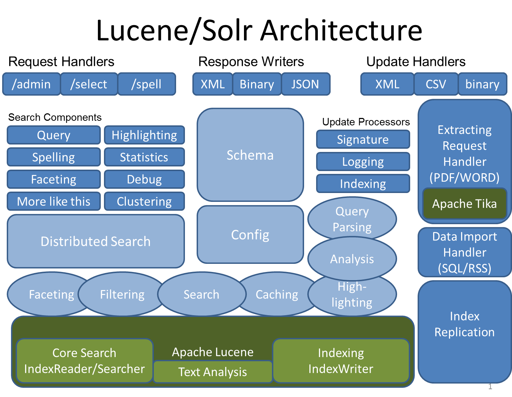
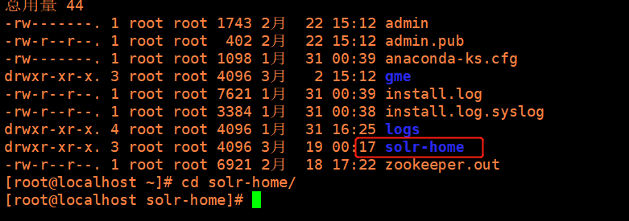
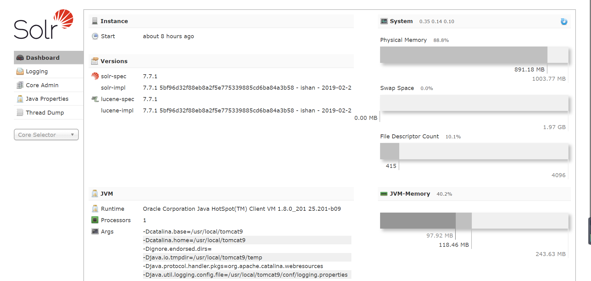

# Solr

[TOC]

## Solr介绍



### 安装


将`/usr/local/solr-7.7.1/server/solr-webapp/webapp`目录下所有拷贝到`tomcat/webapps/solr`目录下，名字可以不用solr，所有的内容：

```bash
drwxr-xr-x. 3 root root  4096 2月  23 05:09 css
-rw-r--r--. 1 root root  3262 2月  23 05:09 favicon.ico
drwxr-xr-x. 4 root root  4096 3月  18 23:24 img
-rw-r--r--. 1 root root 14678 2月  23 05:09 index.html
drwxr-xr-x. 3 root root  4096 2月  23 05:09 js
drwxr-xr-x. 2 root root  4096 3月  18 23:24 libs
drwxr-xr-x. 2 root root  4096 3月  18 23:24 partials
drwxr-xr-x. 3 root root  4096 3月  18 23:24 WEB-INF

```

拷贝相关jar包到`tomcat/webapps/solr/`WEB-INF/lib文件夹下面：

网上的教程提示的是从`${solr}/example/lib/ext`这个目录下：

复制solr-7.1.0/server/lib/下metrics相关的jar，到apache-tomcat-8.5.23/webapps/solr/WEB-INF/lib/下

```bash
-rw-r--r--. 1 root root   82936 2月  27 2018 disruptor-3.4.0.jar
-rw-r--r--. 1 root root   16516 2月  24 2017 jcl-over-slf4j-1.7.24.jar
-rw-r--r--. 1 root root    4597 2月  24 2017 jul-to-slf4j-1.7.24.jar
-rw-r--r--. 1 root root   63725 3月  12 2018 log4j-1.2-api-2.11.0.jar
-rw-r--r--. 1 root root  263109 3月  12 2018 log4j-api-2.11.0.jar
-rw-r--r--. 1 root root 1600782 3月  12 2018 log4j-core-2.11.0.jar
-rw-r--r--. 1 root root   24174 3月  12 2018 log4j-slf4j-impl-2.11.0.jar
-rw-r--r--. 1 root root   41205 2月  24 2017 slf4j-api-1.7.24.jar
-rw-r--r--. 1 root root   9910 12月 25 2017 metrics-ganglia-3.2.6.jar
-rw-r--r--. 1 root root  22071 12月 25 2017 metrics-graphite-3.2.6.jar
-rw-r--r--. 1 root root  20110 12月 25 2017 metrics-jetty9-3.2.6.jar
-rw-r--r--. 1 root root  40184 12月 25 2017 metrics-jvm-3.2.6.jar
```

拷贝`${solr}/example/resources/log4j.properties`文件到${tomcat}/webapps/solr/WEB-INF` 目录下 

复制solr-7.1.0/server/resources下的log4j.properties文件，到apache-tomcat-8.5.23/webapps/solr/WEB-INF/下的classes文件夹中。（classes文件夹如果没有需要自己创建，这是日志文件)

我用的版本里面没有这个文件，上网找了一个，内容如下

```properties
#  Logging level  
solr.log=logs/  
log4j.rootLogger=INFO, file, CONSOLE  
  
log4j.appender.CONSOLE=org.apache.log4j.ConsoleAppender  
  
log4j.appender.CONSOLE.layout=org.apache.log4j.PatternLayout  
log4j.appender.CONSOLE.layout.ConversionPattern=%-4r [%t] %-5p %c %x \u2013 %m%n  
  
#- size rotation with log cleanup.  
log4j.appender.file=org.apache.log4j.RollingFileAppender  
log4j.appender.file.MaxFileSize=4MB  
log4j.appender.file.MaxBackupIndex=9  
  
#- File to log to and log format  
log4j.appender.file.File=${solr.log}/solr.log  
log4j.appender.file.layout=org.apache.log4j.PatternLayout  
log4j.appender.file.layout.ConversionPattern=%-5p - %d{yyyy-MM-dd HH:mm:ss.SSS}; %C; %m\n  
  
log4j.logger.org.apache.zookeeper=WARN  
log4j.logger.org.apache.hadoop=WARN  
  
# set to INFO to enable infostream log messages  
log4j.logger.org.apache.solr.update.LoggingInfoStream=OFF  
```

我的版本在`server/resources`下是这样的

```bash
-rw-r--r--. 1 root root   68 2月  21 16:16 jetty-logging.properties
-rw-r--r--. 1 root root 1432 2月  21 16:16 log4j2-console.xml
-rw-r--r--. 1 root root 2678 2月  21 16:16 log4j2.xml
```

创建`solrhome`：复制`solr-7.1.0/server/下的solr`文件夹，到任意目录处（可以重新命名，这里重命名为`solr-home`，我放在了`/root/solr`下：



配置solrhome路径：修改apache-tomcat-8.5.23/webapps/solr/WEB-INF/下的web.xml文件。

```xml
 <!-- 方法1：默认代码为注释状态。放开之后，替换<env-entry-value></env-entry-value>中间的值为自己的solrhome -->
    <env-entry>
       <env-entry-name>solr/home</env-entry-name>
       <env-entry-value>D:/20161010/test-demo/solr-test-7.1.0/solr-home</env-entry-value>
       <env-entry-type>java.lang.String</env-entry-type>
    </env-entry>

    <!--
     方法2：
     修改tomcat的配置文件， 在apache-tomcat-8.5.23/bin/catalina.bat文件中的第二行加配置参数。也就是@echo off下面一行。

    set "JAVA_OPTS=-Dsolr.solr.home=D:/20161010/test-demo/solr-test-7.1.0/solr-home
    --> 
```

取消权限控制，注释web.xml中的最后几行代码。否则项目会包403.

```xml
<!-- Get rid of error message -->
 <!--
  <security-constraint>
    <web-resource-collection>
      <web-resource-name>Disable TRACE</web-resource-name>
      <url-pattern>/</url-pattern>
      <http-method>TRACE</http-method>
    </web-resource-collection>
    <auth-constraint/>
  </security-constraint>
  <security-constraint>
    <web-resource-collection>
      <web-resource-name>Enable everything but TRACE</web-resource-name>
      <url-pattern>/</url-pattern>
      <http-method-omission>TRACE</http-method-omission>
    </web-resource-collection>
  </security-constraint>

  -->
```

初始化solr-home的数据，在solr-home文件下建一个core1（名字随意取），复制solr-home/configsets/_default/下的conf文件夹，到新建的core1下，在core1下创建文件夹data（空文件加即可）和core.properties(内容只配置name=core1即可，这里的name的值也就是再页面要显示的solrhome名称)

尝试访问http:[虚拟机tomcat](http://192.168.179.22:8080/solr/index.html#/)

访问成功：



tomcat部署solr注意事项

- tomcat7和solr7不兼容，同样的方法使用tomcat7，访问有异常。
- core建立的时候，只要复制conf即可启动访问，data和core.properties可以通过窗口创建。

