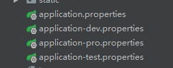

#springboot


##使用@Profile控制程序

```java
@Profile({"producer"})
@Bean
public Producer produce() {
    return new Producer();
}
```


spring通过spring.profiles 和 @Profile 的配置来控制不同的配置文件，加载不同的内容

 用到两个配置项

```properties
spring.profiles.active=test,prod,dev
#或者是默认的
spring.profiles.default
#在spring的xml配置中default是指向dev环境
```


springboot的有一定改动，不再如之前的是dev了 -------

根据文档描述，我们除application.properties外，还可以根据命名约定（
命名格式：application-{profile}.properties）来配置，如果active赋予的参数没有与使用该命名约定格式文件相匹配的话，app则会默认从名为application-default.properties 的配置文件加载配置。
如：spring.profiles.active=hello-world,sender,dev 有三个参数，其中 dev 正好匹配下面配置中的application-dev.properties 配置文件，所以app启动时，项目会先从application-dev.properties加载配置，再从application.properties配置文件加载配置，如果有重复的配置，则会以application.properties的配置为准。（配置文件加载顺序详见官方文档：24. Externalized Configuration）

  


Q1：指定spring.profiles.active=hello-world，但是额外的配置并没有如下的代码初始化是什么样子的

```java
@Profile({"hello-world"})
@Bean
public Producer produce() {
    return new Producer();
}

@Profile({"other-world"})
@Bean
public Producer produce() {
    return new Producer();
}

//配置中是这样的
spring.profiles.active=hello-world
```


hello-world的启动，other-world不启动，虽然没有相应的application-hello-world.properties，

@Profile("value")的value先是一个区分关键词，加上了这个@Profile("value")的词，才会初始化，至于初始化过程中的配置项有没有另说