# 整合SSM

[TOC]
**参考资料**
[spring模块结构](https://blog.csdn.net/sinat_35512245/article/details/53893910)

## Spring流程


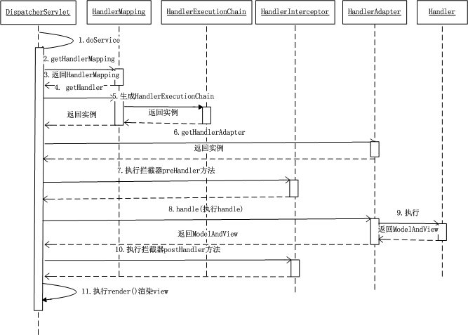

### Spring工作流程描述

1. 用户向服务器发送请求，请求被Spring 前端控制Servelt DispatcherServlet捕获；
2. DispatcherServlet对请求URL进行解析，得到请求资源标识符（URI）。然后根据该URI，调用HandlerMapping获得该Handler配置的所有相关的对象（包括Handler对象以及Handler对象对应的拦截器），最后以HandlerExecutionChain对象的形式返回；
3.  DispatcherServlet 根据获得的Handler，选择一个合适的HandlerAdapter。（**附注**：如果成功获得HandlerAdapter后，此时将开始执行拦截器的preHandler(...)方法）
4.   提取Request中的模型数据，填充Handler入参，开始执行Handler（Controller)。 在填充Handler的入参过程中，根据你的配置，Spring将帮你做一些额外的工作：
   * HttpMessageConveter： 将请求消息（如Json、xml等数据）转换成一个对象，将对象转换为指定的响应信息
   * 数据转换：对请求消息进行数据转换。如String转换成Integer、Double等
   * 数据根式化：对请求消息进行数据格式化。 如将字符串转换成格式化数字或格式化日期等
   *  数据验证： 验证数据的有效性（长度、格式等），验证结果存储到BindingResult或Error
5. Handler执行完成后，向DispatcherServlet 返回一个ModelAndView对象；
6.  根据返回的ModelAndView，选择一个适合的ViewResolver（必须是已经注册到Spring容器中的ViewResolver)返回给DispatcherServlet ；
7.  ViewResolver 结合Model和View，来渲染视图
8.  将渲染结果返回给客户端。


## spring项目结构

### 包含的模块
spring4
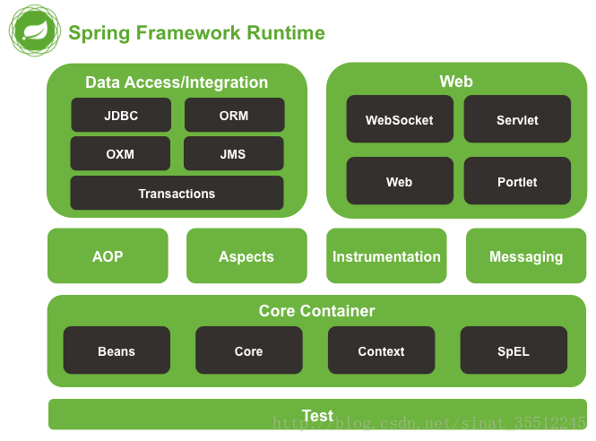

### spring分为5个部分
>* core
>* aop
>* data access
>* web
>* test
>
>图中每一个圆角矩形，都对应一个jar，其groupId都为"org.springframework"，每一个jar都有一个不同的artifactId，另外"instrumentation"和"Messageing"有两个jar，还有一个"spring-context-support"没有列出来，故spring的jar包总共20来个

spring3
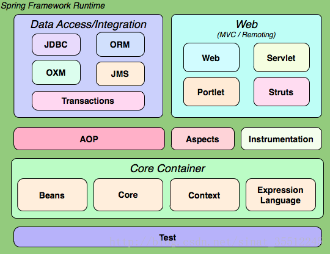

>spring3 有19个jar
******
#### 以下介绍5个部分的jar以及依赖关系
##### core
  ore部分包含4个模块
  >spring-core：依赖注入和DI的最基本实现
  >spring-beans：Bean工厂和bean装配
  >spring-context：spring的上下文即`IOC`容器
  >spring- expression：spring表达式语言

`他们的完整依赖关系`:
    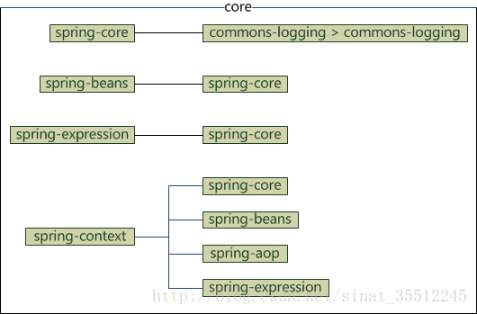
    

>spring-core依赖了commons-logging，而其他的模块都依赖了spring-core，故整个spring框架都依赖了commons-logging

`只引入spring-context包的情况下会自动导入其他的jar包`
```
<dependency>  
    <groupId>org.springframework</groupId>  
    <artifactId>spring-context</artifactId>  
    <version>${spring.version}</version>
</dependency>
```
`结果如下`

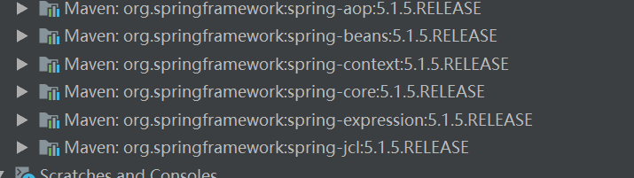
`所以可以直接引入context包`

##### AOP
`AOP部分包含六个模块`

>* spring-aop：面向切面编程
>* spring-aspects：集成AspectJ
>* spring- instrument：提供一些类级的工具支持和ClassLoader级的实现，用于服务器
>* spring-instrument-tomcat：针对tomcat的instrument实现
>* spring-websocket：为web应用提供的高效通信工具
>* spring-messaging：用于构建基于消息的应用程序

`他们的依赖关系`
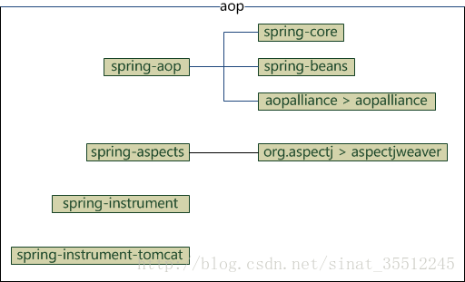
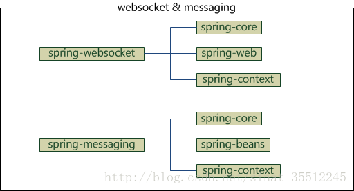


##### data access
>data access 部分包含5个模块
>* spring-jdbc：jdbc的支持
>* spring-tx：事务的控制
>* spring-orm：对象关系映射，集成orm框架
>* spring-oxm：对象xml映射
>* spring-jms：java消息服务


`他们的依赖关系`
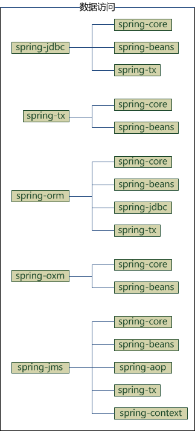

##### web
>web包含4个模块
>* spring-web：基础web功能，如文件上传
>* spring-webmvc：mvc实现
>* spring-webmvc-portlet：基于portlet的mvc实现
>* spring-websocket
>>spring3提供的是
>>
>>* spring-struts：与struts的集成，不推荐，spring4不再提供

`他们的依赖关系`

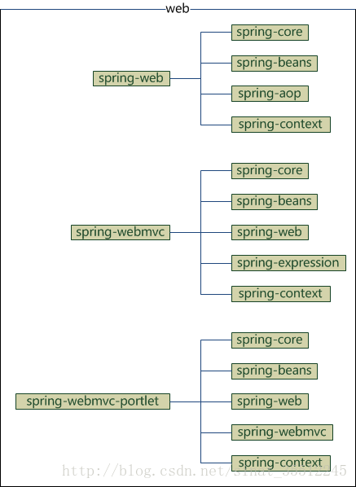


##### test和spring-context-support
>test部分只有一个模块，将spring-context-support也放在这里
>* spring-test：spring测试，提供junit和mock的功能测试
>* spring-context-support：spring的额外支持包，比如邮件服务，视图解析等
>  `他们的依赖关系`
>  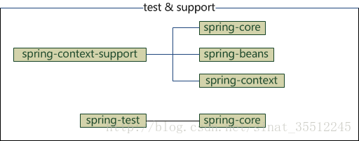


## 添加依赖
>添加依赖的过程中，一些jar包依赖于项目中其他的jar包，可以不用在pom中书写太多的jar包

## 开发过程中的详细配置
### IOC容器配置
#### xml配置式

#### 注解配置式
#### xml和注解比较
### web配置

==web.xml的作用==：**web.xml文件的作用是配置web工程启动**,对于一个web工程来说，web.xml可以有也可以没有，如果存在web.xml文件；web工程在启动的时候，**web容器(tomcat容器)**会去加载web.xml文件，然后按照一定规则配置web.xml文件中的组件。

==web容器的加载顺序==：ServletContext -> context-param -> listener -> filter ->servlet ;不会因在web.xml中的书写顺序改变：   
   a、web容器启动后,会去加载web.xml文件，读取listener和context-param两个节点
   b、创建一个ServletContext（Servlet上下文）这个上下文供所有部分共享
   c、容器将context-param转换成键值对，交给ServletContext
   d、接着按照上述顺序继续执行

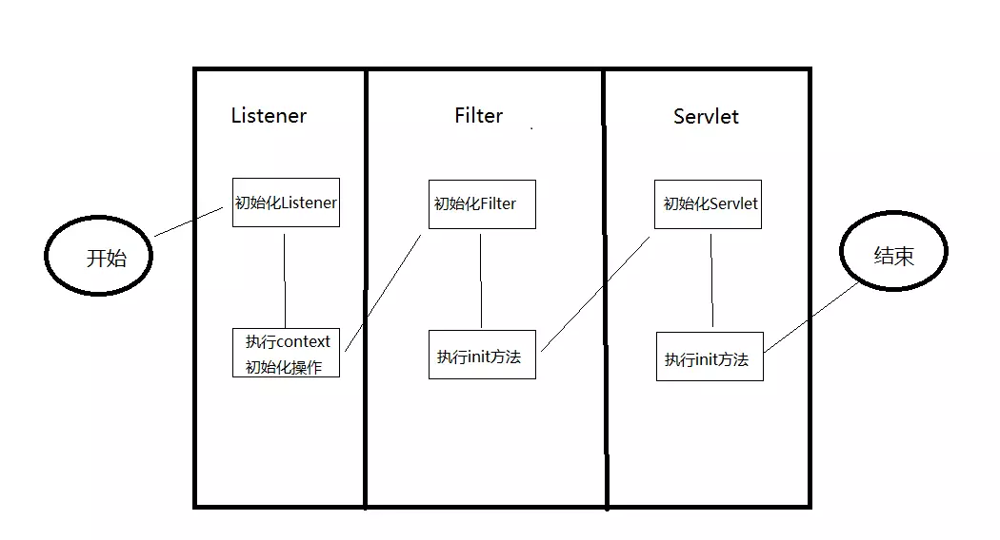

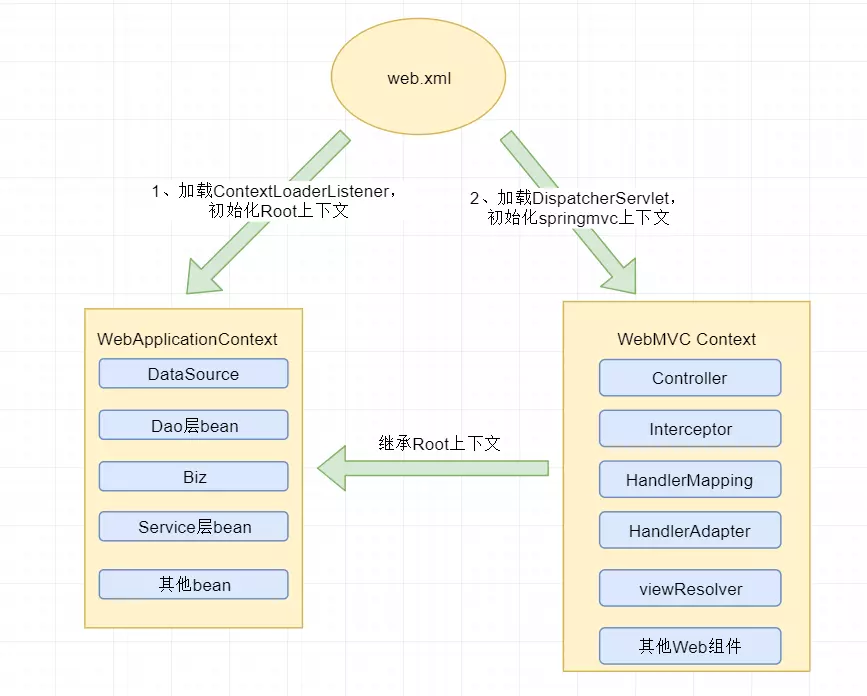

**加载顺序** 
a、首先加载Spring容器加载器：ContextLoaderListener

b、加载过滤器Filter（此处以编码过滤器CharacterEncodingFilter为例）此过滤器的作用就是设置请求参数的编码为UTF-8.

c、加载Servlet：初始化DispatcherServlet，在SpringMVC架构中，DispatchServlet负责请求分发，起到控制器的作用

#### 过滤器

```
作用：
```


#### xml配置式
#### 注解配置式
#### 监听器

[listener学习](other/listener.md)

#### xml配置式
#### 注解配置式
#### 控制器


#### xml配置式
#### 注解配置式


需要说明的是 Spring Boot 2.0 已经不再支持使用继承WebMvcConfigurerAdapter 来实现MVC 配置了


使用了thymeleaf所以，使用mvc的自然是无用的，必须要修改为thymeleaf才行