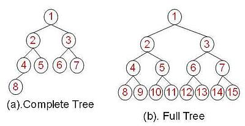
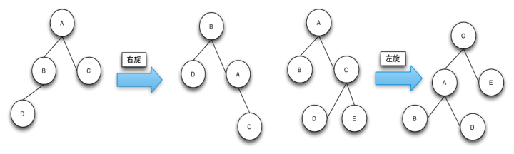
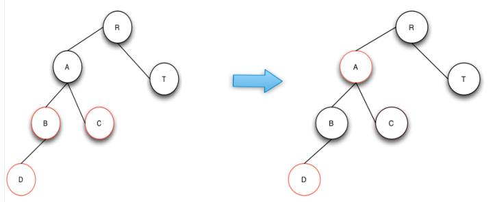
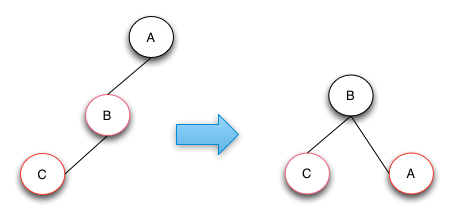
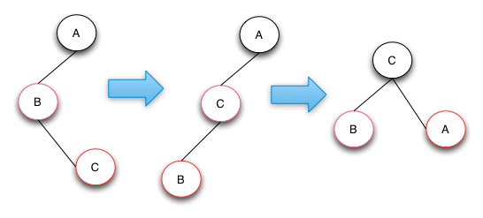

# 数据结构

[toc]

## 树中使用的术语

- **根（Root）**：树中最顶端的节点，根没有父节点。
- **子节点（Child）**：节点所拥有子树的根节点称为该节点的子节点。
- **父节点（Parent）**：如果节点拥有子节点，则该节点为子节点的父节点。
- **兄弟节点（Sibling）**：与节点拥有相同父节点的节点。
- **子孙节点（Descendant）**：节点向下路径上可达的节点。
- **叶节点（Leaf）**：没有子节点的节点。
- **内节点（Internal Node）**：至少有一个子节点的节点。
- **度（Degree）**：节点拥有子树的数量。
- **边（Edge）**：两个节点中间的链接。
- **路径（Path）**：从节点到子孙节点过程中的边和节点所组成的序列。
- **层级（Level）**：根为 Level 0 层，根的子节点为 Level 1 层，以此类推。
- **高度（Height）/深度（Depth）**：树中层的数量。比如只有 Level 0,Level 1,Level 2 则高度为 3。

## BST(Binary Search Tree)

二叉查找树：它的左子节点的值比父节点的值要小，右节点的值要比父节点的要大。它的高度决定了它的查找效率

在理想的情况下，二叉查找树增删查改的时间复杂度为O(logN)（其中N为节点数），最坏的情况下为O(N)。当它的高度为logN+1时，我们就说二叉查找树是平衡的。 


  

**完全二叉树和满二叉树**

完全二叉树（Complete Binary Tree）：深度为 h，有 n 个节点的二叉树，当且仅当其每一个节点都与深度为 h 的满二叉树中，序号为 1 至 n 的节点对应时，称之为完全二叉树。

满二叉树（Full Binary Tree）：一棵深度为 h，且有 2h - 1 个节点称之为满二叉树。

  

### BST存在的问题

BST存在的主要问题是，数在插入的时候会导致树倾斜，不同的插入顺序会导致树的高度不一样，而树的高度直接的影响了树的查找效率。理想的高度是logN，最坏的情况是所有的节点都在一条斜线上，这样的树的高度为N。

## RBTree(红黑树)

基于BST存在的问题，一种新的树——平衡二叉查找树(Balanced BST)产生了。平衡树在插入和删除的时候，会通过旋转操作将高度保持在logN。其中两款具有代表性的平衡树分别为AVL树和红黑树。AVL树由于实现比较复杂，而且插入和删除性能差，在实际环境下的应用不如红黑树。

红黑树（Red-Black Tree，以下简称RBTree）的实际应用非常广泛，比如Linux内核中的完全公平调度器、高精度计时器、ext3文件系统等等，各种语言的函数库如Java的TreeMap和TreeSet，C++ STL的map、multimap、multiset等。

RBTree也是函数式语言中最常用的持久数据结构之一，在计算几何中也有重要作用。值得一提的是，Java 8中HashMap的实现也因为用RBTree取代链表，性能有所提升。

### RBTree的定义

RBTree的定义如下:

1. 任何一个节点都有颜色，黑色或者红色
2. 根节点是黑色的
3. 父子节点之间不能出现两个连续的红节点
4. 任何一个节点向下遍历到其子孙的叶子节点，所经过的黑节点个数必须相等
5. 空节点被认为是黑色的

数据结构表示如下：

```java
class  Node<T>{
   public  T value;
   public   Node<T> parent;
   public   boolean isRed;
   public   Node<T> left;
   public   Node<T> right;
}
```

 RBTree在理论上还是一棵BST树，但是它在对BST的插入和删除操作时会维持树的平衡，即保证树的高度在[logN,logN+1]（理论上，极端的情况下可以出现RBTree的高度达到2*logN，但实际上很难遇到）。这样RBTree的查找时间复杂度始终保持在O(logN)从而接近于理想的BST。RBTree的删除和插入操作的时间复杂度也是O(logN)。RBTree的查找操作就是BST的查找操作。 

### RBTree的旋转操作

旋转操作(Rotate)的目的是使节点颜色符合定义，让RBTree的高度达到平衡。
Rotate分为left-rotate（左旋）和right-rotate（右旋），区分左旋和右旋的方法是：待旋转的节点从左边上升到父节点就是右旋，待旋转的节点从右边上升到父节点就是左旋。

  

### RBTree的插入操作

RBTree的插入与BST的插入方式是一致的，只不过是在插入过后，可能会导致树的不平衡，这时就需要对树进行旋转操作和颜色修复（在这里简称插入修复），使得它符合RBTree的定义。

新插入的节点是红色的，插入修复操作如果遇到父节点的颜色为黑则修复操作结束。也就是说，只有在父节点为红色节点的时候是需要插入修复操作的。

插入修复操作分为以下的三种情况，而且新插入的节点的父节点都是红色的：

1. 叔叔节点也为红色。
2. 叔叔节点为空，且祖父节点、父节点和新节点处于一条斜线上。
3. 叔叔节点为空，且祖父节点、父节点和新节点不处于一条斜线上。


#### 插入操作-case 1

case 1的操作是将父节点和叔叔节点与祖父节点的颜色互换，这样就符合了RBTRee的定义。即维持了高度的平衡，修复后颜色也符合RBTree定义的第三条和第四条。下图中，操作完成后A节点变成了新的节点。如果A节点的父节点不是黑色的话，则继续做修复操作。

  


#### 插入操作-case 2

case 2的操作是将B节点进行右旋操作，并且和父节点A互换颜色。通过该修复操作RBTRee的高度和颜色都符合红黑树的定义。如果B和C节点都是右节点的话，只要将操作变成左旋就可以了。

  

#### 插入操作-case 3

case 3的操作是将C节点进行左旋，这样就从case 3转换成case 2了，然后针对case 2进行操作处理就行了。case 2操作做了一个右旋操作和颜色互换来达到目的。如果树的结构是下图的镜像结构，则只需要将对应的左旋变成右旋，右旋变成左旋即可。

  