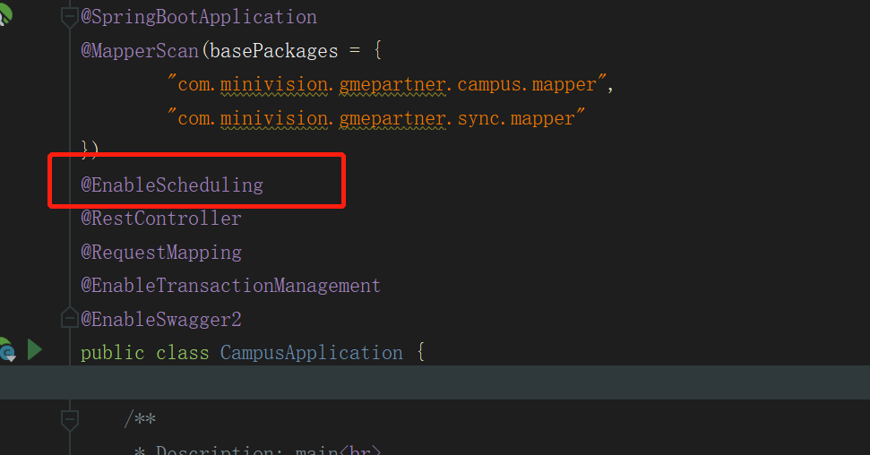

笔记资料吧，系统的学习还是要进行整理的！！

# SpringBoot的定时任务

springboot使用@Scheduled注解来创建定时任务。

## 创建步骤

### 开启

在spring boot的主类中加入@EnableScheduled注解，启用定时任务的配置

```java

@SpringBootApplication
@EnableScheduling
public class Application {

	public static void main(String[] args) {
		SpringApplication.run(Application.class, args);
	}

}
```



项目里是这样开启的

### 创建任务实现类

```java
@Component
public class ScheduledTasks {

    private static final SimpleDateFormat dateFormat = new SimpleDateFormat("HH:mm:ss");

    @Scheduled(fixedRate = 5000)
    public void reportCurrentTime() {
        System.out.println("现在时间：" + dateFormat.format(new Date()));
    }

}
```

